# 处理双向文本

> 译文：[`docs.oracle.com/javase/tutorial/2d/text/textlayoutbidirectionaltext.html`](https://docs.oracle.com/javase/tutorial/2d/text/textlayoutbidirectionaltext.html)

这一部分讨论如何使用[`java.awt`](https://docs.oracle.com/javase/8/docs/api/java/awt/package-summary.html)和[`java.awt.font`](https://docs.oracle.com/javase/8/docs/api/java/awt/font/package-summary.html)包中的类处理双向文本。这些类允许您以任何语言或脚本绘制样式化文本，这些语言或脚本受到 Unicode 标准的支持：这是一个全球字符编码系统，用于处理各种现代、古典和历史语言。在绘制文本时，必须考虑文本的阅读方向，以便字符串中的所有单词都能正确显示。这些类维护文本的方向，并正确绘制它，无论字符串是从左到右、从右到左还是双向运行。双向文本对于正确定位插入符、准确定位选择以及正确显示多行文本提出了有趣的问题。另外，双向和从右到左的文本对于根据右箭头和左箭头键的按压正确移动插入符也存在类似问题。

下列主题包括：

+   文本排序

+   操作双向文本

    +   显示插入符

    +   移动插入符

    +   点击测试

    +   突出显示选择

+   在 Java 应用程序中执行文本布局

+   使用 TextLayout 类管理文本布局

    +   使用 TextLayout 类布局文本

    +   使用 TextLayout 类显示双插入符

    +   使用 TextLayout 类移动插入符

    +   使用 TextLayout 类进行点击测试

    +   使用 TextLayout 类突出显示选择

如果您计划使用 Swing 组件，请参阅使用 JTextComponent 类处理双向文本和使用文本组件获取更多信息。

## 文本排序

Java SE 在内存中以逻辑顺序存储文本，这是字符和单词读取和写入的顺序。逻辑顺序不一定与视觉顺序相同，后者是显示相应字形的顺序。

即使混合使用多种语言，双向文本中必须保持书写系统的视觉顺序。下图展示了一个嵌入在英语句子中的阿拉伯短语。

**注意：** 在这个和后续的示例中，阿拉伯语和希伯来语文本由大写字母表示，空格由下划线表示。每个示例包含两部分：存储在内存中的字符表示（逻辑顺序的字符）后跟这些字符如何显示的表示（视觉顺序的字符）。字符框下面的数字表示插入偏移量。

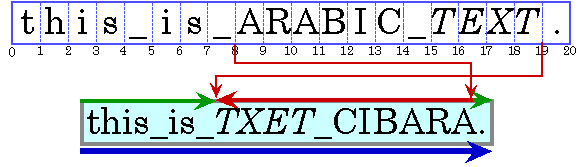

尽管它们是英语句子的一部分，但阿拉伯语单词以阿拉伯语书写顺序从右到左显示。因为斜体的阿拉伯语单词在逻辑上位于普通文本的阿拉伯语单词之后，所以在视觉上位于普通文本的左侧。

当显示混合左到右和右到左文本的行时，*基本方向*很重要。基本方向是主要书写系统的书写顺序。例如，如果文本主要是英语并带有一些嵌入的阿拉伯语，则基本方向是从左到右。如果文本主要是阿拉伯语并带有一些嵌入的英语或数字，则基本方向是从右到左。

基本方向确定具有共同方向的文本段的显示顺序。在前面图中显示的示例中，基本方向是从左到右。在这个示例中有三个方向性运行：句子开头的英语文本从左到右运行，阿拉伯文本从右到左运行，句号从左到右运行。

图形通常嵌入在文本流中。这些内联图形在影响文本流和换行方式方面类似于字形。这样的内联图形需要使用相同的双向布局算法定位，以便它们出现在字符流的适当位置。

Java SE 使用[Unicode 双向算法](http://unicode.org/reports/tr9/)，这是一种用于在一行内对字形进行排序的算法，从而确定双向文本的方向性。在大多数情况下，您无需包含任何额外信息，以便该算法获取正确的显示顺序。

## 操纵双向文本

为了允许用户编辑双向文本，您必须能够执行以下操作：

+   显示插入符

+   移动插入符

+   点击测试

+   突出显示选择

### 显示插入符

在可编辑文本中，*插入符*用于图形化表示当前插入点，即文本中新字符将被插入的位置。通常，插入符显示为两个字形之间闪烁的垂直条。新字符被插入并显示在插入符的位置。

计算插入符位置可能会很复杂，特别是对于双向文本。在方向边界上的插入偏移量有两个可能的插入符位置，因为对应于字符偏移量的两个字形不会相邻显示。如下图所示。在此图中，插入符显示为方括号，表示插入符对应的字形。 

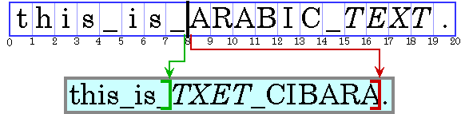

字符偏移量 8 对应于下划线后和*A*之前的位置。如果用户输入阿拉伯字符，其字形将显示在*A*的右侧；如果用户输入英文字符，其字形将显示在下划线的右侧。

为了处理这种情况，一些系统显示双插入符，一个强（主要）插入符和一个弱（次要）插入符。强插入符指示插入的字符的方向与文本基础方向相同时将显示在何处。弱插入符显示插入的字符的方向与基础方向相反时将显示在何处[`TextLayout`](https://docs.oracle.com/javase/8/docs/api/java/awt/font/TextLayout.html)自动支持双插入符。

当处理双向文本时，不能简单地将字符偏移量之前的字形宽度相加以计算插入符位置。如果这样做，插入符将被绘制在错误的位置，如下图所示：

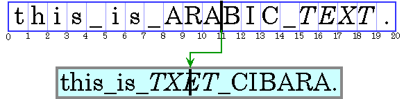

为了正确定位插入符，需要将偏移量左侧的字形宽度相加，并考虑当前上下文。除非考虑上下文，否则字形度量可能不会与显示匹配。（上下文可能会影响使用哪些字形。）

### 移动插入符

所有文本编辑器都允许用户使用箭头键移动插入符。用户期望插入符沿按下的箭头键方向移动。在从左到右的文本中，移动插入偏移量很简单：右箭头键将插入偏移量增加一，左箭头键将其减少一。在双向文本或带有连字的文本中，此行为会导致插入符跨越方向边界的字形并在不同方向运行内部反向移动。

要在双向文本中平滑移动插入符，需要考虑文本运行的方向。当按下右箭头键时不能简单地增加插入偏移量，当按下左箭头键时减少它。如果当前插入偏移量位于从右到左字符的运行内，右箭头键应减少插入偏移量，左箭头键应增加它。

在跨越方向边界时移动插入符更加复杂。下图说明了当用户使用箭头键导航时，当穿越方向边界时会发生什么。在显示的文本中向右移动三个位置对应于移动到字符偏移 7、19，然后是 18。

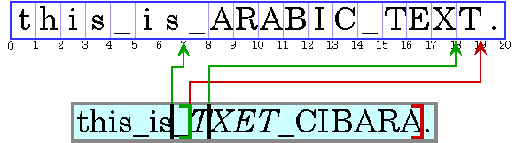

某些字形之间永远不应该有插入符；相反，插入符应该移动得像这些字形代表一个单一字符一样。例如，如果一个 *o* 和一个变音符由两个单独的字符表示，那么它们之间永远不应该有插入符。

[`TextLayout`](https://docs.oracle.com/javase/8/docs/api/java/awt/font/TextLayout.html) 类提供了方法（[`getNextRightHit`](https://docs.oracle.com/javase/8/docs/api/java/awt/font/TextLayout.html#getNextRightHit-int-) 和 [`getNextLeftHit`](https://docs.oracle.com/javase/8/docs/api/java/awt/font/TextLayout.html#getNextLeftHit-int-)），使您能够轻松地在双向文本中平滑地移动插入符。

### 命中测试

通常，设备空间中的位置必须转换为文本偏移量。例如，当用户在可选择文本上单击鼠标时，鼠标位置将转换为文本偏移量，并用作选择范围的一端。从逻辑上讲，这是放置插入符的逆过程。

当处理双向文本时，显示中的单个视觉位置可以对应源文本中的两个不同偏移量，如下图所示：

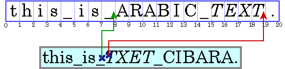

因为单个视觉位置可以对应两个不同的偏移量，所以命中测试双向文本不仅仅是测量字形宽度直到找到正确位置的字形，然后将该位置映射回字符偏移量。检测命中位置所在的一侧有助于区分这两种选择。

您可以使用 [`TextLayout.hitTestChar`](https://docs.oracle.com/javase/8/docs/api/java/awt/font/TextLayout.html#hitTestChar-float-float-) 进行命中测试。命中信息封装在 [`TextHitInfo`](https://docs.oracle.com/javase/8/docs/api/java/awt/font/TextHitInfo.html) 对象中，并包括有关命中位置所在一侧的信息。

### 突出显示选择

一段选定的字符范围通过一个高亮区域图形化表示，其中字形以反色或不同背景颜色显示。

高亮区域，就像插入符一样，在双向文本中比单向文本更复杂。在双向文本中，一段连续的字符范围在显示时可能没有连续的高亮区域。相反，显示为视觉上连续的一系列字形的高亮区域可能不对应单一、连续的字符范围。

这导致双向文本中突出选择的两种策略：

+   *逻辑高亮*：使用逻辑高亮，所选字符在文本模型中始终是连续的，而高亮区域允许是不连续的。以下是逻辑高亮的示例：

    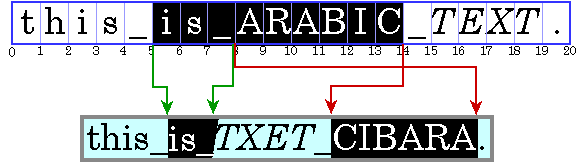

+   *可视高亮*：使用可视高亮，可能会有多个选定字符范围，但高亮区域始终是连续的。以下是可视高亮的示例：

    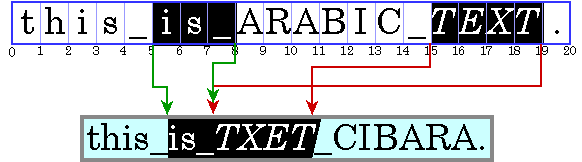

逻辑高亮更容易实现，因为所选字符在文本中始终是连续的。

示例`SelectionSample.java`演示了逻辑高亮：

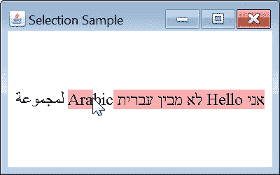

## 在 Java 应用程序中执行文本布局

根据您使用的 Java API，您可以根据需要对文本布局进行精细或粗略的控制：

+   如果您只想显示一块文本或需要一个可编辑的文本控件，您可以使用[`JTextComponent`](https://docs.oracle.com/javase/8/docs/api/javax/swing/text/JTextComponent.html)，它将为您执行文本布局。[`JTextComponent`](https://docs.oracle.com/javase/8/docs/api/javax/swing/text/JTextComponent.html)旨在处理大多数国际应用程序的需求，并支持双向文本。有关[`JTextComponent`](https://docs.oracle.com/javase/8/docs/api/javax/swing/text/JTextComponent.html)的更多信息，请参见使用 JTextComponent 类处理双向文本和使用文本组件。

+   如果您想显示一个简单的文本字符串，您可以调用方法[`Graphics2D.drawString`](https://docs.oracle.com/javase/8/docs/api/java/awt/Graphics2D.html#drawString-java.text.AttributedCharacterIterator-int-int-)，让 Java 2D 为您布局字符串。您还可以使用[`Graphics2D.drawString`](https://docs.oracle.com/javase/8/docs/api/java/awt/Graphics2D.html#drawString-java.text.AttributedCharacterIterator-int-int-)来呈现带样式的字符串和包含双向文本的字符串。有关通过[`Graphics2D`](https://docs.oracle.com/javase/8/docs/api/java/awt/Graphics2D.html)呈现文本的更多信息，请参见使用文本 API。

+   如果您想实现自己的文本编辑例程，可以使用 [`TextLayout`](https://docs.oracle.com/javase/8/docs/api/java/awt/font/TextLayout.html) 来管理文本布局、高亮显示和点击检测。[`TextLayout`](https://docs.oracle.com/javase/8/docs/api/java/awt/font/TextLayout.html) 提供的功能处理了大多数常见情况，包括具有混合字体、混合语言和双向文本的文本字符串。有关使用 TextLayout 的更多信息，请参见管理文本布局。

+   如果您想完全控制文本的形状和位置，可以使用 [`Font`](https://docs.oracle.com/javase/8/docs/api/java/awt/Font.html) 类构建自己的 [`GlyphVector`](https://docs.oracle.com/javase/8/docs/api/java/awt/font/GlyphVector.html) 实例，然后通过 [`Graphics2D`](https://docs.oracle.com/javase/8/docs/api/java/awt/Graphics2D.html) 类进行渲染。

通常，您不需要自己执行文本布局操作。对于大多数应用程序，[`JTextComponent`](https://docs.oracle.com/javase/8/docs/api/javax/swing/text/JTextComponent.html) 是显示静态和可编辑文本的最佳解决方案。但是，[`JTextComponent`](https://docs.oracle.com/javase/8/docs/api/javax/swing/text/JTextComponent.html) 不支持双插入符或双向文本中的不连续选择的显示。如果您的应用程序需要这些功能，或者您更喜欢实现自己的文本编辑例程，可以使用 Java 2D 文本布局 API。

## 使用 TextLayout 类管理文本布局

[`TextLayout`](https://docs.oracle.com/javase/8/docs/api/java/awt/font/TextLayout.html) 类支持包含多种样式和来自不同书写系统（包括阿拉伯文和希伯来文）的字符的文本。（阿拉伯文和希伯来文特别难以显示，因为您必须重新排列和重新排序文本以获得可接受的表示。）

即使您只处理英文文本，[`TextLayout`](https://docs.oracle.com/javase/8/docs/api/java/awt/font/TextLayout.html) 也简化了显示和测量文本的过程。通过使用 [`TextLayout`](https://docs.oracle.com/javase/8/docs/api/java/awt/font/TextLayout.html)，您可以在不费额外努力的情况下实现高质量的排版。

[`TextLayout`](https://docs.oracle.com/javase/8/docs/api/java/awt/font/TextLayout.html) 被设计为在显示简单的单向文本时不会产生显著的性能影响。当使用 [`TextLayout`](https://docs.oracle.com/javase/8/docs/api/java/awt/font/TextLayout.html) 显示阿拉伯文或希伯来文时，会有一些额外的处理开销。但是，这通常是每个字符的微秒数量级，并且被正常绘图代码的执行所主导。

[`TextLayout`](https://docs.oracle.com/javase/8/docs/api/java/awt/font/TextLayout.html) 类为您管理字形的定位和排序。您可以使用[`TextLayout`](https://docs.oracle.com/javase/8/docs/api/java/awt/font/TextLayout.html) 来执行以下操作：

+   使用 TextLayout 类进行文本布局

+   使用 TextLayout 类显示双光标

+   使用 TextLayout 类移动光标

+   使用 TextLayout 类进行点击测试

+   使用 TextLayout 类突出显示选择内容

### 使用 TextLayout 类进行文本布局

[`TextLayout`](https://docs.oracle.com/javase/8/docs/api/java/awt/font/TextLayout.html) 自动布局文本，包括双向文本，具有正确的形状和顺序。为了正确形状和排序表示一行文本的字形，[`TextLayout`](https://docs.oracle.com/javase/8/docs/api/java/awt/font/TextLayout.html) 必须了解文本的完整上下文：

+   如果文本适合单行，例如按钮的单词标签或对话框中的一行文本，您可以直接从文本构造一个[`TextLayout`](https://docs.oracle.com/javase/8/docs/api/java/awt/font/TextLayout.html)。

+   如果您有更多文本无法适合单行或想要在单行文本上分隔制表符段，您不能直接构造一个[`TextLayout`](https://docs.oracle.com/javase/8/docs/api/java/awt/font/TextLayout.html)。您必须使用[`LineBreakMeasurer`](https://docs.oracle.com/javase/8/docs/api/java/awt/font/LineBreakMeasurer.html) 提供足够的上下文。有关更多信息，请参见绘制多行文本。

文本的基本方向通常由文本上的属性（样式）设置。如果该属性缺失，[`TextLayout`](https://docs.oracle.com/javase/8/docs/api/java/awt/font/TextLayout.html) 将遵循 Unicode 双向算法，并从段落中的初始字符推导基本方向。

### 使用 TextLayout 类显示双光标

[`TextLayout`](https://docs.oracle.com/javase/8/docs/api/java/awt/font/TextLayout.html) 保留光标信息，如光标[`Shape`](https://docs.oracle.com/javase/8/docs/api/java/awt/Shape.html)、位置和角度。您可以使用此信息轻松地在单向和双向文本中显示光标。在为双向文本绘制光标时，使用[`TextLayout`](https://docs.oracle.com/javase/8/docs/api/java/awt/font/TextLayout.html) 可确保光标位置正确。

[`TextLayout`](https://docs.oracle.com/javase/8/docs/api/java/awt/font/TextLayout.html)提供默认插入符`Shapes`并自动支持双插入符。对于斜体和倾斜字形，[`TextLayout`](https://docs.oracle.com/javase/8/docs/api/java/awt/font/TextLayout.html)会产生倾斜插入符，如下图所示。这些插入符位置也用作高亮和命中测试之间的字形边界，有助于产生一致的用户体验。

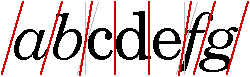

给定插入偏移量，[`getCaretShapes`](https://docs.oracle.com/javase/8/docs/api/java/awt/font/TextLayout.html#getCaretShapes-int-)方法返回一个包含两个[`Shape`](https://docs.oracle.com/javase/8/docs/api/java/awt/Shape.html)对象的数组：元素 0 包含强插入符，元素 1 包含弱插入符（如果存在）。要显示双插入符，只需绘制两个插入符[`Shape`](https://docs.oracle.com/javase/8/docs/api/java/awt/Shape.html)对象；插入符将自动呈现在正确的位置。

如果您想使用自定义插入符，可以从[`TextLayout`](https://docs.oracle.com/javase/8/docs/api/java/awt/font/TextLayout.html)中检索插入符的位置和角度，并自行绘制它们。

示例`HitTestSample.java`演示了双插入符。

点击希伯来文本旁边的*o*会记录用户在*o*之后点击的位置，这部分属于英文文本。这将使弱（黑色）插入符位于*o*旁边，而强插入符（红色）位于*H*之前：

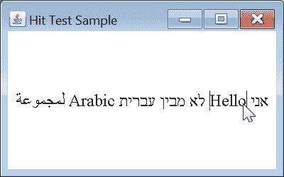

点击*o*右侧的空格会记录用户点击了空格，这部分属于希伯来文本。这将使强（红色）插入符位于*o*旁边，而弱插入符（黑色）位于*H*之前：

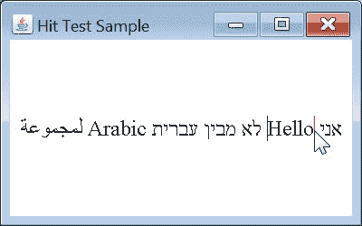

### 使用 TextLayout 类移动插入符

您还可以使用[`TextLayout`](https://docs.oracle.com/javase/8/docs/api/java/awt/font/TextLayout.html)类确定用户按下左箭头或右箭头键时的插入偏移量。给定表示当前插入偏移量的`TextHitInfo`对象，[`getNextRightHit`](https://docs.oracle.com/javase/8/docs/api/java/awt/font/TextLayout.html#getNextRightHit-java.awt.font.TextHitInfo-)方法返回一个表示正确插入偏移量的[`TextHitInfo`](https://docs.oracle.com/javase/8/docs/api/java/awt/font/TextHitInfo.html)对象，如果按下右箭头键。[`getNextLeftHit`](https://docs.oracle.com/javase/8/docs/api/java/awt/font/TextLayout.html#getNextLeftHit-java.awt.font.TextHitInfo-)方法为左箭头键提供相同的信息。

来自示例``ArrowKeySample.java``的以下摘录演示了确定用户按下左箭头或右箭头键时的插入偏移量的方法：

```java
public class ArrowKeySample extends JPanel implements KeyListener {

  // ...

  private static void createAndShowGUI() {
    // Create and set up the window.
    ArrowKey demo = new ArrowKey();
    frame = new JFrame("Arrow Key Sample");
    frame.addKeyListener(demo);
    // ...
  }

  private void handleArrowKey(boolean rightArrow) {
    TextHitInfo newPosition;
    if (rightArrow) {
      newPosition = textLayout.getNextRightHit(insertionIndex);
    } else {
      newPosition = textLayout.getNextLeftHit(insertionIndex);
    }

    // getNextRightHit() / getNextLeftHit() will return null if
    // there is not a caret position to the right (left) of the
    // current position.
    if (newPosition != null) {
      // Update insertionIndex.
      insertionIndex = newPosition.getInsertionIndex();
      // Repaint the Component so the new caret(s) will be displayed.
      frame.repaint();
    }
  }

  // ...

  @Override
  public void keyPressed(KeyEvent e) {
    int keyCode = e.getKeyCode();
    if (keyCode == KeyEvent.VK_LEFT || keyCode == KeyEvent.VK_RIGHT) {
      handleArrowKey(keyCode == KeyEvent.VK_RIGHT);
    }
  }
}

```

### 使用 TextLayout 类进行命中测试

[`TextLayout`](https://docs.oracle.com/javase/8/docs/api/java/awt/font/TextLayout.html)类提供了一个简单的文本命中测试机制。`hitTextChar`方法以鼠标的*x*和*y*坐标作为参数，并返回一个[`TextHitInfo`](https://docs.oracle.com/javase/8/docs/api/java/awt/font/TextHitInfo.html)对象。[`TextHitInfo`](https://docs.oracle.com/javase/8/docs/api/java/awt/font/TextHitInfo.html)包含指定位置的插入偏移量和命中位置的侧面。插入偏移量是最接近命中位置的偏移量：如果命中位置超过行尾，将返回行尾的偏移量。

来自``HitTestSample.java``的以下摘录从鼠标点击中检索偏移量：

```java
private class HitTestMouseListener extends MouseAdapter {
    public void mouseClicked(MouseEvent e) {
      Point2D origin = computeLayoutOrigin();
      // Compute the mouse click location relative to
      // textLayout's origin.
      float clickX = (float) (e.getX() - origin.getX());
      float clickY = (float) (e.getY() - origin.getY());
      // Get the character position of the mouse click.
      TextHitInfo currentHit = textLayout.hitTestChar(clickX, clickY);
      insertionIndex = currentHit.getInsertionIndex();
      // Repaint the Component so the new caret(s) will be displayed.
      repaint();
    }
  }

```

### 使用 TextLayout 类进行高亮选择

你可以从[`TextLayout`](https://docs.oracle.com/javase/8/docs/api/java/awt/font/TextLayout.html)获取代表高亮区域的[`Shape`](https://docs.oracle.com/javase/8/docs/api/java/awt/Shape.html)。在计算高亮区域的尺寸时，[`TextLayout`](https://docs.oracle.com/javase/8/docs/api/java/awt/font/TextLayout.html)会自动考虑上下文。[`TextLayout`](https://docs.oracle.com/javase/8/docs/api/java/awt/font/TextLayout.html)支持逻辑和视觉高亮。

来自``SelectionSample.java``的以下摘录演示了显示高亮文本的一种方法：

```java
public void paint(Graphics g) {

    // ...

    boolean haveCaret = anchorEnd == activeEnd;

    if (!haveCaret) {
      // Retrieve highlight region for selection range.
      Shape highlight = 
          textLayout.getLogicalHighlightShape(anchorEnd, activeEnd);
      // Fill the highlight region with the highlight color.
      graphics2D.setColor(HIGHLIGHT_COLOR);
      graphics2D.fill(highlight);
    }

    // ...

  }

  // ...

  private class SelectionMouseMotionListener extends MouseMotionAdapter {
    public void mouseDragged(MouseEvent e) {
      Point2D origin = computeLayoutOrigin();
      // Compute the mouse location relative to
      // textLayout's origin.
      float clickX = (float) (e.getX() - origin.getX());
      float clickY = (float) (e.getY() - origin.getY());
      // Get the character position of the mouse location.
      TextHitInfo position = textLayout.hitTestChar(clickX, clickY);
      int newActiveEnd = position.getInsertionIndex();
      // If newActiveEnd is different from activeEnd, update activeEnd
      // and repaint the Panel so the new selection will be displayed.
      if (activeEnd != newActiveEnd) {
        activeEnd = newActiveEnd;
        frame.repaint();
      }
    }
  }

  private class SelectionMouseListener extends MouseAdapter {
    public void mousePressed(MouseEvent e) {
      Point2D origin = computeLayoutOrigin();
      // Compute the mouse location relative to
      // TextLayout's origin.
      float clickX = (float) (e.getX() - origin.getX());
      float clickY = (float) (e.getY() - origin.getY());
      // Set the anchor and active ends of the selection
      // to the character position of the mouse location.
      TextHitInfo position = textLayout.hitTestChar(clickX, clickY);
      anchorEnd = position.getInsertionIndex();
      activeEnd = anchorEnd;
      // Repaint the Panel so the new selection will be displayed.
      frame.repaint();
    }
  }

```

方法`SelectionMouseListener.mousePressed`指定了变量`anchorEnd`，它是鼠标点击的文本位置。方法`SelectionMouseMotionListener.mouseDragged`指定了变量`activeEnd`，它是鼠标拖动到的文本位置。`paint`方法检索一个代表所选文本的[`Shape`](https://docs.oracle.com/javase/8/docs/api/java/awt/Shape.html)对象（即`anchorEnd`和`activeEnd`位置之间的文本）。然后`paint`方法用高亮颜色填充[`Shape`](https://docs.oracle.com/javase/8/docs/api/java/awt/Shape.html)对象。
