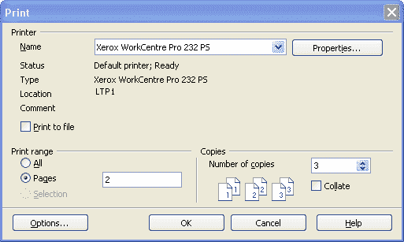
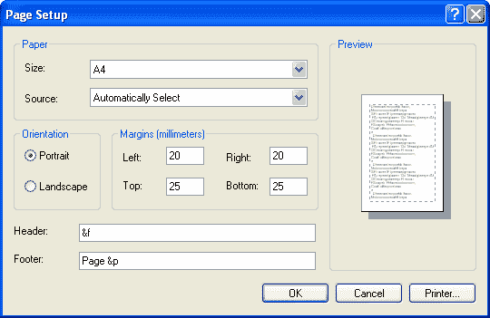

# 使用打印设置对话框

> 原文：[`docs.oracle.com/javase/tutorial/2d/printing/dialog.html`](https://docs.oracle.com/javase/tutorial/2d/printing/dialog.html)

传统上，用户希望看到页面设置和打印对话框。从打印对话框中，您可以选择打印机，指定要打印的页面，并设置副本数量。



当用户按下与打印命令相关的按钮或从打印菜单中选择项目时，应用程序会显示打印对话框。要显示此对话框，请调用[`PrinterJob`](https://docs.oracle.com/javase/8/docs/api/java/awt/print/PrinterJob.html)类的`printDialog`方法：

```java
PrinterJob pj = PrinterJob.getPrinterJob();
...
    if (pj.printDialog()) {
        try {pj.print();}
        catch (PrinterException exc) {
            System.out.println(exc);
         }
     }   
...    

```

如果用户点击确定按钮离开对话框，则此方法返回`true`，否则返回`false`。对话框中用户的选择受限于已设置到`PrinterJob`的页面的数量和格式。

上述代码片段中的`printDialog`方法打开一个本机打印对话框。`PrintDialogExample.java`代码示例展示了如何显示跨平台打印对话框。

你可以通过使用页面设置对话框来更改包含在[`PageFormat`](https://docs.oracle.com/javase/8/docs/api/java/awt/print/PageFormat.html)对象中的页面设置信息。



要显示页面设置对话框，请调用`PrinterJob`类的`pageDialog`方法。

```java
PrinterJob pj = PrinterJob.getPrinterJob();
PageFormat pf = pj.pageDialog(pj.defaultPage());

```

页面设置对话框使用传递给`pageDialog`的参数进行初始化。如果用户在对话框中点击确定按钮，则将根据用户的选择创建`PageFormat`实例，然后返回。如果用户取消对话框，则`pageDialog`将返回原始未更改的`PageFormat`。

通常，Java 2D 打印 API 要求应用程序显示打印对话框，但有时可能可以在不显示任何对话框的情况下打印。这种类型的打印称为*静默打印*。在特定情况下可能会很有用，例如，当您需要打印特定数据库每周报告时。在其他情况下，始终建议在打印过程开始时通知用户。
