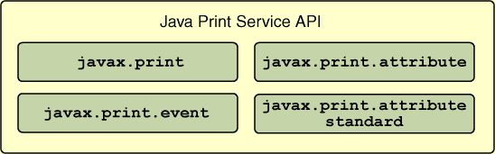

# 使用打印服务和属性

> 原文：[`docs.oracle.com/javase/tutorial/2d/printing/services.html`](https://docs.oracle.com/javase/tutorial/2d/printing/services.html)

从之前的课程中，您已经了解到 Java 2D 打印 API 支持页面成像，显示打印和页面设置对话框，并指定打印属性。 打印服务是任何打印子系统的另一个关键组件。

**Java 打印服务（JPS）API**扩展了当前的 Java 2D 打印功能，提供以下功能：

+   应用程序通过动态查询打印机功能来发现满足其需求的打印机。

+   应用程序扩展了包含在 JPS API 中的属性。

+   第三方可以通过服务提供者接口插入其自己的打印服务，打印不同格式，包括 Postscript、PDF 和 SVG。

Java 打印服务 API 由四个包组成：



[`javax.print`](https://docs.oracle.com/javase/8/docs/api/javax/print/package-summary.html)包为 Java 打印服务 API 提供了主要的类和接口。 它使客户端和服务器应用程序能够：

+   根据其功能发现和选择打印服务。

+   指定打印数据的格式。

+   将打印作业提交给支持要打印的文档类型的服务。

## 文档类型规范

[`DocFlavor`](https://docs.oracle.com/javase/8/docs/api/javax/print/DocFlavor.html)类表示打印数据的格式，例如 JPEG 或 PostScript。`DocFlavor`格式由两部分组成：一个是 MIME 类型，另一个是表示类名称。 MIME 类型描述了格式，文档表示类名称指示文档如何传递给打印机或输出流。 应用程序使用`DocFlavor`和属性集来查找具有属性集指定功能的打印机。 此代码示例演示了获取能够将 GIF 图像转换为 PostScript 的`StreamPrintService`对象的`StreamPrintServiceFactory`对象数组：

```java
DocFlavor flavor  = DocFlavor.INPUT_STREAM.GIF;
String psMimeType = DocFlavor.BYTE_ARRAY.
                    POSTSCRIPT.getMimeType();
StreamPrintServiceFactory[] psfactories =
              StreamPrintServiceFactory.
              lookupStreamPrintServiceFactories(
              flavor, psMimeType);

```

## 属性定义

[`javax.print.attribute`](https://docs.oracle.com/javase/8/docs/api/javax/print/attribute/package-frame.html)和[`javax.print.attribute.standard`](https://docs.oracle.com/javase/8/docs/api/javax/print/attribute/standard/package-frame.html)包定义了描述打印服务功能、指定打印作业要求以及跟踪打印作业进度的打印属性。

例如，如果您想使用 A4 纸张格式并打印文档的三份副本，则必须创建一组实现`PrintRequestAttributeSet`接口的以下属性：

```java
PrintRequestAttributeSet attr_set =
    new HashPrintRequestAttributeSet();
attr_set.add(MediaSize.ISO_A4); 
attr_set.add(new Copies(3)); 

```

然后，您必须将属性集传递给打印作业的`print`方法，以及`DocFlavor`。

## 打印服务发现

应用程序调用抽象类`PrintServiceLookup`的静态方法来定位具有满足应用程序打印请求能力的打印服务。例如，为了打印一份双面文档的两份副本，应用程序首先需要找到具有双面打印能力的打印机：

```java
DocFlavor doc_flavor = DocFlavor.INPUT_STREAM.PDF;
PrintRequestAttributeSet attr_set =
    new HashPrintRequestAttributeSet();
attr_set.add(new Copies(2));
attr_set.add(Sides.DUPLEX);
PrintService[] service = PrintServiceLookup.
              lookupPrintServices(doc_flavor,
              attr_set);

```

## API 的常见用法

总之，Java 打印服务 API 执行以下步骤来处理打印请求：

1.  选择一个`DocFlavor`。

1.  创建一组属性。

1.  定位一个可以处理由`DocFlavor`和属性集指定的打印请求的打印服务。

1.  创建一个封装了`DocFlavor`和实际打印数据的`Doc`对象。

1.  从打印服务获取由`DocPrintJob`表示的打印作业。

1.  调用打印作业的`print`方法。

有关 Java 打印服务的更多信息，请参阅[Java 2D 打印服务 API 用户指南](https://docs.oracle.com/javase/8/docs/technotes/guides/jps/spec/JPSTOC.fm.html)。
