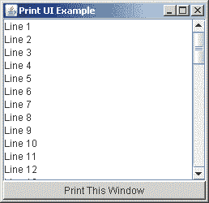

# 打印用户界面的内容

> 原文：[`docs.oracle.com/javase/tutorial/2d/printing/gui.html`](https://docs.oracle.com/javase/tutorial/2d/printing/gui.html)

另一个常见的打印任务是打印窗口或框架的内容，可以是全部内容，也可以是部分内容。窗口可能包含以下组件：工具栏、按钮、滑块、文本标签、可滚动文本区域、图像和其他图形内容。所有这些组件都是使用 Java 2D 打印 API 的以下方法打印的：

```java
java.awt.Component.print(Graphics g);
java.awt.Component.printAll(Graphics g);

```

以下图表示一个简单的用户界面。



创建此用户界面的代码位于示例程序`PrintUIWindow.java`中。

要打印此窗口，请修改之前打印文本或图像的示例中的代码。结果代码应如下所示：

```java
public int print(Graphics g, PageFormat pf, int page)
    throws PrinterException {
    if (page > 0) {
        return NO_SUCH_PAGE;
    }

    Graphics2D g2d = (Graphics2D)g;
    g2d.translate(pf.getImageableX(), pf.getImageableY());

    // Print the entire visible contents of a
    // java.awt.Frame.
    frame.printAll(g);

    return PAGE_EXISTS;
}

```

* * *

**注意：** `printAll`方法的调用是此示例与打印文本或图像示例之间的唯一区别。`print(Graphics g)`方法反映了用于屏幕渲染的`java.awt.Component.paint(Graphics g)`方法。使用`print()`方法而不是`paint()`方法，因为`Components`类可能已经重写了`print()`方法以不同方式处理打印情况。

* * *

`printAll(Graphics g)`方法打印组件及其所有子组件。通常使用此方法打印对象，例如完整窗口，而不是单个组件。
