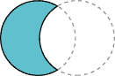
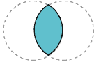
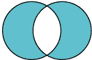

# 从几何原语构建复杂形状

> 原文：[`docs.oracle.com/javase/tutorial/2d/advanced/complexshapes.html`](https://docs.oracle.com/javase/tutorial/2d/advanced/complexshapes.html)

构造区域几何（CAG）是通过对现有几何形状执行布尔运算来创建新几何形状的过程。在 Java 2D API 中，[`Area`](https://docs.oracle.com/javase/8/docs/api/java/awt/geom/Area.html) 类实现了 [`Shape`](https://docs.oracle.com/javase/8/docs/api/java/awt/Shape.html) 接口，并支持以下布尔运算。

|  | 并集 |  | 减法 |
| --- | --- | --- | --- |
|  | 交集 |  | 异或 (`XOR`) |

## 例子：区域

在这个例子中，`Area`对象从几个椭圆构建了一个梨形。

<applet code="Pear" archive="examples/lib/PearApplet.jar" width="150" height="200" alt="小程序构建梨形"><param name="permissions" value="sandbox"></applet>

* * *

**注意：** 如果你看不到小程序运行，你需要至少安装 [Java SE Development Kit (JDK) 7](http://www.oracle.com/technetwork/java/javase/downloads/index.html) 版本。

* * *

``Pear.java`` 包含了这个小程序的完整代码。

每片叶子是通过在两个重叠圆上执行交集操作创建的。

```java
leaf = new Ellipse2D.Double();
...
leaf1 = new Area(leaf);
leaf2 = new Area(leaf);
...
leaf.setFrame(ew-16, eh-29, 15.0, 15.0);
leaf1 = new Area(leaf);
leaf.setFrame(ew-14, eh-47, 30.0, 30.0);
leaf2 = new Area(leaf);
leaf1.intersect(leaf2);
g2.fill(leaf1);
...
leaf.setFrame(ew+1, eh-29, 15.0, 15.0);
leaf1 = new Area(leaf);
leaf2.intersect(leaf1);
g2.fill(leaf2);

```

重叠的圆也被用来通过减法操作构建茎。

```java
stem = new Ellipse2D.Double();
...
stem.setFrame(ew, eh-42, 40.0, 40.0);
st1 = new Area(stem);
stem.setFrame(ew+3, eh-47, 50.0, 50.0);
st2 = new Area(stem);
st1.subtract(st2);
g2.fill(st1);

```

梨的主体是通过在一个圆和一个椭圆上执行并集操作构建的。

```java
circle = new Ellipse2D.Double();
oval = new Ellipse2D.Double();
circ = new Area(circle);
ov = new Area(oval);
...
circle.setFrame(ew-25, eh, 50.0, 50.0);
oval.setFrame(ew-19, eh-20, 40.0, 70.0);
circ = new Area(circle);
ov = new Area(oval);
circ.add(ov);
g2.fill(circ);

```
