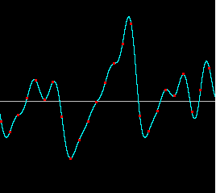
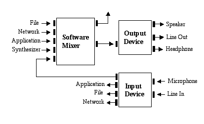
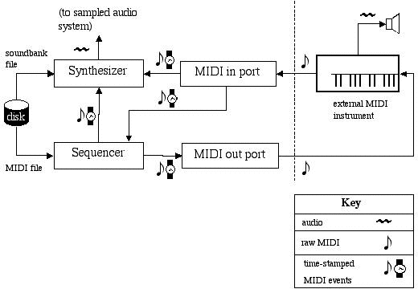

# 路径：声音

> 原文：[`docs.oracle.com/javase/tutorial/sound/index.html`](https://docs.oracle.com/javase/tutorial/sound/index.html)

Java Sound API 是一个低级 API，用于影响和控制声音媒体的输入和输出，包括音频和 MIDI（Musical Instrument Digital Interface）数据。 Java Sound API 提供了对通常需要的声音输入和输出功能的明确控制，以促进可扩展性和灵活性。

Java Sound API 满足了各种应用程序开发人员的需求。潜在的应用领域包括：

+   通信框架，如会议和电话会议

+   最终用户内容传递系统，如使用流媒体内容的媒体播放器和音乐

+   交互式应用程序，如使用动态内容的游戏和网站

+   内容创建和编辑

+   工具、工具包和实用程序

Java Sound API 在 Java 平台上提供了最低级别的声音支持。它为应用程序提供了对声音操作的大量控制，并且是可扩展的。例如，Java Sound API 提供了安装、访问和操作系统资源的机制，如音频混音器、MIDI 合成器、其他音频或 MIDI 设备、文件读取器和写入器以及声音格式转换器。 Java Sound API 不包括复杂的声音编辑器或图形工具，但它提供了可以构建此类程序的功能。它强调低于最终用户通常期望的低级别控制。

Java Sound API 包括对数字音频和 MIDI 数据的支持。这两个主要功能模块分别在不同的包中提供：

+   [`javax.sound.sampled`](https://docs.oracle.com/javase/8/docs/api/javax/sound/sampled/package-summary.html) – 该包指定了用于捕获、混合和播放数字（采样）音频的接口。

+   [`javax.sound.midi`](https://docs.oracle.com/javase/8/docs/api/javax/sound/midi/package-summary.html) – 该包提供了用于 MIDI 合成、序列化和事件传输的接口。

另外两个包允许服务提供商（而不是应用程序开发人员）创建自定义软件组件，以扩展 Java Sound API 的实现的功能：

+   [`javax.sound.sampled.spi`](https://docs.oracle.com/javase/8/docs/api/javax/sound/sampled/spi/package-summary.html)

+   [`javax.sound.midi.spi`](https://docs.oracle.com/javase/8/docs/api/javax/sound/midi/spi/package-summary.html)

本页介绍了采样音频系统、MIDI 系统和 SPI 包。每个包稍后在教程中进行了更详细的讨论。

* * *

**注意：**

还有其他 Java 平台 API 也涉及声音相关元素。[Java 媒体框架 API (JMF)](http://www.oracle.com/technetwork/java/javase/tech/index-jsp-140239.html) 是当前作为 Java 平台标准扩展可用的更高级 API。JMF 指定了用于捕获和播放基于时间的媒体的统一架构、消息协议和编程接口。JMF 为基本媒体播放器应用程序提供了更简单的解决方案，并且它实现了不同媒体类型之间的同步，例如音频和视频。另一方面，专注于声音的程序可以从 Java Sound API 中受益，特别是如果它们需要更高级的功能，例如精细控制缓冲音频播放或直接操作 MIDI 合成器。其他具有声音方面的 Java API 包括 Java 3D 和用于电话和语音的 API。这些 API 的任何实现可能在内部使用 Java Sound API 的实现，但不是必须的。

* * *

## 什么是采样音频？

[`javax.sound.sampled`](https://docs.oracle.com/javase/8/docs/api/javax/sound/sampled/package-summary.html) 包处理数字音频数据，Java Sound API 将其称为采样音频。*样本* 是信号的连续快照。在音频的情况下，信号是声波。麦克风将声学信号转换为相应的模拟电信号，模拟-数字转换器将该模拟信号转换为采样数字形式。以下图显示了声音录制中的一个瞬间。

采样声波

这个图表将声压（振幅）绘制在垂直轴上，时间绘制在水平轴上。模拟声波的振幅以一定速率周期性地进行测量，导致离散样本（图中的红色数据点）构成数字音频信号。中心水平线表示零振幅；线上的点为正值样本，线下的点为负值。模拟信号的数字近似精度取决于其时间分辨率（*采样率*）和振幅分辨率（*量化*），即用于表示每个样本的位数。作为参考，用于存储在光盘上的音频每秒采样 44,100 次，并以每个样本 16 位表示。

这里稍微宽松地使用了“采样音频”这个术语。声波可以在被保留为模拟形式的同时以离散间隔进行采样。然而，对于 Java Sound API 来说，“采样音频”等同于“数字音频”。

通常，计算机上的采样音频来自声音录制，但声音也可以被合成生成（例如，创建触摸电话的声音）。术语“采样音频”指的是数据类型，而不是其来源。

Java Sound API 不假设特定的音频硬件配置；它设计为允许在系统上安装不同类型的音频组件，并通过 API 访问。Java Sound API 支持常见功能，例如从声卡输入和输出（例如，用于录制和播放声音文件）以及混合多个音频流。以下是一个典型音频架构的示例：

典型音频架构

在这个例子中，像声卡这样的设备具有各种输入和输出端口，并且混音是在软件中提供的。混音器可能接收从文件中读取的数据，从网络流式传输的数据，应用程序动态生成的数据，或者由 MIDI 合成器产生的数据。混音器将所有音频输入组合成一个流，可以发送到输出设备进行渲染。

## 什么是 MIDI？

[javax.sound.midi](https://docs.oracle.com/javase/8/docs/api/javax/sound/midi/package-summary.html)包含用于传输和排序 MIDI 事件以及从这些事件中合成声音的 API。

而采样音频是声音本身的直接表示，*MIDI 数据*可以被视为创建声音的配方，特别是音乐声音的配方。与音频数据不同，MIDI 数据不直接描述声音。相反，它描述影响由 MIDI 启用的设备或乐器执行的声音（或动作）的事件，例如合成器。 MIDI 数据类似于图形用户界面的键盘和鼠标事件。在 MIDI 的情况下，这些事件可以被视为对音乐键盘以及乐器上的各种踏板、滑块、开关和旋钮的动作。这些事件不一定实际起源于硬件乐器；它们可以在软件中模拟，并且可以存储在 MIDI 文件中。一个可以创建、编辑和执行这些文件的程序被称为序列器。许多计算机声卡包括可以通过序列器发送其 MIDI 事件的 MIDI 可控音乐合成器芯片。合成器也可以完全在软件中实现。合成器解释它们接收到的 MIDI 事件并产生音频输出。通常，从 MIDI 数据合成的声音是音乐声音（例如，与语音相对）。MIDI 合成器还能够生成各种声音效果。

一些声卡包括 MIDI 输入和输出端口，可以连接外部 MIDI 硬件设备（如键盘合成器或其他乐器）。从 MIDI 输入端口，应用程序可以接收外部 MIDI 设备生成的事件。程序可以使用计算机的内部合成器演奏音乐表演，将其保存为 MIDI 文件，或将其渲染为音乐符号。程序可以使用 MIDI 输出端口来演奏外部乐器，或控制其他外部设备，如录音设备。

以下图示了基于 Java Sound API 的可能 MIDI 配置中主要组件之间的功能关系。（与音频一样，Java Sound API 允许安装和连接各种 MIDI 软件设备。此处显示的系统只是一个潜在的场景。）组件之间的数据流由箭头表示。数据可以是标准文件格式，或者（如图示右下角的关键所示），可以是音频、原始 MIDI 字节或时间标记 MIDI 消息。

可能的 MIDI 配置

在此示例中，应用程序通过加载存储在磁盘上的标准 MIDI 文件的音乐乐谱（图中的左侧）来准备音乐表演。标准 MIDI 文件包含轨道，每个轨道都是一个时间标记 MIDI 事件列表。大多数事件代表音乐音符（音高和节奏）。这个 MIDI 文件被读取，然后由软件音序器“演奏”。音序器通过向其他设备发送 MIDI 消息来演奏音乐，例如内部或外部合成器。合成器本身可能会读取包含模拟某些乐器声音指令的声音库文件。如果没有，合成器将使用已加载的任何乐器声音来播放 MIDI 文件中存储的音符。

如图所示，MIDI 事件必须在通过 MIDI 输出端口发送到外部 MIDI 乐器之前被转换为原始（非时间标记）MIDI。同样，从外部 MIDI 源（图中的键盘乐器）进入计算机的原始 MIDI 数据被转换为可以控制合成器的时间标记 MIDI 消息，或者可以由音序器存储以供以后使用。

## 服务提供者接口

[`javax.sound.sampled.spi`](https://docs.oracle.com/javase/8/docs/api/javax/sound/sampled/spi/package-summary.html) 和 [`javax.sound.midi.spi`](https://docs.oracle.com/javase/8/docs/api/javax/sound/midi/spi/package-summary.html) 包含的 API 允许软件开发人员创建新的音频或 MIDI 资源，可以单独提供给用户并“插入”到 Java Sound API 的现有实现中。以下是可以以这种方式添加的一些服务（资源）的示例：

+   音频混音器

+   MIDI 合成器

+   一个可以读取或写入新类型音频或 MIDI 文件的文件解析器

+   在不同声音数据格式之间进行转换的转换器

在某些情况下，服务是软件接口，用于访问硬件设备的功能，比如声卡，而服务提供者可能与硬件供应商相同。在其他情况下，服务纯粹存在于软件中。例如，合成器或混音器可以是声卡上的芯片的接口，也可以在没有任何硬件支持的情况下实现。

Java Sound API 的实现包含一组基本服务，但服务提供者接口（SPI）包允许第三方创建新服务。这些第三方服务以与内置服务相同的方式集成到系统中。[`AudioSystem`](https://docs.oracle.com/javase/8/docs/api/javax/sound/sampled/AudioSystem.html)类和[`MidiSystem`](https://docs.oracle.com/javase/8/docs/api/javax/sound/midi/MidiSystem.html)类充当协调器，让应用程序明确或隐式地访问服务。对于使用它的应用程序来说，服务的存在通常对其完全透明。服务提供者机制使基于 Java Sound API 的应用程序的用户受益，因为可以向程序添加新的声音功能，而无需新版本的 JDK 或运行时环境，甚至在许多情况下，甚至无需新版本的应用程序本身。
