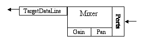

# 采样包概述

> 原文：[`docs.oracle.com/javase/tutorial/sound/sampled-overview.html`](https://docs.oracle.com/javase/tutorial/sound/sampled-overview.html)

[`javax.sound.sampled`](https://docs.oracle.com/javase/8/docs/api/javax/sound/sampled/package-summary.html) 包主要涉及音频传输 - 换句话说，Java Sound API 专注于播放和捕获。 Java Sound API 解决的核心任务是如何将格式化音频数据的字节移入和移出系统。 这项任务涉及打开音频输入和输出设备以及管理填充实时音频数据的缓冲区。 它还可以涉及将多个音频流混合成一个流（无论是用于输入还是输出）。 当用户请求启动、暂停、恢复或停止声音流时，系统内部的声音传输必须得到正确处理。

为了支持对基本音频输入和输出的关注，Java Sound API 提供了在各种音频数据格式之间转换的方法，并且提供了读取和写入常见类型的声音文件的方法。 但是，它并不试图成为一个全面的声音文件工具包。 Java Sound API 的特定实现不必支持广泛的文件类型或数据格式转换。 第三方服务提供商可以提供模块，这些模块可以“插入”到现有实现中，以支持额外的文件类型和转换。

Java Sound API 可以以流式缓冲方式和内存中非缓冲方式处理音频传输。 这里所说的“流式”是指实时处理音频字节； 它并不是指以某种特定格式通过互联网发送音频的众所周知的情况。 换句话说，音频流只是一组连续的音频字节，它们以更多或更少的相同速率到达，以便处理（播放、录制等）。 操作在所有数据到达之前开始。 在流式模型中，特别是在音频输入而不是音频输出的情况下，您不一定事先知道声音的持续时间以及何时会完成到达。 您只需一次处理一个音频数据缓冲区，直到操作停止。 在音频输出（播放）的情况下，如果要播放的声音太大而无法一次性放入内存中，则还需要缓冲数据。 换句话说，您以块的形式将音频字节传递给声音引擎，它会在正确的时间播放每个样本。 提供了机制，使得很容易知道每个块中要传递多少数据。

Java Sound API 还允许在仅播放的情况下进行无缓冲传输，假设您已经拥有所有音频数据并且数据量不太大以适应内存。在这种情况下，应用程序无需缓冲音频，尽管如果需要，仍然可以使用缓冲的实时方法。相反，整个声音可以一次性预加载到内存中以供后续播放。由于所有声音数据都是预先加载的，因此播放可以立即开始，例如，用户点击“开始”按钮时。与缓冲模型相比，这可能是一个优势，因为在缓冲填满之前，播放必须等待第一个缓冲区。此外，内存中的无缓冲模型允许轻松循环（循环）声音或将其设置为数据中的任意位置。

使用 Java Sound API 播放或捕获声音时，您至少需要三样东西：格式化的音频数据，混音器和线路。以下是这些概念的概述。

## 什么是格式化音频数据？

格式化的音频数据指的是任何一种标准格式的声音。Java Sound API 区分*数据格式*和*文件格式*。

### 数据格式

数据格式告诉您如何解释一系列“原始”采样音频数据的字节，例如已从声音文件中读取的样本，或者已从麦克风输入捕获的样本。例如，您可能需要知道一个样本包含多少比特（表示声音的最短瞬间的表示），同样您可能需要知道声音的采样率（样本应该多快地跟随彼此）。在设置播放或捕获时，您指定正在捕获或播放的声音的数据格式。

在 Java Sound API 中，数据格式由一个[`AudioFormat`](https://docs.oracle.com/javase/8/docs/api/javax/sound/sampled/AudioFormat.html)对象表示，其中包括以下属性：

+   编码技术，通常是脉冲编码调制（PCM）

+   通道数（单声道为 1，立体声为 2，等等）

+   采样率（每秒每个通道的样本数）

+   每个样本（每个通道）的比特数

+   帧率

+   每帧大小（以字节为单位）

+   字节顺序（大端或小端）

PCM 是声波的一种编码方式。Java Sound API 包括两种使用线性幅度量化的 PCM 编码，以及带符号或无符号整数值。线性量化意味着每个样本中存储的数字与该瞬间的原始声压（除了任何失真）成正比，类似地与振动声音的扬声器或鼓膜的位移成正比，该振动声音在该瞬间发生。例如，CD 使用线性 PCM 编码的声音。 mu-law 编码和 a-law 编码是常见的非线性编码，它们提供音频数据的更紧缩版本；这些编码通常用于电话或语音录音。非线性编码将原始声音的幅度通过非线性函数映射到存储值，该函数可以设计为给予安静声音比响亮声音更多的幅度分辨率。

一个帧包含特定时间所有通道的数据。对于 PCM 编码的数据，帧只是所有通道在给定时间点的同时样本集，没有任何附加信息。在这种情况下，帧速率等于采样率，帧大小以字节为单位是通道数乘以位采样大小，再除以字节的位数。

对于其他类型的编码，一个帧可能包含除样本之外的附加信息，并且帧速率可能与采样率完全不同。例如，考虑 MP3（MPEG-1 音频第三层）编码，它在当前版本的 Java Sound API 中没有明确提到，但可以由 Java Sound API 的实现或第三方服务提供商支持。在 MP3 中，每个帧包含一系列样本的压缩数据包，而不仅仅是每个通道的一个样本。由于每个帧封装了一整个系列的样本，因此帧速率比采样率慢。帧还包含一个头部。尽管有头部，但帧的字节大小比等量的 PCM 帧的字节大小要小。（毕竟，MP3 的目的是比 PCM 数据更紧凑。）对于这种编码，采样率和采样大小指的是编码后的声音最终将被转换成的 PCM 数据，然后传递给数字模拟转换器（DAC）。

### 文件格式

文件格式指定了声音文件的结构，包括文件中原始音频数据的格式，以及可以存储在文件中的其他信息。声音文件有各种标准品种，如 WAVE（也称为 WAV，通常与 PC 关联）、AIFF（通常与 Macintosh 关联）和 AU（通常与 UNIX 系统关联）。不同类型的声音文件具有不同的结构。例如，它们可能在文件的“头部”中具有不同的数据排列。头部包含描述性信息，通常在文件的实际音频样本之前，尽管一些文件格式允许连续的描述性和音频数据“块”。头部包括规范用于存储声音文件中音频的数据格式。任何这些类型的声音文件都可以包含各种数据格式（尽管通常在给定文件中只有一个数据格式），并且相同的数据格式可以在具有不同文件格式的文件中使用。

在 Java Sound API 中，文件格式由一个[`AudioFileFormat`](https://docs.oracle.com/javase/8/docs/api/javax/sound/sampled/AudioFileFormat.html)对象表示，其中包含：

+   文件类型（WAVE、AIFF 等）

+   文件的字节长度

+   文件中包含的音频数据的帧数长度

+   一个指定文件中包含的音频数据的数据格式的 AudioFormat 对象

[`AudioSystem`](https://docs.oracle.com/javase/8/docs/api/javax/sound/sampled/AudioSystem.html)类提供了用于读取和写入不同文件格式的声音以及在不同数据格式之间转换的方法。其中一些方法允许您通过一种称为[`AudioInputStream`](https://docs.oracle.com/javase/8/docs/api/javax/sound/sampled/AudioInputStream.html)的流来访问文件的内容。`AudioInputStream`是[`InputStream`](https://docs.oracle.com/javase/8/docs/api/java/io/InputStream.html)类的子类，封装了可以按顺序读取的一系列字节。`AudioInputStream`类添加了有关字节音频数据格式的知识（由`AudioFormat`对象表示）到其超类。通过将声音文件作为`AudioInputStream`读取，您可以立即访问样本，而无需担心声音文件的结构（其头部、块等）。单个方法调用将为您提供有关数据格式和文件类型的所有信息。

## 什么是混音器？

许多声音应用程序编程接口（API）使用音频*设备*的概念。设备通常是对物理输入/输出设备的软件接口。例如，声音输入设备可能代表声卡的输入功能，包括麦克风输入、线路级模拟输入，以及可能的数字音频输入。

在 Java Sound API 中，设备由[`Mixer`](https://docs.oracle.com/javase/8/docs/api/javax/sound/sampled/Mixer.html)对象表示。混音器的目的是处理一个或多个音频输入流和一个或多个音频输出流。在典型情况下，它实际上将多个传入流混合成一个传出流。一个`Mixer`对象可以表示物理设备（如声卡）的声音混合功能，该设备可能需要混合从各种输入到计算机的声音，或者从应用程序到输出的声音。

或者，一个`Mixer`对象可以表示完全在软件中实现的声音混合功能，而没有与物理设备的固有接口。

在 Java Sound API 中，诸如声卡上的麦克风输入之类的组件本身并不被视为设备——也就是混音器——而是混音器内或外的*端口*。一个端口通常提供一个音频流进入或离开混音器（尽管该流可以是多声道的，比如立体声）。混音器可能有几个这样的端口。例如，代表声卡输出功能的混音器可能将几个音频流混合在一起，然后将混合信号发送到连接到混音器的任何或所有各种输出端口。这些输出端口可以是（例如）耳机插孔、内置扬声器或线路级输出。

要理解 Java Sound API 中混音器的概念，有助于想象一个物理混音控制台，比如在现场音乐会和录音室中使用的那种。

物理混音控制台

物理混音器有“条带”（也称为“切片”），每个条带代表一个音频信号通过混音器进行处理的路径。该条带有旋钮和其他控件，通过这些控件可以控制该条带中信号的音量和声像（在立体声图像中的位置）。此外，混音器可能有一个用于混响等效果的单独总线，该总线可以连接到内部或外部混响单元。每个条带都有一个电位器，用于控制该条带信号的多少进入混响混合中。混响（“湿”）混合然后与来自条带的“干”信号混合。物理混音器将这个最终混合发送到一个输出总线，通常连接到磁带录音机（或基于磁盘的录音系统）和/或扬声器。

想象一场正在立体录制的现场音乐会。来自舞台上许多麦克风和电子乐器的电缆（或无线连接）插入混音台的输入。每个输入都进入混音器的一个单独条道，如图所示。音响工程师决定增益、声像和混响控件的设置。所有条道和混响单元的输出混合成两个声道。这两个声道进入混音器的两个输出，插入连接到立体磁带录音机输入的电缆中。这两个声道可能也通过放大器发送到大厅的扬声器，这取决于音乐类型和大厅的大小。

现在想象一个录音室，在录音室中，每个乐器或歌手都被录制到多轨磁带录音机的单独轨道上。在所有乐器和歌手都被录制后，录音工程师执行“混音”操作，将所有录制的轨道组合成可以分发到 CD 上的两声道（立体声）录音。在这种情况下，混音器条的每个输入不是麦克风，而是多轨录音的一个轨道。工程师可以再次使用条上的控件来决定每个轨道的音量、声像和混响量。混音器的输出再次进入立体录音机和立体扬声器，就像现场音乐会的例子一样。

这两个例子说明了混音器的两种不同用途：捕获多个输入通道，将它们组合成较少的轨道并保存混合物，或者播放多个轨道同时将它们混合成较少的轨道。

在 Java Sound API 中，混音器可以类似地用于输入（捕获音频）或输出（播放音频）。在输入的情况下，混音器获取音频进行混音的*源*是一个或多个输入端口。混音器将捕获和混合的音频流发送到其*目标*，这是一个带有缓冲区的对象，应用程序可以从中检索这些混合音频数据。在音频输出的情况下，情况则相反。混音器的音频源是一个或多个包含缓冲区的对象，其中一个或多个应用程序将其声音数据写入其中；混音器的目标是一个或多个输出端口。

## 什么是一条线？

一个物理混音台的隐喻也有助于理解 Java Sound API 对*线路*概念的理解。

一条线是数字音频“管道”的一个元素，即将音频移入或移出系统的路径。通常，该线路是进入或离开混音器的路径（尽管从技术上讲，混音器本身也是一种线路）。

音频输入和输出端口是线路。这些类似于连接到物理混音台的麦克风和扬声器。另一种线路是应用程序可以通过其中获取输入音频或将输出音频发送到混音器的数据路径。这些数据路径类似于连接到物理混音台的多轨录音机的轨道。

Java Sound API 中的线路与物理混音器的一个区别是，通过 Java Sound API 中的线路流动的音频数据可以是单声道或多声道（例如，立体声）。相比之下，物理混音器的每个输入和输出通常是单声道的声音。要从物理混音器获得两个或更多声道的输出，通常会使用两个或更多个物理输出（至少在模拟声音的情况下；数字输出插孔通常是多声道的）。在 Java Sound API 中，线路中的声道数由当前流经线路的数据的[`AudioFormat`](https://docs.oracle.com/javase/8/docs/api/javax/sound/sampled/AudioFormat.html)指定。

现在让我们来看一些特定类型的线路和混音器。以下图表显示了 Java Sound API 实现的简单音频输出系统中不同类型的线路：

音频输出的可能配置线路

在这个例子中，一个应用程序已经获得了音频输入混音器的一些可用输入：一个或多个*片段*和*源数据线路*。片段是一个混音器输入（一种线路），你可以在播放之前将音频数据加载到其中；源数据线路是一个接受实时音频数据流的混音器输入。应用程序将音频数据从声音文件预加载到片段中。然后，它将其他音频数据一次一个缓冲区地推送到源数据线路中。混音器从所有这些线路中读取数据，每个线路可能有自己的混响、增益和声像控制，并将干净的音频信号与湿润（混响）混合。混音器将最终输出传送到一个或多个输出端口，例如扬声器、耳机插孔和线路输出插孔。

尽管在图中各个线路被描绘为单独的矩形，但它们都是混音器的“所有权”，可以被视为混音器的组成部分。混响、增益和声像矩形代表混音器可以应用于流经线路的数据的处理控制（而不是线路）。

请注意，这只是 API 支持的可能混音器的一个示例。并非所有音频配置都具有所示的所有功能。个别源数据线路可能不支持声像控制，混音器可能不实现混响等。

一个简单的音频输入系统可能类似：

音频输入线路的可能配置

在这里，数据从一个或多个输入端口流入混音器，通常是麦克风或线路输入插孔。增益和声像被应用，混音器通过混音器的目标数据线将捕获的数据传递给应用程序。目标数据线是混音器的输出，包含流式输入声音的混合物。最简单的混音器只有一个目标数据线，但有些混音器可以同时将捕获的数据传递给多个目标数据线。

### 线接口层次结构

现在我们已经看到了一些关于线路和混音器的功能图片，让我们从稍微更具编程视角的角度来讨论它们。通过基本[`Line`](https://docs.oracle.com/javase/8/docs/api/javax/sound/sampled/Line.html)接口的子接口定义了几种类型的线路。接口层次结构如下所示。

线接口层次结构

基本接口[`Line`](https://docs.oracle.com/javase/8/docs/api/javax/sound/sampled/Line.html)描述了所有线路共有的最小功能：

+   控件 - 数据线和端口通常具有一组控件，影响通过线路传递的音频信号。Java Sound API 指定了可以用于操纵声音方面的控件类，例如：增益（影响信号的分贝音量）、声像（影响声音的左右定位）、混响（为声音添加混响以模拟不同种类的房间声学）和采样率（影响播放速率以及声音的音调）。

+   打开或关闭状态 - 成功打开线路保证已为线路分配了资源。混音器具有有限数量的线路，因此在某些时候，多个应用程序（或同一个应用程序）可能会竞争使用混音器的线路。关闭线路表示线路使用的任何资源现在可以被释放。

+   事件 - 当线路打开或关闭时，线路会生成事件。`Line`的子接口可以引入其他类型的事件。当线路生成事件时，事件会发送给所有已注册在该线路上“监听”事件的对象。应用程序可以创建这些对象，将它们注册为监听线路事件，并根据需要对事件做出反应。

现在我们将检查`Line`接口的子接口。

[`端口`](https://docs.oracle.com/javase/8/docs/api/javax/sound/sampled/Port.html)是用于音频输入或输出到音频设备的简单线路。如前所述，一些常见类型的端口是麦克风、线路输入、CD-ROM 驱动器、扬声器、耳机和线路输出。

[`Mixer`](https://docs.oracle.com/javase/8/docs/api/javax/sound/sampled/Mixer.html)接口代表一个混音器，当然，正如我们所见，它代表一个硬件或软件设备。`Mixer`接口提供了获取混音器线的方法。这些包括源线，将音频馈送到混音器，以及目标线，混音器将其混合音频传递给的线。对于音频输入混音器，源线是输入端口，如麦克风输入，目标线是[`TargetDataLines`](https://docs.oracle.com/javase/8/docs/api/javax/sound/sampled/TargetDataLine.html)（下文描述），它会将音频传递给应用程序。另一方面，对于音频输出混音器，源线是[`Clips`](https://docs.oracle.com/javase/8/docs/api/javax/sound/sampled/Clip.html)或[`SourceDataLines`](https://docs.oracle.com/javase/8/docs/api/javax/sound/sampled/SourceDataLine.html)（下文描述），应用程序向其馈送音频数据，目标线是输出端口，如扬声器。

一个`Mixer`被定义为具有一个或多个源线和一个或多个目标线。请注意，这个定义意味着一个混音器不一定实际混合数据；它可能只有一个单一的源线。`Mixer` API 旨在涵盖各种设备，但典型情况下支持混音。

`Mixer`接口支持同步；也就是说，您可以指定一个混音器的两个或多个线被视为同步组。然后，您可以通过向组中的任何线发送单个消息来启动、停止或关闭所有这些数据线，而不必单独控制每条线。使用支持此功能的混音器，您可以在线之间获得样本精确的同步。

通用的`Line`接口不提供启动和停止播放或录制的方法。为此，您需要一个数据线。[`DataLine`](https://docs.oracle.com/javase/8/docs/api/javax/sound/sampled/DataLine.html)接口提供了以下额外的与媒体相关的功能，超出了`Line`的功能：

+   音频格式 – 每个数据线都有与其数据流相关联的音频格式。

+   媒体位置 – 数据线可以报告其在媒体中的当前位置，以采样帧表示。这代表自数据线打开以来捕获或渲染的采样帧数量。

+   缓冲区大小 – 这是数据线内部缓冲区的大小，以字节为单位。对于源数据线，内部缓冲区是可以写入数据的，对于目标数据线，它是可以读取数据的。

+   音量（音频信号的当前振幅）

+   启动和停止播放或捕获

+   暂停和恢复播放或捕获

+   刷新（丢弃队列中的未处理数据）

+   排空（阻塞直到队列中的所有未处理数据都被排空，并且数据线的缓冲区变为空）

+   活动状态 – 如果数据线参与从混音器捕获音频数据或向混音器捕获音频数据，则被视为活动状态。

+   事件 – `START` 和 `STOP` 事件在从数据线开始或停止活动演示或捕获数据时产生。

`TargetDataLine` 从混音器接收音频数据。通常，混音器从诸如麦克风之类的端口捕获音频数据；在将数据放入目标数据线缓冲区之前，它可能会处理或混合此捕获的音频。`TargetDataLine` 接口提供了从目标数据线缓冲区读取数据的方法，并确定当前可用于读取的数据量。

`SourceDataLine` 接收用于播放的音频数据。它提供了将数据写入源数据线缓冲区以进行播放的方法，并确定数据线准备接收多少数据而不会阻塞。

`Clip` 是一个数据线，可以在播放之前加载音频数据。由于数据是预加载而不是流式传输，因此在播放之前可以知道剪辑的持续时间，并且可以选择媒体中的任何起始位置。剪辑可以循环播放，意味着在播放时，两个指定循环点之间的所有数据将重复指定次数，或者无限循环。

本节介绍了采样音频 API 中大部分重要的接口和类。后续章节将展示如何在应用程序中访问和使用这些对象。
