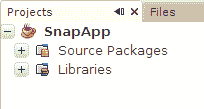

# 创建一个项目

> 原文：[`docs.oracle.com/javase/tutorial/javabeans/quick/project.html`](https://docs.oracle.com/javase/tutorial/javabeans/quick/project.html)

学习 JavaBeans 最简单的方法是开始使用它们。首先，[下载并安装最新版本的 NetBeans](http://netbeans.org/)。本教程描述了如何使用 NetBeans 7.0 版本。

NetBeans 是一个*bean 构建工具*，这意味着它识别 JavaBeans 组件（bean）并使您能够轻松地将组件拼接在一起形成应用程序。

## 按钮是一个 Bean

启动 NetBeans。从菜单中选择**文件 > 新建项目...**。

点击查看完整图片

从**类别**列表中选择**Java**，从**项目**列表中选择**Java 应用程序**。点击**下一步 >**。

点击查看完整图片

输入**SnapApp**作为应用程序名称。取消选中**创建主类**，然后点击**完成**。NetBeans 创建新项目，您可以在 NetBeans 的**项目**窗格中看到它：

在**SnapApp**项目上按住控制键单击，从弹出菜单中选择**新建 > JFrame 表单...**。

点击查看完整图片

在类名中填写**SnapFrame**，包名填写**snapapp**。点击**完成**。NetBeans 创建新类并显示其可视化设计工具：

点击查看完整图片

在左侧的**项目**窗格中，您可以看到新创建的`SnapFrame`类。屏幕中央是 NetBeans 的可视化设计工具。右侧是**Palette**，其中包含您可以在可视化设计工具中添加到框架中的所有组件。
