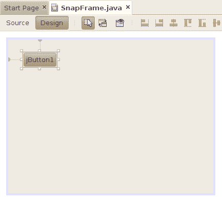
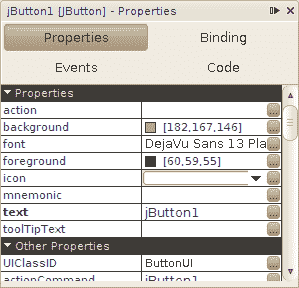
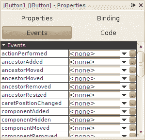
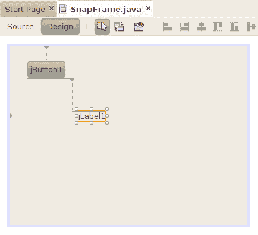

# 一个按钮是一个 Bean

> 原文：[`docs.oracle.com/javase/tutorial/javabeans/quick/button.html`](https://docs.oracle.com/javase/tutorial/javabeans/quick/button.html)

仔细看看**工具栏**。列出的所有组件都是 bean。组件按功能分组。滚动查找**Swing 控件**组，然后点击**按钮**并将其拖到可视化设计器中。按钮就是一个 bean！

在 NetBeans 右侧的工具栏下方是一个检查器窗格，你可以用它来检查和操作按钮。尝试关闭底部的输出窗口，以便给检查器窗格更多的空间。

## 属性

一个 bean 的属性是你可以改变的影响其外观或内部状态的事物。在这个例子中的按钮，属性包括前景色、字体和按钮上显示的文本。属性分为两组。**属性**列出了最常用的属性，而**其他属性**显示了不常用的属性。

继续编辑按钮的属性。对于一些属性，你可以直接在表格中输入值。对于其他属性，点击**...**按钮来编辑值。例如，点击**前景**属性右侧的**...**。一个颜色选择对话框弹出，你可以选择一个新的前景文本颜色。尝试一些其他属性看看会发生什么。注意你没有编写任何代码。

## 事件

Bean 也可以触发事件。点击 bean 属性窗格中的**事件**按钮。你会看到按钮能够触发的每一个事件的列表。

你可以使用 NetBeans 来通过它们的事件和属性连接 bean。要看看这是如何工作的，从工具栏中拖动一个**标签**到`SnapFrame`的可视化设计器中。

编辑标签的属性，直到看起来完美为止。
