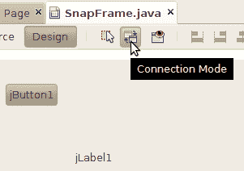

# 连接应用程序

> 原文：[`docs.oracle.com/javase/tutorial/javabeans/quick/wiring.html`](https://docs.oracle.com/javase/tutorial/javabeans/quick/wiring.html)

要将按钮和标签连接在一起，请点击可视化设计工具栏中的**连接模式**按钮。

点击`SnapFrame`表单中的按钮。NetBeans 用红色轮廓显示按钮，以显示它是将生成事件的组件。

点击标签。NetBeans 的**连接向导**弹出。首先，您将选择要响应的事件。对于按钮来说，这是**动作**事件。点击**动作**旁边的**+**，然后选择**actionPerformed**。点击**下一步**。

现在您可以选择按钮触发其**动作**事件时发生的情况。**连接向导**列出标签 bean 中的所有属性。在列表中选择**text**，然后点击**下一步**。

在**连接向导**的最后一个屏幕中，填写您希望为**text**属性设置的值。点击**值**，然后输入**您按下了按钮！**或类似的内容。点击**完成**。

NetBeans 将组件连接在一起，并在源代码编辑器中展示其成果。

点击源代码工具栏中的**设计**按钮返回 UI 设计器。点击**运行主项目**或按**F6**构建和运行您的项目。

NetBeans 构建并运行项目。它会要求您标识主类，即`SnapFrame`。当应用程序窗口弹出时，点击按钮。您将在标签中看到您的不朽散文。

请注意，您没有编写任何代码。这就是 JavaBeans 的真正力量——借助像 NetBeans 这样的优秀构建工具，您可以快速将组件连接在一起，创建一个运行的应用程序。
