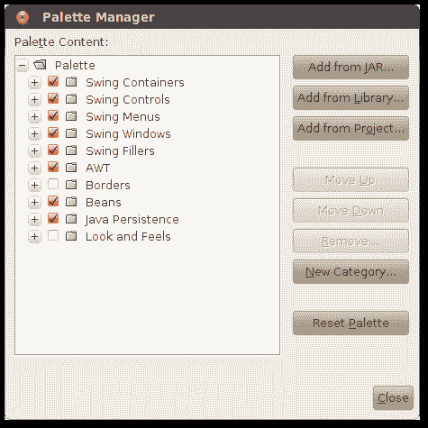
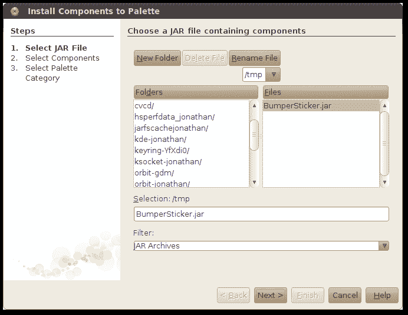
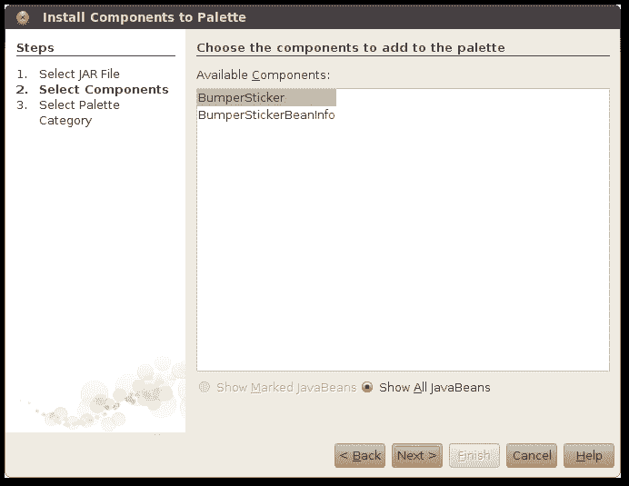
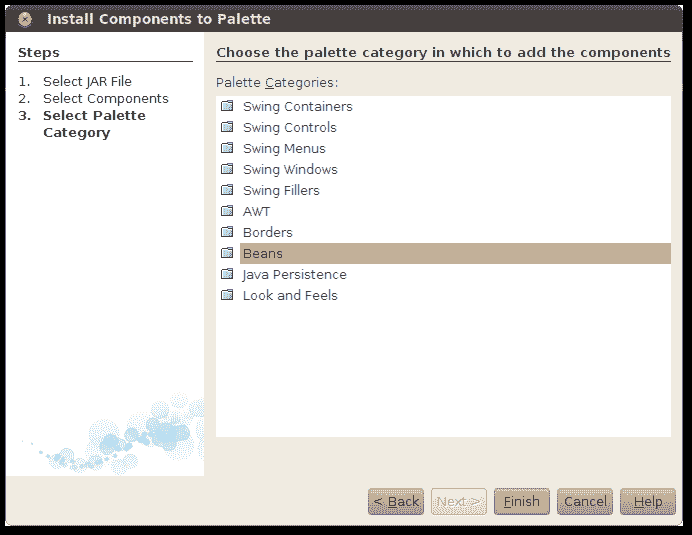
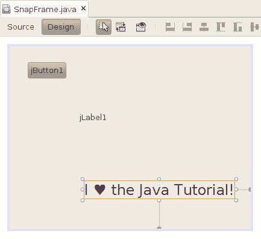
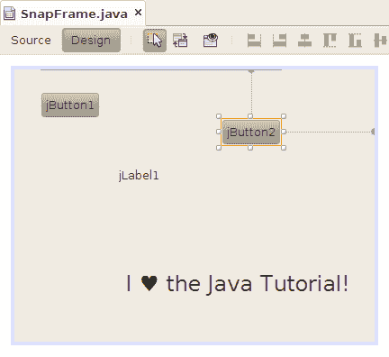
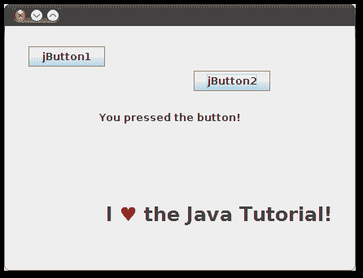

# 使用第三方 Bean

> 原文：[`docs.oracle.com/javase/tutorial/javabeans/quick/addbean.html`](https://docs.oracle.com/javase/tutorial/javabeans/quick/addbean.html)

几乎任何代码都可以打包为 bean。到目前为止，您看到的 bean 都是可视化 bean，但 bean 可以提供功能而不必具有可见组件。

JavaBeans 的强大之处在于您可以使用软件组件，而无需编写它们或了解其实现。

本页描述了如何将 JavaBean 添加到您的应用程序中，并利用其功能。

## 添加一个 Bean 到 NetBeans 调色板

下载`一个示例 JavaBean 组件，`BumperSticker``。Beans 以 JAR 文件的形式分发。将文件保存在计算机的某个位置。`BumperSticker`是一个图形组件，公开一个名为`go()`的方法，用于启动动画。

要将`BumperSticker`添加到 NetBeans 调色板中，请从 NetBeans 菜单中选择**工具 > 调色板 > Swing/AWT 组件**。

点击**从 JAR 添加...**按钮。NetBeans 会要求您定位包含您希望添加到调色板中的 bean 的 JAR 文件。找到您刚下载的文件，然后点击**下一步**。

NetBeans 显示了 JAR 文件中的类列表。选择您希望添加到调色板中的类。在这种情况下，选择**BumperSticker**并点击**下一步**。

最后，NetBeans 需要知道调色板的哪个部分将接收新的 bean。选择**Beans**，然后点击**完成**。

点击**关闭**使**调色板管理器**窗口消失。现在看看调色板。`BumperSticker`在**Beans**部分中。

## 使用您的新 JavaBean

将`BumperSticker`从调色板拖到您的表单中。

您可以像处理其他 bean 一样处理`BumperSticker`实例。要看到这一点，将另一个按钮拖到表单中。这个按钮将启动`BumperSticker`的动画。

将按钮连接到`BumperSticker` bean，就像您已经将第一个按钮连接到文本字段一样。

1.  首先，点击**连接模式**按钮。

1.  点击第二个按钮。NetBeans 会给它一个红色轮廓。

1.  点击`BumperSticker`组件。**连接向导**弹出。

1.  点击**+**旁边的**action**，然后选择**actionPerformed**。点击**下一步 >**。

1.  选择**方法调用**，然后从列表中选择**go()**。点击**完成**。

如果您对任何步骤感到不确定，请查看连接应用程序。这里的过程非常相似。

再次运行该应用程序。当你点击第二个按钮时，`BumperSticker` 组件会动画显示心形的颜色。

再次注意，你已经制作出一个功能完善的应用程序，而没有编写任何代码。

