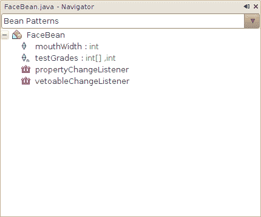

# 属性

> 原文：[`docs.oracle.com/javase/tutorial/javabeans/writing/properties.html`](https://docs.oracle.com/javase/tutorial/javabeans/writing/properties.html)

要在 bean 类中定义属性，请提供公共的 getter 和 setter 方法。例如，以下方法定义了一个名为`mouthWidth`的`int`属性：

```java
public class FaceBean {
    private int mMouthWidth = 90;

    public int getMouthWidth() {
        return mMouthWidth;
    }

    public void setMouthWidth(int mw) {
        mMouthWidth = mw;
    }
}

```

像 NetBeans 这样的构建工具识别方法名，并在其属性列表中显示`mouthWidth`属性。它还识别类型`int`，并提供一个适当的编辑器，以便在设计时操作属性。

此示例显示了一个可读写的属性。还有其他组合也是可能的。例如，只读属性具有 getter 方法但没有 setter。只写属性只有 setter 方法。

`boolean`属性的特殊情况允许使用`is`而不是`get`来定义访问方法。例如，`boolean`属性`running`的访问器可以如下所示：

```java
public boolean isRunning() {
    // ...
}

```

可用并在以下部分描述基本属性的各种特殊化。

## 索引属性

*索引*属性是一个数组而不是单个值。在这种情况下，bean 类提供了一个用于获取和设置整个数组的方法。以下是一个名为`testGrades`的`int[]`属性的示例：

```java
public int[] getTestGrades() {
    return mTestGrades;
}

public void setTestGrades(int[] tg) {
    mTestGrades = tg;
}

```

对于索引属性，bean 类还提供了用于获取和设置数组特定元素的方法。

```java
public int getTestGrades(int index) {
    return mTestGrades[index];
}

public void setTestGrades(int index, int grade) {
    mTestGrades[index] = grade;
}

```

## 绑定属性

*绑定*属性在其值更改时通知监听器。这有两个含义：

1.  bean 类包括用于管理 bean 监听器的`addPropertyChangeListener()`和`removePropertyChangeListener()`方法。

1.  当绑定属性更改时，bean 向其注册的监听器发送`PropertyChangeEvent`。

`PropertyChangeEvent`和`PropertyChangeListener`位于`java.beans`包中。

`java.beans`包还包括一个名为`PropertyChangeSupport`的类，它负责大部分绑定属性的工作。这个方便的类跟踪属性监听器，并包含一个方便的方法，向所有注册的监听器触发属性更改事件。

以下示例显示了如何使用`PropertyChangeSupport`使`mouthWidth`属性成为绑定属性。绑定属性的必要添加部分用粗体显示。

```java
import java.beans.*;

public class FaceBean {
    private int mMouthWidth = 90;
    private PropertyChangeSupport mPcs =
        new PropertyChangeSupport(this);

    public int getMouthWidth() {
        return mMouthWidth;
    }

    public void setMouthWidth(int mw) {
        int oldMouthWidth = mMouthWidth;
        mMouthWidth = mw;
        mPcs.firePropertyChange("mouthWidth",
                                   oldMouthWidth, mw);
    }

    public void
    addPropertyChangeListener(PropertyChangeListener listener) {
        mPcs.addPropertyChangeListener(listener);
    }

    public void
    removePropertyChangeListener(PropertyChangeListener listener) {
        mPcs.removePropertyChangeListener(listener);
    }
}

```

绑定属性可以直接与其他 bean 属性绑定，使用像 NetBeans 这样的构建工具。例如，您可以将滑块组件的`value`属性绑定到示例中显示的`mouthWidth`属性。NetBeans 允许您在不编写任何代码的情况下执行此操作。

## 约束属性

*约束*属性是一种特殊类型的绑定属性。对于约束属性，bean 跟踪一组*否决*监听器。当约束属性即将更改时，监听器会就更改进行协商。任何一个监听器都有机会否决更改，此时属性保持不变。

否决监听器与属性更改监听器是分开的。幸运的是，`java.beans`包中包含一个`VetoableChangeSupport`类，大大简化了受限属性。

对`mouthWidth`示例的更改显示为粗体：

```java
import java.beans.*;

public class FaceBean {
    private int mMouthWidth = 90;
    private PropertyChangeSupport mPcs =
        new PropertyChangeSupport(this);
    private VetoableChangeSupport mVcs =
        new VetoableChangeSupport(this);

    public int getMouthWidth() {
        return mMouthWidth;
    }

    public void
    setMouthWidth(int mw) throws PropertyVetoException {
        int oldMouthWidth = mMouthWidth;
        mVcs.fireVetoableChange("mouthWidth",
                                    oldMouthWidth, mw);
        mMouthWidth = mw;
        mPcs.firePropertyChange("mouthWidth",
                                 oldMouthWidth, mw);
    }

    public void
    addPropertyChangeListener(PropertyChangeListener listener) {
        mPcs.addPropertyChangeListener(listener);
    }

    public void
    removePropertyChangeListener(PropertyChangeListener listener) {
        mPcs.removePropertyChangeListener(listener);
    }

    public void
    addVetoableChangeListener(VetoableChangeListener listener) {
        mVcs.addVetoableChangeListener(listener);
    }

    public void
    removeVetoableChangeListener(VetoableChangeListener listener) {
        mVcs.removeVetoableChangeListener(listener);
    }
}

```

## NetBeans 中的开发支持

创建 bean 属性的编码模式很简单，但有时很难确定是否一切都正确。NetBeans 支持属性模式，因此您在编写代码时可以立即看到结果。

要利用此功能，请查看**Navigator**窗格，通常位于 NetBeans 窗口的左下角。通常，此窗格处于**Members View**模式，显示当前类中定义的所有方法和字段。

单击组合框切换到**Bean Patterns**视图。您将看到一个属性列表，其中列出了 NetBeans 可以从您的方法定义中推断出的属性。随着您的输入，NetBeans 会更新此列表，这是检查您工作的方便方式。

在下面的示例中，NetBeans 发现了可读写的`mouthWidth`属性和可读写的索引`testGrades`属性。此外，NetBeans 还意识到`FaceBean`允许注册`PropertyChangeListener`和`VetoableChangeListener`。


