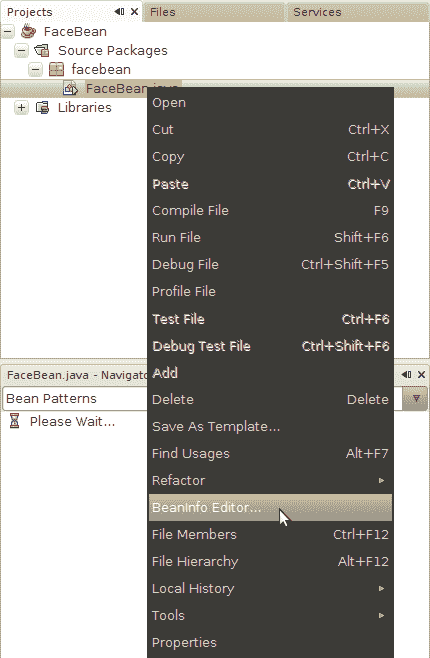
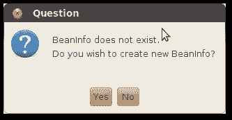

# 使用 BeanInfo

> 原文：[`docs.oracle.com/javase/tutorial/javabeans/writing/beaninfo.html`](https://docs.oracle.com/javase/tutorial/javabeans/writing/beaninfo.html)

Bean，尤其是图形组件，可能有大量属性。如果你的类继承自 `Component`、`JComponent` 或其他 Swing 类，它已经拥有一百多个属性。虽然像 NetBeans 这样的构建工具使编辑 bean 属性变得容易，但对于经验不足的程序员来说，很难找到要编辑的正确属性。

## `BeanInfo` 概述

`BeanInfo` 是一个改变你的 bean 在构建工具中显示方式的类。构建工具可以查询 `BeanInfo` 以找出应该首先显示哪些属性以及哪些应该隐藏。

你的 bean 对应的 `BeanInfo` 类应该与 bean 类同名，只是在末尾加上 `BeanInfo`。例如，`FaceBean` 类有一个对应的描述它的 `FaceBeanBeanInfo` 类。

虽然可以手动实现 `BeanInfo` 类，但使用像 NetBeans 这样的工具来编辑 `BeanInfo` 会更容易。

## 在 NetBeans 中创建 `BeanInfo`

在**项目**窗格中，按住 Control 键单击 bean 类的名称，然后从上下文菜单中选择**BeanInfo Editor...**。

NetBeans 注意到你没有 `BeanInfo` 并询问是否要创建一个。点击**Yes**。

NetBeans 会创建一个新的类并将你带到源代码编辑器。点击**Designer**切换到可视化编辑器。

点击查看完整图片

从可视化编辑器左侧的列表中选择属性，然后在右侧编辑其属性。如果你不希望某个特定属性出现在使用构建工具的开发人员面前，点击**Hidden**。要表示某个属性应该在其他属性之前显示，点击**Preferred**。你还可以指示属性是否绑定或受限。

你可以为 bean 的事件源和方法提供类似的信息。

当构建工具加载你的 bean 类以将其添加到工具栏时，它会自动找到相应的 `BeanInfo` 并用它来决定如何向开发人员展示你的 bean。
