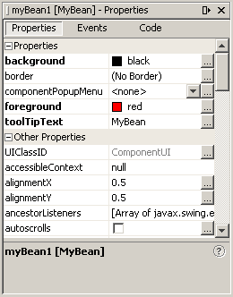

# Bean 自定义

> 原文：[`docs.oracle.com/javase/tutorial/javabeans/advanced/customization.html`](https://docs.oracle.com/javase/tutorial/javabeans/advanced/customization.html)

*自定义*提供了一种修改 Bean 外观和行为的方式，使其在应用程序构建器中满足您的特定需求。对于 Bean 开发人员，有几个级别的自定义可用，以允许其他开发人员充分利用 Bean 的潜在功能。

* * *

以下链接对学习有关属性编辑器和自定义器很有用：

+   [`PropertyEditor`](https://docs.oracle.com/javase/8/docs/api/java/beans/PropertyEditor.html) 接口

+   [`PropertyEditorSupport`](https://docs.oracle.com/javase/8/docs/api/java/beans/PropertyEditorSupport.html) 类

+   [`PropertyEditorManager`](https://docs.oracle.com/javase/8/docs/api/java/beans/PropertyEditorManager.html) 类

+   [`Customizer`](https://docs.oracle.com/javase/8/docs/api/java/beans/Customizer.html) 接口

+   [`BeanInfo`](https://docs.oracle.com/javase/8/docs/api/java/beans/BeanInfo.html) 接口

* * *

在符合 Beans 规范的构建工具中，可以在设计时自定义 Bean 的外观和行为。有两种方式可以自定义 Bean：

+   通过使用*属性编辑器*。每个 Bean 属性都有自己的属性编辑器。NetBeans GUI Builder 通常在属性窗口中显示 Bean 的属性编辑器。与特定属性类型相关联的属性编辑器编辑该属性类型。

+   通过使用*自定义器*。自定义器为您提供了完全的 GUI 控制权，用于对 Bean 进行自定义。当属性编辑器不实用或不适用时，将使用自定义器。与属性关联的属性编辑器不同，自定义器与 Bean 关联。

## 属性编辑器

属性编辑器是用于自定义特定属性类型的工具。属性编辑器在属性窗口中激活。此窗口确定属性的类型，搜索相关的属性编辑器，并以相关方式显示属性的当前值。

属性编辑器必须实现`PropertyEditor`接口，该接口提供了指定属性在属性表中如何显示的方法。以下图表示包含`myBean1`属性的属性窗口：



您可以通过单击属性条目开始编辑这些属性。单击大多数条目将弹出单独的面板。例如，要设置`foreground`或`background`，请使用带有颜色选择的选择框，或按下“…”按钮以使用标准 ColorEditor 窗口。单击`toolTipText`属性将打开 StringEditor 窗口。

支持类`PropertyEditorSupport`提供了`PropertyEditor`接口的默认实现。通过从`PropertyEditorSupport`子类化您的属性编辑器，您可以简单地重写您需要的方法。

要在属性窗口中显示当前属性值"sample"，需要重写`isPaintable`以返回`true`。然后必须重写`paintValue`以在属性表中的矩形中绘制当前属性值。以下是`ColorEditor`如何实现`paintValue`：

```java
public void paintValue(java.awt.Graphics gfx, java.awt.Rectangle box) {
    Color oldColor = gfx.getColor();
    gfx.setColor(Color.black);
    gfx.drawRect(box.x, box.y, box.width-3, box.height-3);
    gfx.setColor(color);
    gfx.fillRect(box.x+1, box.y+1, box.width-4, box.height-4);
    gfx.setColor(oldColor);
}

```

要支持自定义属性编辑器，需要重写另外两个方法。重写`supportsCustomEditor`以返回 true，然后重写`getCustomEditor`以返回自定义编辑器实例。`ColorEditor.getCustomEditor`返回`this`。

此外，`PropertyEditorSupport`类维护一个`PropertyChangeListener`列表，并在绑定属性更改时向这些侦听器发送属性更改事件通知。

## 如何将属性编辑器与属性关联

属性编辑器是通过以下方式发现并与给定属性关联的：

+   通过`BeanInfo`对象进行显式关联。标题的编辑器通过以下代码行设置：

    ```java
    pd.setPropertyEditorClass(TitleEditor.class);

    ```

+   通过`java.beans.PropertyEditorManager.registerEditor`方法进行显式注册。此方法接受两个参数：bean 类类型和要与该类型关联的编辑器类。

+   名称搜索。如果一个类没有明确关联的属性编辑器，那么`PropertyEditorManager`将通过以下方式搜索该类的属性编辑器：

    +   将"Editor"附加到完全限定的类名。例如，对于`my.package.ComplexNumber`类，属性编辑器管理器将搜索`my.package.ComplexNumberEditor`类。

    +   将"Editor"附加到类名并搜索类路径。

## 自定义器

您已经了解到构建工具为您创建自己的属性编辑器提供支持。对于复杂的、工业强度的 bean，视觉构建器应满足哪些其他需求？有时，将一个单一根选择关于 bean 类型渲染的一半属性变得无关紧要是不可取的。JavaBeans 规范提供了用户定义的自定义器，通过它们您可以为 bean 属性定义比属性编辑器提供的更高级别的定制。

当您使用一个 bean *自定义器*时，您完全控制如何配置或编辑一个 bean。自定义器是专门针对 bean 定制的应用程序。有时属性不足以表示 bean 的可配置属性。自定义器用于需要复杂指令来更改 bean 的地方，以及属性编辑器过于原始无法实现 bean 定制的地方。

所有自定义器必须：

+   扩展`java.awt.Component`或其子类之一。

+   实现`java.beans.Customizer`接口，这意味着实现方法来注册`PropertyChangeListener`对象，并在目标 bean 发生更改时向这些侦听器触发属性更改事件。

+   实现一个默认构造函数。

+   通过`BeanInfo.getBeanDescriptor`将自定义器与其目标类关联。
