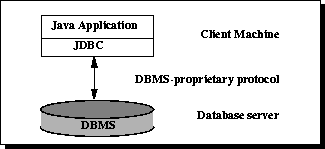
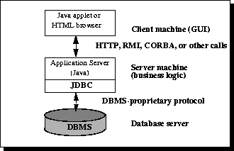

# JDBC 架构

> 原文：[`docs.oracle.com/javase/tutorial/jdbc/overview/architecture.html`](https://docs.oracle.com/javase/tutorial/jdbc/overview/architecture.html)

JDBC API 支持数据库访问的两层和三层处理模型。

图 1：用于数据访问的两层架构。

在两层模型中，Java 小程序或应用程序直接与数据源通信。这需要一个能够与被访问的特定数据源通信的 JDBC 驱动程序。用户的命令被传递到数据库或其他数据源，并将这些语句的结果发送回用户。数据源可能位于用户通过网络连接的另一台机器上。这被称为客户端/服务器配置，用户的机器是客户端，而托管数据源的机器是服务器。网络可以是一个内部网络，例如连接公司内部员工的网络，也可以是互联网。

在三层模型中，命令被发送到一个“中间层”服务，然后再将命令发送到数据源。数据源处理命令并将结果发送回中间层，然后再发送给用户。MIS 主管发现三层模型非常有吸引力，因为中间层使得可以控制对企业数据的访问和更新类型。另一个优点是简化了应用程序的部署。最后，在许多情况下，三层架构可以提供性能优势。

图 2：用于数据访问的三层架构。

直到最近，中间层通常是用诸如 C 或 C++之类的语言编写的，这些语言提供了快速的性能。然而，随着将 Java 字节码转换为高效的机器特定代码的优化编译器的引入，以及诸如 Enterprise JavaBeans™之类的技术，Java 平台正迅速成为中间层开发的标准平台。这是一个巨大的优势，使得可以利用 Java 的健壮性、多线程和安全功能。

随着企业越来越多地使用 Java 编程语言编写服务器代码，JDBC API 在三层架构的中间层中被越来越多地使用。使 JDBC 成为服务器技术的一些特点包括其支持连接池、分布式事务和断开的行集。JDBC API 也是允许从 Java 中间层访问数据源的途径。
