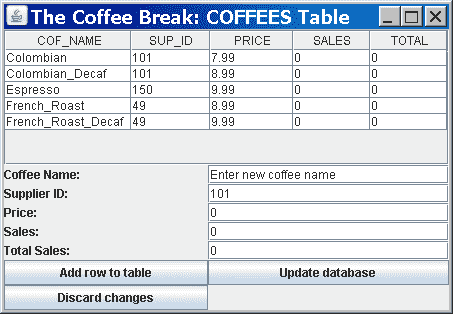

# 使用 GUI API 的 JDBC

> 原文：[`docs.oracle.com/javase/tutorial/jdbc/basics/jdbcswing.html`](https://docs.oracle.com/javase/tutorial/jdbc/basics/jdbcswing.html)

示例`CoffeesFrame.java`演示了如何将 JDBC 与 GUI API 集成，特别是 Swing API。它在表中显示了`COFFEES`数据库表的内容，并包含字段和按钮，使您可以向表中添加行。以下是此示例的屏幕截图：



该示例包含五个文本字段，对应于`COFFEES`表中的每一列。它还包含三个按钮：

+   **向表中添加行**：根据文本字段中输入的数据向示例表中添加一行。

+   **更新数据库**：根据示例表中的数据更新`COFFEES`表。

+   **放弃更改**：检索`COFFEES`表的内容，替换示例表中的现有数据。

这个示例（需要`CoffeesTableModel.java`）演示了将 JDBC 与 Swing API 集成的一般步骤：

1.  实现`TableModel`接口

1.  实现`RowSetListener`接口

1.  布局 Swing 组件

1.  为示例中的按钮添加监听器

## 实现 javax.swing.event.TableModel

`TableModel`接口使得 Java Swing 应用程序能够管理`JTable`对象中的数据。示例`CoffeesTableModel.java`实现了这个接口。它指定了`JTable`对象应该如何从`RowSet`对象中检索数据并在表中显示。

**注意**：尽管此示例在 Swing 应用程序中显示了`COFFEES`表的内容，但`CoffeesTableModel`类应该适用于任何 SQL 表，只要它的数据可以用`String`对象表示。（但是，用于向`COFFEES`添加行的字段，这些字段在`CoffeesFrame`类中指定，必须针对其他 SQL 表进行修改。）

在实现`TableModel`接口的方法之前，`CoffeeTableModel`类的构造函数初始化了为这些实现方法所需的各种成员变量，如下所示：

```java
public CoffeesTableModel(CachedRowSet rowSetArg)
    throws SQLException {

    this.coffeesRowSet = rowSetArg;
    this.metadata = this.coffeesRowSet.getMetaData();
    numcols = metadata.getColumnCount();

    // Retrieve the number of rows.
    this.coffeesRowSet.beforeFirst();
    this.numrows = 0;
    while (this.coffeesRowSet.next()) {
        this.numrows++;
    }
    this.coffeesRowSet.beforeFirst();
}

```

以下描述了在这个构造函数中初始化的成员变量：

+   `CachedRowSet coffeesRowSet`：存储`COFFEES`表的内容。

    本示例使用`RowSet`对象，特别是`CachedRowSet`对象，而不是`ResultSet`对象，有两个原因。`CachedRowSet`对象使应用程序的用户能够对其中包含的数据进行更改，而无需连接到数据库。此外，因为`CachedRowSet`对象是一个 JavaBeans 组件，它可以在发生某些事情时通知其他组件。在本示例中，当向`CachedRowSet`对象添加新行时，它会通知渲染表中数据的 Swing 组件刷新自身并显示新行。

+   `ResultSetMetaData metadata`: 检索表`COFFEES`中的列数以及每个列的名称。

+   `int numcols, numrows`: 分别存储表`COFFEES`中的列数和行数。

`CoffeesTableModel.java`示例实现了`TableModel`接口中的以下方法：

+   `Class<?> getColumnClass(int columnIndex)`: 返回列中所有单元格值的最具体的超类。

+   `int getColumnCount()`: 返回模型中的列数。

+   `String getColumnName(int columnIndex)`: 返回由参数`columnIndex`指定的列的名称。

+   `int getRowCount()`: 返回模型中的行数。

+   `Object getValueAt(int rowIndex, int columnIndex)`: 返回交叉点处的单元格的值，该单元格位于列`columnIndex`和行`rowIndex`的交叉点处。

+   `boolean isCellEditable(int rowIndex, int columnIndex)`: 如果列`rowIndex`和行`columnIndex`的交叉点处的单元格可以编辑，则返回 true。

以下方法未实现，因为此示例不允许用户直接编辑表的内容：

+   `void addTableModelListener(TableModelListener l)`: 向列表中添加一个侦听器，每当数据模型发生更改时通知该侦听器。

+   `void removeTableModelListener(TableModelListener l)`: 从列表中移除一个侦听器，每当数据模型发生更改时通知该侦听器。

+   `void setValueAt(Object aValue, int rowIndex, int columnIndex)`: 将交叉点处的单元格中的值设置为对象`aValue`，该单元格位于列`columnIndex`和行`rowIndex`的交叉点处。

### 实现 getColumnCount 和 getRowCount

`getColumnCount`和`getRowCount`方法分别返回成员变量`numcols`和`numrows`的值：

```java
public int getColumnCount() {
    return numcols;
}

public int getRowCount() {
    return numrows;
}

```

### 实现 getColumnClass

`getColumnClass`方法返回指定列的数据类型。为了保持简单，此方法返回`String`类，从而将表中的所有数据转换为`String`对象。`JTable`类使用此方法确定如何在 GUI 应用程序中呈现数据。

```java
public Class getColumnClass(int column) {
    return String.class;
}

```

### 实现 getColumnName

`getColumnName`方法返回指定列的名称。`JTable`类使用此方法为其每一列加上标签。

```java
public String getColumnName(int column) {
    try {
        return this.metadata.getColumnLabel(column + 1);
    } catch (SQLException e) {
        return e.toString();
    }
}

```

### 实现 getColumnAt

`getColumnAt`方法检索行集`coffeesRowSet`中指定行和列的值。`JTable`类使用此方法来填充其表格。请注意，SQL 从 1 开始对其行和列进行编号，但`TableModel`接口从 0 开始；这就是为什么`rowIndex`和`columnIndex`的值要增加 1 的原因。

```java
public Object getValueAt(int rowIndex, int columnIndex) {

    try {
        this.coffeesRowSet.absolute(rowIndex + 1);
        Object o = this.coffeesRowSet.getObject(columnIndex + 1);
        if (o == null)
            return null;
        else
            return o.toString();
    } catch (SQLException e) {
        return e.toString();
    }
}

```

### 实现 isCellEditable

因为此示例不允许用户直接编辑表的内容（行是由另一个窗口控件添加的），所以无论`rowIndex`和`columnIndex`的值如何，此方法都返回`false`：

```java
public boolean isCellEditable(int rowIndex, int columnIndex) {
    return false;
}

```

## 实现 javax.sql.RowSetListener

类`CoffeesFrame`仅实现接口`RowSetListener`中的一个方法`rowChanged`。当用户向表中添加行时，将调用此方法。

```java
public void rowChanged(RowSetEvent event) {

    CachedRowSet currentRowSet =
        this.myCoffeesTableModel.coffeesRowSet;

    try {
        currentRowSet.moveToCurrentRow();
        myCoffeesTableModel = new CoffeesTableModel(
            myCoffeesTableModel.getCoffeesRowSet());
        table.setModel(myCoffeesTableModel);

    } catch (SQLException ex) {

        JDBCTutorialUtilities.printSQLException(ex);

        // Display the error in a dialog box.

        JOptionPane.showMessageDialog(
            CoffeesFrame.this,
            new String[] {
                // Display a 2-line message
                ex.getClass().getName() + ": ",
                ex.getMessage()
            }
        );
    }
}

```

此方法更新 GUI 应用程序中的表格。

## 布置 Swing 组件

类`CoffeesFrame`的构造函数初始化并布置 Swing 组件。以下语句检索`COFFEES`表的内容，将内容存储在`CachedRowSet`对象`myCachedRowSet`中，并初始化`JTable` Swing 组件：

```java
CachedRowSet myCachedRowSet = getContentsOfCoffeesTable();
myCoffeesTableModel = new CoffeesTableModel(myCachedRowSet);
myCoffeesTableModel.addEventHandlersToRowSet(this);

// Displays the table   
table = new JTable(); 
table.setModel(myCoffeesTableModel);

```

如前所述，此示例使用`RowSet`对象（特别是`CachedRowSet`对象）而不是`ResultSet`对象来表示`COFFEES`表的内容。

方法`CoffeesFrame.getContentsOfCoffeesTable`检索表`COFFEES`的内容。

方法`CoffeesTableModel.addEventHandlersToRowSet`将在`CoffeesFrame`类中定义的事件处理程序添加到行集成员变量`CoffeesTableModel.coffeesRowSet`中。这使得`CoffeesFrame`类能够通知行集`coffeesRowSet`任何事件，特别是当用户点击按钮**Add row to table**、**Update database**或**Discard changes**时。当行集`coffeesRowSet`被通知到这些变化之一时，方法`CoffeesFrame.rowChanged`被调用。

语句`table.setModel(myCoffeesTableModel)`指定使用`CoffeesTableModel`对象`myCoffeesTableModel`来填充`JTable` Swing 组件`table`。

以下语句指定`CoffeesFrame`类使用布局`GridBagLayout`来布置其 Swing 组件：

```java
Container contentPane = getContentPane();
contentPane.setComponentOrientation(
    ComponentOrientation.LEFT_TO_RIGHT);
contentPane.setLayout(new GridBagLayout());
GridBagConstraints c = new GridBagConstraints();

```

有关使用布局`GridBagLayout`的更多信息，请参见如何使用 GridBagLayout 中的 JFC/Swing 创建 GUI。

查看`CoffeesFrame.java`的源代码，了解如何将此示例的 Swing 组件添加到布局`GridBagLayout`中。

## 为按钮添加监听器

以下语句向按钮**Add row to table**添加了一个监听器：

```java
button_ADD_ROW.addActionListener(
    new ActionListener() {

    public void actionPerformed(ActionEvent e) {

        JOptionPane.showMessageDialog(
            CoffeesFrame.this, new String[] {
                "Adding the following row:",
                "Coffee name: [" +
                textField_COF_NAME.getText() +
                "]",
                "Supplier ID: [" +
                textField_SUP_ID.getText() + "]",
                "Price: [" +
                textField_PRICE.getText() + "]",
                "Sales: [" +
                textField_SALES.getText() + "]",
                "Total: [" +
                textField_TOTAL.getText() + "]"
            }
        );

        try {
            myCoffeesTableModel.insertRow(
                textField_COF_NAME.getText(),
                Integer.parseInt(textField_SUP_ID.getText().trim()),
                Float.parseFloat(textField_PRICE.getText().trim()),
                Integer.parseInt(textField_SALES.getText().trim()),
                Integer.parseInt(textField_TOTAL.getText().trim())
            );
        } catch (SQLException sqle) {
            displaySQLExceptionDialog(sqle);
        }
    }
});

```

当用户点击此按钮时，它执行以下操作：

+   创建一个消息对话框，显示要添加到表中的行。

+   调用方法`CoffeesTableModel.insertRow`，将行添加到成员变量`CoffeesTableModel.coffeesRowSet`中。

如果抛出`SQLException`，则方法`CoffeesFrame.displaySQLExceptionDialog`将创建一个消息对话框，显示`SQLException`的内容。

以下语句向按钮**更新数据库**添加了一个监听器：

```java
button_UPDATE_DATABASE.addActionListener(
    new ActionListener() {
        public void actionPerformed(ActionEvent e) {
            try {
                myCoffeesTableModel.coffeesRowSet.acceptChanges();
                msgline.setText("Updated database");
            } catch (SQLException sqle) {
                displaySQLExceptionDialog(sqle);
                // Now revert back changes
                try {
                    createNewTableModel();
                    msgline.setText("Discarded changes");
                } catch (SQLException sqle2) {
                    displaySQLExceptionDialog(sqle2);
                }
            }
        }
    }
);

```

当用户点击此按钮时，将使用行集`myCoffeesTableModel.coffeesRowSet`的内容更新表`COFFEES`。

以下语句向按钮**放弃更改**添加了一个监听器：

```java
button_DISCARD_CHANGES.addActionListener(new ActionListener() {
    public void actionPerformed(ActionEvent e) {
        try {
            createNewTableModel();
        } catch (SQLException sqle) {
            displaySQLExceptionDialog(sqle);
        }
    }
});

```

当用户点击此按钮时，将调用方法`CoffeesFrame.createNewTableModel`，该方法重新填充`JTable`组件，其中包含`COFFEES`表的内容。
