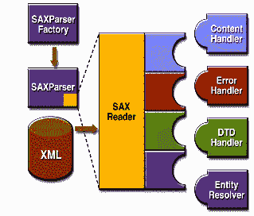

# 简单的 XML API

> 原文：[`docs.oracle.com/javase/tutorial/jaxp/intro/simple.html`](https://docs.oracle.com/javase/tutorial/jaxp/intro/simple.html)

SAX 解析 API 的基本概述如图 1-1 所示。要启动该过程，需要使用`SAXParserFactory`类的一个实例来生成解析器的一个实例。

图 1-1 SAX API

解析器包装了一个`SAXReader`对象。当调用解析器的`parse()`方法时，阅读器会调用应用程序中实现的几个回调方法之一。这些方法由`ContentHandler`、`ErrorHandler`、`DTDHandler`和`EntityResolver`接口定义。

下面是关键的 SAX API 摘要：

`SAXParserFactory`

`SAXParserFactory`对象根据系统属性`javax.xml.parsers.SAXParserFactory`创建解析器的实例。

`SAXParser`

`SAXParser`接口定义了几种`parse()`方法。通常情况下，你会将 XML 数据源和一个`DefaultHandler`对象传递给解析器，解析器会处理 XML 并调用处理程序对象中适当的方法。

`SAXReader`

`SAXParser`包装了一个`SAXReader`。通常情况下，你不需要关心这一点，但偶尔你需要使用`SAXParser`的`getXMLReader()`来获取它，以便进行配置。`SAXReader`与你定义的 SAX 事件处理程序进行交互。

`DefaultHandler`

在图中未显示的是，`DefaultHandler`实现了`ContentHandler`、`ErrorHandler`、`DTDHandler`和`EntityResolver`接口（带有空方法），因此你只需要覆盖你感兴趣的方法。

`ContentHandler`

当识别到 XML 标签时，诸如`startDocument`、`endDocument`、`startElement`和`endElement`等方法会被调用。该接口还定义了`characters()`和`processingInstruction()`方法，当解析器遇到 XML 元素中的文本或内联处理指令时会被调用。

`ErrorHandler`

方法`error()`、`fatalError()`和`warning()`会在响应各种解析错误时被调用。默认的错误处理程序对于致命错误会抛出异常，并忽略其他错误（包括验证错误）。这就是为什么即使使用 DOM，你也需要了解一些关于 SAX 解析器的知识的原因。有时，应用程序可能能够从验证错误中恢复。其他时候，可能需要生成异常。为确保正确处理，你需要向解析器提供自己的错误处理程序。

`DTDHandler`

定义了通常不会被调用的方法。在处理 DTD 时用于识别和处理未解析实体的声明。

`EntityResolver`

当解析器必须识别由 URI 标识的数据时，将调用`resolveEntity`方法。在大多数情况下，URI 只是一个 URL，指定了文档的位置，但在某些情况下，文档可能由 URN 标识-在网络空间中是唯一的公共标识符或名称。公共标识符可以在 URL 之外指定。`EntityResolver`然后可以使用公共标识符而不是 URL 来查找文档-例如，如果存在本地副本，则可以访问文档。

一个典型的应用程序至少实现了大部分`ContentHandler`方法。因为接口的默认实现除了致命错误外忽略所有输入，一个健壮的实现可能还想要实现`ErrorHandler`方法。

## SAX 包

SAX 解析器在下表中列出的包中定义。 

表 SAX 包

| 包 | 描述 |
| --- | --- |
| `org.xml.sax` | 定义了 SAX 接口。`org.xml`是由定义 SAX API 的组确定的包前缀。 |
| `org.xml.sax.ext` | 定义了用于执行更复杂的 SAX 处理的 SAX 扩展-例如，处理文档类型定义（DTD）或查看文件的详细语法。 |
| `org.xml.sax.helpers` | 包含一些辅助类，使得使用 SAX 更加容易-例如，通过定义一个默认处理程序，其中所有接口的方法都是空方法，这样你只需要重写你真正想要实现的方法。 |
| `javax.xml.parsers` | 定义了`SAXParserFactory`类，该类返回`SAXParser`。还定义了用于报告错误的异常类。 |
