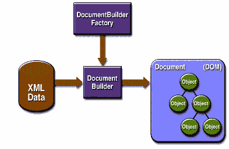

# 文档对象模型 API

> 原文：[`docs.oracle.com/javase/tutorial/jaxp/intro/dom.html`](https://docs.oracle.com/javase/tutorial/jaxp/intro/dom.html)

下图  展示了 DOM API 的运行情况。

图  DOM API

您可以使用 `javax.xml.parsers.DocumentBuilderFactory` 类获取一个 `DocumentBuilder` 实例，并使用该实例生成符合 DOM 规范的 `Document` 对象。实际上，您获得的构建器是由系统属性 `javax.xml.parsers.DocumentBuilderFactory` 决定的，该属性选择用于生成构建器的工厂实现。（可以从命令行覆盖平台的默认值。）

您还可以使用 `DocumentBuilder` 的 `newDocument()` 方法创建一个实现 `org.w3c.dom.Document` 接口的空 `Document`。或者，您可以使用构建器的解析方法之一从现有 XML 数据创建一个 `Document`。结果是一个类似上述 图  中显示的 DOM 树。

* * *

-   **注意 -** 尽管它们被称为对象，但 DOM 树中的条目实际上是相当低级的数据结构。例如，考虑这个结构：`<color>blue</color>`。颜色标签有一个元素节点，在其下有一个包含数据 blue 的文本节点！这个问题将在本教程的 DOM 课程中详细探讨，但是那些期望得到对象的开发人员通常会惊讶地发现，在元素节点上调用 `getNodeValue()` 不会返回任何内容。要获得真正面向对象的树，请参阅 [`www.jdom.org`](http://www.jdom.org) 上的 JDOM API。

* * *

## DOM 包

文档对象模型实现在以下 表  中列出的包中定义。

表  DOM 包

| 包 | 描述 |
| --- | --- |
| `org.w3c.dom` | 定义了 W3C 规范中 XML（以及可选的 HTML）文档的 DOM 编程接口。 |
| `javax.xml.parsers` | 定义了 `DocumentBuilderFactory` 类和 `DocumentBuilder` 类，后者返回一个实现 W3C Document 接口的对象。用于创建构建器的工厂由 `javax.xml.parsers` 系统属性确定，可以从命令行设置或在调用 new Instance 方法时覆盖。此包还定义了用于报告错误的 `ParserConfigurationException` 类。 |
