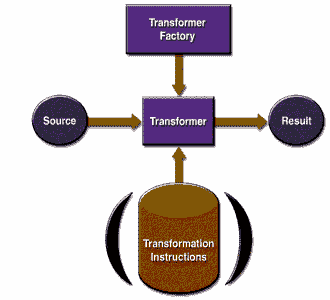

# 可扩展样式表语言转换 APIs

> 原文：[`docs.oracle.com/javase/tutorial/jaxp/intro/extensible.html`](https://docs.oracle.com/javase/tutorial/jaxp/intro/extensible.html)

下面的 图 展示了 XSLT APIs 的运行情况。

图 XSLT APIs

创建一个 `TransformerFactory` 对象，并用它来创建一个 `Transformer`。源对象是转换过程的输入。源对象可以从 SAX 读取器、DOM 或输入流创建。

类似地，结果对象是转换过程的结果。该对象可以是 SAX 事件处理程序、DOM 或输出流。

创建转换器时，可以根据一组转换指令创建它，这样指定的转换就会执行。如果没有任何特定的指令创建它，那么转换器对象只是将源复制到结果。

## XSLT 包

XSLT APIs 定义在 表 中所示的包中。

表 XSLT 包

| 包 | 描述 |
| --- | --- |
| `javax.xml.transform` | 定义了 `TransformerFactory` 和 `Transformer` 类，用于获取能够执行转换的对象。创建转换器对象后，调用其 `transform()` 方法，提供输入（源）和输出（结果）。 |
| `javax.xml.transform.dom` | 用于从 DOM 创建输入（源）和输出（结果）对象的类。 |
| `javax.xml.transform.sax` | 用于从 SAX 解析器创建输入（源）对象和从 SAX 事件处理程序创建输出（结果）对象的类。 |
| `javax.xml.transform.stream` | 用于从 I/O 流创建输入（源）对象和输出（结果）对象的类。 |
