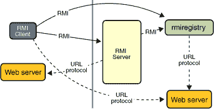

# RMI 应用概述

> 原文：[`docs.oracle.com/javase/tutorial/rmi/overview.html`](https://docs.oracle.com/javase/tutorial/rmi/overview.html)

RMI 应用程序通常由两个独立的程序组成，一个服务器和一个客户端。典型的服务器程序创建一些远程对象，使这些对象的引用可访问，并等待客户端调用这些对象的方法。典型的客户端程序获取服务器上一个或多个远程对象的远程引用，然后调用这些对象的方法。RMI 提供了服务器和客户端进行通信和传递信息的机制。这样的应用有时被称为*分布式对象应用*。

分布式对象应用需要执行以下操作：

+   **定位远程对象。** 应用程序可以使用各种机制获取对远程对象的引用。例如，应用程序可以使用 RMI 的简单命名设施，即 RMI 注册表，注册其远程对象。另外，应用程序可以将远程对象引用作为其他远程调用的一部分传递和返回。

+   **与远程对象通信。** 远程对象之间的通信细节由 RMI 处理。对于程序员来说，远程通信看起来类似于常规的 Java 方法调用。

+   **加载传递的对象的类定义。** 因为 RMI 允许对象来回传递，它提供了加载对象的类定义以及传输对象数据的机制。

以下插图描述了一个使用 RMI 注册表获取远程对象引用的 RMI 分布式应用程序。服务器调用注册表将名称与远程对象关联（或绑定）。客户端在服务器的注册表中按名称查找远程对象，然后调用其方法。插图还显示了 RMI 系统使用现有的 Web 服务器在需要时从服务器到客户端和从客户端到服务器加载类定义的过程。

## 动态代码加载的优势

RMI 的一个核心和独特特性是，如果接收方的 Java 虚拟机中未定义类的定义，它可以下载对象类的定义。一个对象的所有类型和行为，以前仅在单个 Java 虚拟机中可用，可以传输到另一个可能是远程的 Java 虚拟机。RMI 通过其实际类传递对象，因此当它们被发送到另一个 Java 虚拟机时，对象的行为不会改变。这种能力使得可以将新类型和行为引入到远程 Java 虚拟机中，从而动态扩展应用程序的行为。本教程中的计算引擎示例使用了这种能力来向分布式程序引入新行为。

## 远程接口、对象和方法

与任何其他 Java 应用程序一样，使用 Java RMI 构建的分布式应用程序由接口和类组成。接口声明方法。类实现接口中声明的方法，并且可能还声明其他方法。在分布式应用程序中，一些实现可能驻留在一些 Java 虚拟机中，而另一些则不在。具有可以在 Java 虚拟机之间调用的方法的对象称为*远程对象*。

通过实现*远程接口*，对象变成远程对象，具有以下特征：

+   一个远程接口扩展接口`java.rmi.Remote`。

+   接口的每个方法在其`throws`子句中声明`java.rmi.RemoteException`，除了任何特定于应用程序的异常。

当对象从一个 Java 虚拟机传递到另一个 Java 虚拟机时，RMI 会将远程对象与非远程对象区别对待。RMI 不会在接收 Java 虚拟机中复制实现对象，而是传递一个远程对象的远程*存根*。存根充当远程对象的本地代表或代理，并且基本上是客户端的远程引用。客户端在本地存根上调用方法，本地存根负责在远程对象上执行方法调用。

一个远程对象的存根实现了远程对象实现的相同一组远程接口。这个属性使得一个存根可以被转换为远程对象实现的任何接口。然而，*只有*在远程接口中定义的方法才能从接收 Java 虚拟机中调用。

## 使用 RMI 创建分布式应用程序

使用 RMI 开发分布式应用程序涉及以下一般步骤：

1.  设计和实现分布式应用程序的组件。

1.  编译源代码。

1.  使类可网络访问。

1.  启动应用程序。

### 设计和实现应用程序组件

首先，确定您的应用程序架构，包括哪些组件是本地对象，哪些组件是可远程访问的。这一步包括：

+   **定义远程接口。** 远程接口指定客户端可以远程调用的方法。客户端编程针对远程接口，而不是针对这些接口的实现类。这些接口的设计包括确定将用作这些方法的参数和返回值的对象类型。如果这些接口或类中的任何一个尚不存在，您也需要定义它们。

+   **实现远程对象。** 远程对象必须实现一个或多个远程接口。远程对象类可能包括其他仅在本地可用的接口和方法的实现。如果要将任何本地类用作这些方法的参数或返回值，那么它们也必须被实现。

+   **实现客户端。** 使用远程对象的客户端可以在定义远程接口之后的任何时间实现，包括在部署远程对象之后。

### 编译源代码

与任何 Java 程序一样，您使用`javac`编译器来编译源文件。源文件包含远程接口的声明、它们的实现、任何其他服务器类以及客户端类。

* * *

**注意：** 在 Java 平台标准版 5.0 之前的版本中，需要通过使用`rmic`编译器来构建存根类，但现在不再需要这一步骤。

* * *

### 使类能够在网络中访问

在这一步中，您需要使某些类定义能够在网络中访问，例如远程接口及其关联类型的定义，以及需要下载到客户端或服务器的类的定义。通常通过 Web 服务器使类定义能够在网络中访问。

### 启动应用程序

启动应用程序包括运行 RMI 远程对象注册表、服务器和客户端。

本节的其余部分将介绍创建计算引擎所使用的步骤。

## 构建通用计算引擎

本教程专注于一个简单但强大的分布式应用程序，称为*计算引擎*。计算引擎是服务器上的一个远程对象，它接收来自客户端的任务，运行这些任务，并返回任何结果。这些任务在运行服务器的机器上执行。这种类型的分布式应用程序可以让多台客户端机器利用特别强大或具有专门硬件的机器。

计算引擎的新颖之处在于它运行的任务不需要在编写或启动计算引擎时定义。可以随时创建新类型的任务，然后将其交给计算引擎运行。任务的唯一要求是其类实现特定接口。RMI 系统可以将执行任务所需的代码下载到计算引擎中。然后，计算引擎在运行它的机器上利用资源运行任务。

执行任意任务的能力是由 Java 平台的动态特性实现的，通过 RMI 扩展到网络。RMI 动态加载任务代码到计算引擎的 Java 虚拟机中，并在没有实现任务的类的先验知识的情况下运行任务。这种具有动态下载代码能力的应用程序通常被称为*基于行为的应用程序*。这些应用程序通常需要完整的代理启用基础设施。在 Java 平台上，这些应用程序是分布式计算的基本机制之一。
