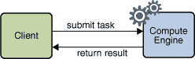

# 设计远程接口

> 原文：[`docs.oracle.com/javase/tutorial/rmi/designing.html`](https://docs.oracle.com/javase/tutorial/rmi/designing.html)

计算引擎的核心是一种协议，使得任务可以提交到计算引擎，计算引擎可以运行这些任务，并将这些任务的结果返回给客户端。这个协议在支持计算引擎的接口中表达。该协议的远程通信在下图中有所体现。



每个接口包含一个方法。计算引擎的远程接口`Compute`允许任务提交到引擎。客户端接口`Task`定义了计算引擎如何执行提交的任务。

``compute.Compute``接口定义了远程访问部分，即计算引擎本身。这里是`Compute`接口的源代码：

```java
package compute;

import java.rmi.Remote;
import java.rmi.RemoteException;

public interface Compute extends Remote {
    <T> T executeTask(Task<T> t) throws RemoteException;
}

```

通过扩展接口`java.rmi.Remote`，`Compute`接口将自身标识为一个可以从另一个 Java 虚拟机中调用其方法的接口。实现这个接口的任何对象都可以是一个远程对象。

作为远程接口的成员，`executeTask`方法是一个远程方法。因此，该方法必须被定义为能够抛出`java.rmi.RemoteException`的方法。这个异常是由 RMI 系统从远程方法调用中抛出的，用于指示通信失败或协议错误。`RemoteException`是一个受检异常，因此任何调用远程方法的代码都需要通过捕获它或在其`throws`子句中声明来处理这个异常。

计算引擎所需的第二个接口是`Task`接口，它是`Compute`接口中`executeTask`方法的参数类型。``compute.Task``接口定义了计算引擎和需要执行的工作之间的接口，提供了开始工作的方式。这里是`Task`接口的源代码：

```java
package compute;

public interface Task<T> {
    T execute();
}

```

`Task`接口定义了一个方法`execute`，该方法没有参数，也不会抛出异常。因为该接口没有扩展`Remote`，所以在该接口中的方法不需要在`throws`子句中列出`java.rmi.RemoteException`。

`Task`接口有一个类型参数`T`，代表任务计算的结果类型。该接口的`execute`方法返回计算的结果，因此其返回类型是`T`。

`Compute`接口的`executeTask`方法反过来返回传递给它的`Task`实例的执行结果。因此，`executeTask`方法有自己的类型参数`T`，将其自己的返回类型与传递的`Task`实例的结果类型关联起来。

RMI 使用 Java 对象序列化机制在 Java 虚拟机之间按值传输对象。要使对象被视为可序列化，其类必须实现`java.io.Serializable`标记接口。因此，实现`Task`接口的类必须也实现`Serializable`，任务结果所使用的对象的类也必须实现。

只要它们是`Task`类型的实现，不同类型的任务可以由`Compute`对象运行。实现这个接口的类可以包含任务计算所需的任何数据以及计算所需的任何其他方法。

这就是 RMI 如何使这个简单的计算引擎成为可能。因为 RMI 可以假定`Task`对象是用 Java 编程语言编写的，之前未知于计算引擎的`Task`对象的实现会根据需要通过 RMI 下载到计算引擎的 Java 虚拟机中。这种能力使得计算引擎的客户端能够定义新的任务类型，而无需将代码明确安装在该机器上。

由`ComputeEngine`类实现的计算引擎实现了`Compute`接口，通过调用其`executeTask`方法，使不同的任务可以提交给它。这些任务使用任务的`execute`方法的实现来运行，并将结果返回给远程客户端。
