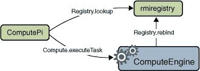

# 创建客户端程序

> 原文：[`docs.oracle.com/javase/tutorial/rmi/client.html`](https://docs.oracle.com/javase/tutorial/rmi/client.html)

计算引擎是一个相对简单的程序：它运行交给它的任务。计算引擎的客户端更加复杂。客户端需要调用计算引擎，但也必须定义计算引擎执行的任务。

在我们的示例中，客户端由两个单独的类组成。第一个类`ComputePi`查找并调用`Compute`对象。第二个类`Pi`实现`Task`接口并定义计算引擎执行的工作。`Pi`类的工作是计算到某个小数位数的的值。

非远程`Task`接口定义如下：

```java
package compute;

public interface Task<T> {
    T execute();
}

```

调用`Compute`对象方法的代码必须获取对该对象的引用，创建一个`Task`对象，然后请求执行该任务。稍后将显示任务类`Pi`的定义。使用单个参数构造`Pi`对象，该参数是所需结果的精度。任务执行的结果是表示计算到指定精度的的`java.math.BigDecimal`。

这里是`client.ComputePi`的源代码，主要客户端类：

```java
package client;

import java.rmi.registry.LocateRegistry;
import java.rmi.registry.Registry;
import java.math.BigDecimal;
import compute.Compute;

public class ComputePi {
    public static void main(String args[]) {
        if (System.getSecurityManager() == null) {
            System.setSecurityManager(new SecurityManager());
        }
        try {
            String name = "Compute";
            Registry registry = LocateRegistry.getRegistry(args[0]);
            Compute comp = (Compute) registry.lookup(name);
            Pi task = new Pi(Integer.parseInt(args[1]));
            BigDecimal pi = comp.executeTask(task);
            System.out.println(pi);
        } catch (Exception e) {
            System.err.println("ComputePi exception:");
            e.printStackTrace();
        }
    }    
}

```

像`ComputeEngine`服务器一样，客户端首先安装安全管理器。这一步是必要的，因为接收服务器远程对象存根的过程可能需要从服务器下载类定义。为了让 RMI 下载类，必须启用安全管理器。

安装安全管理器后，客户端构造一个名称用于查找`Compute`远程对象，使用与`ComputeEngine`绑定其远程对象相同的名称。此外，客户端使用`LocateRegistry.getRegistry` API 合成服务器主机上注册表的远程引用。第一个命令行参数`args[0]`的值是`Compute`对象运行的远程主机的名称。然后客户端在注册表上调用`lookup`方法，通过名称在服务器主机的注册表中查找远程对象。使用的`LocateRegistry.getRegistry`重载版本具有单个`String`参数，返回命名主机和默认注册表端口 1099 的注册表引用。如果注册表在除 1099 之外的端口上创建，则必须使用具有`int`参数的重载。

接下来，客户端创建一个新的`Pi`对象，将第二个命令行参数`args[1]`解析为整数传递给`Pi`构造函数。这个参数指示计算中要使用的小数位数。最后，客户端调用`Compute`远程对象的`executeTask`方法。传入`executeTask`调用的对象返回一个`BigDecimal`类型的对象，程序将其存储在变量`result`中。最后，程序打印结果。下图描述了`ComputePi`客户端、`rmiregistry`和`ComputeEngine`之间消息流的过程。



`Pi`类实现了`Task`接口，并计算了的值到指定的小数位数。对于这个示例，实际算法并不重要。重要的是算法是计算密集型的，这意味着你希望它在一个能力强大的服务器上执行。

这是``client.Pi``的源代码，该类实现了`Task`接口：

```java
package client;

import compute.Task;
import java.io.Serializable;
import java.math.BigDecimal;

public class Pi implements Task<BigDecimal>, Serializable {

    private static final long serialVersionUID = 227L;

    /** constants used in pi computation */
    private static final BigDecimal FOUR =
        BigDecimal.valueOf(4);

    /** rounding mode to use during pi computation */
    private static final int roundingMode = 
        BigDecimal.ROUND_HALF_EVEN;

    /** digits of precision after the decimal point */
    private final int digits;

    /**
     * Construct a task to calculate pi to the specified
     * precision.
     */
    public Pi(int digits) {
        this.digits = digits;
    }

    /**
     * Calculate pi.
     */
    public BigDecimal execute() {
        return computePi(digits);
    }

    /**
     * Compute the value of pi to the specified number of 
     * digits after the decimal point.  The value is 
     * computed using Machin's formula:
     *
     *          pi/4 = 4*arctan(1/5) - arctan(1/239)
     *
     * and a power series expansion of arctan(x) to 
     * sufficient precision.
     */
    public static BigDecimal computePi(int digits) {
        int scale = digits + 5;
        BigDecimal arctan1_5 = arctan(5, scale);
        BigDecimal arctan1_239 = arctan(239, scale);
        BigDecimal pi = arctan1_5.multiply(FOUR).subtract(
                                  arctan1_239).multiply(FOUR);
        return pi.setScale(digits, 
                           BigDecimal.ROUND_HALF_UP);
    }
    /**
     * Compute the value, in radians, of the arctangent of 
     * the inverse of the supplied integer to the specified
     * number of digits after the decimal point.  The value
     * is computed using the power series expansion for the
     * arc tangent:
     *
     * arctan(x) = x - (x³)/3 + (x⁵)/5 - (x⁷)/7 + 
     *     (x⁹)/9 ...
     */   
    public static BigDecimal arctan(int inverseX, 
                                    int scale) 
    {
        BigDecimal result, numer, term;
        BigDecimal invX = BigDecimal.valueOf(inverseX);
        BigDecimal invX2 = 
            BigDecimal.valueOf(inverseX * inverseX);

        numer = BigDecimal.ONE.divide(invX,
                                      scale, roundingMode);

        result = numer;
        int i = 1;
        do {
            numer = 
                numer.divide(invX2, scale, roundingMode);
            int denom = 2 * i + 1;
            term = 
                numer.divide(BigDecimal.valueOf(denom),
                             scale, roundingMode);
            if ((i % 2) != 0) {
                result = result.subtract(term);
            } else {
                result = result.add(term);
            }
            i++;
        } while (term.compareTo(BigDecimal.ZERO) != 0);
        return result;
    }
}

```

注意，所有可序列化的类，无论它们是否直接或间接实现了`Serializable`接口，都必须声明一个名为`serialVersionUID`的`private` `static` `final`字段，以确保在不同版本之间的序列化兼容性。如果该类之前没有发布过版本，则该字段的值可以是任何`long`值，类似于`Pi`使用的`227L`，只要该值在未来版本中一致使用即可。如果该类的先前版本已发布但没有显式声明`serialVersionUID`，但与该版本的序列化兼容性很重要，则必须使用先前版本的默认隐式计算值作为新版本显式声明的值。可以运行`serialver`工具来确定先前版本的默认计算值。

这个示例最有趣的特点是`Compute`实现对象在`Pi`对象作为参数传递给`executeTask`方法之前从不需要`Pi`类的定义。在那时，RMI 会将该类的代码加载到`Compute`对象的 Java 虚拟机中，调用`execute`方法，并执行任务的代码。结果，对于`Pi`任务来说是一个`BigDecimal`对象，会被传回给调用客户端，在那里用于打印计算结果。

供给的`Task`对象计算`Pi`值这一事实对于`ComputeEngine`对象来说并不重要。你也可以实现一个任务，比如通过使用概率算法生成一个随机素数。这个任务也会需要大量计算，因此是传递给`ComputeEngine`的一个很好的选择，但它需要非常不同的代码。当`Task`对象传递给`Compute`对象时，这段代码也可以被下载。就像在需要时引入计算的算法一样，生成随机素数的代码也会在需要时被引入。`Compute`对象只知道它接收到的每个对象都实现了`execute`方法。`Compute`对象不知道，也不需要知道实现的具体内容。
