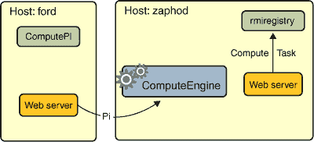

# 运行示例程序

> 原文：[`docs.oracle.com/javase/tutorial/rmi/running.html`](https://docs.oracle.com/javase/tutorial/rmi/running.html)

## 关于安全性的说明

服务器和客户端程序都安装了安全管理器。当您运行任一程序时，您需要指定一个安全策略文件，以便代码被授予其运行所需的安全权限。这是一个用于服务器程序的示例策略文件。

```java
grant codeBase "file:/home/ann/src/" {
    permission java.security.AllPermission;
};

```

这是一个用于客户端程序的示例策略文件。

```java
grant codeBase "file:/home/jones/src/" {
    permission java.security.AllPermission;
};

```

对于这两个示例策略文件，所有权限都授予程序本地类路径中的类，因为本地应用程序代码是受信任的，但不授予从其他位置下载的代码任何权限。因此，计算引擎服务器限制其执行的任务（其代码未知是否受信任且可能具有敌意）执行需要安全权限的任何操作。示例客户端的`Pi`任务不需要任何权限来执行。

在此示例中，服务器程序的策略文件名为`server.policy`，客户端程序的策略文件名为`client.policy`。

## 启动服务器

在启动计算引擎之前，您需要启动 RMI 注册表。RMI 注册表是一个简单的服务器端引导命名工具，使远程客户端能够获取对初始远程对象的引用。它可以通过`rmiregistry`命令启动。在执行`rmiregistry`之前，您必须确保您将运行`rmiregistry`的 shell 或窗口要么没有设置`CLASSPATH`环境变量，要么具有不包括您希望下载到远程对象的客户端的任何类路径的`CLASSPATH`环境变量。

要在服务器上启动注册表，请执行`rmiregistry`命令。此命令不会产生任何输出，并且通常在后台运行。在此示例中，注册表在主机`mycomputer`上启动。

**Microsoft Windows**（如果`start`不可用，请使用`javaw`）：

```java
start rmiregistry

```

**Solaris 操作系统或 Linux**：

```java
rmiregistry &

```

默认情况下，注册表在端口 1099 上运行。要在不同端口上启动注册表，请在命令行上指定端口号。不要忘记取消设置`CLASSPATH`环境变量。

**Microsoft Windows**：

```java
start rmiregistry 2001

```

**Solaris 操作系统或 Linux**：

```java
rmiregistry 2001 &

```

一旦注册表启动，你可以启动服务器。你需要确保`compute.jar`文件和远程对象实现类都在你的类路径中。当你启动计算引擎时，你需要使用`java.rmi.server.codebase`属性指定服务器类的网络访问位置。在这个例子中，要提供下载的服务器端类是`Compute`和`Task`接口，在用户`ann`的`public_html\classes`目录中的`compute.jar`文件中可用。计算引擎服务器在主机`mycomputer`上启动，与注册表启动的主机相同。

**Microsoft Windows**:

```java
java -cp c:\home\ann\src;c:\home\ann\public_html\classes\compute.jar
     -Djava.rmi.server.codebase=file:/c:/home/ann/public_html/classes/compute.jar
     -Djava.rmi.server.hostname=mycomputer.example.com
     -Djava.security.policy=server.policy
        engine.ComputeEngine

```

**Solaris OS 或 Linux**:

```java
java -cp /home/ann/src:/home/ann/public_html/classes/compute.jar
     -Djava.rmi.server.codebase=http://mycomputer/~ann/classes/compute.jar
     -Djava.rmi.server.hostname=mycomputer.example.com
     -Djava.security.policy=server.policy
        engine.ComputeEngine

```

上述`java`命令定义了以下系统属性：

+   `java.rmi.server.codebase`属性指定了一个代码库 URL，从这个服务器可以下载源自*的类的定义。如果代码库指定了一个目录层次结构（而不是一个 JAR 文件），你必须在代码库 URL 的末尾包含一个斜杠。

+   `java.rmi.server.hostname`属性指定了要放在此 Java 虚拟机中导出的远程对象存根中的主机名或地址。当客户端尝试通信远程方法调用时，客户端使用的值是主机名或地址。默认情况下，RMI 实现使用服务器的 IP 地址，如`java.net.InetAddress.getLocalHost` API 所示。然而，有时，这个地址对于所有客户端都不合适，一个完全合格的主机名会更有效。为了确保 RMI 使用一个对所有潜在客户端都可路由的主机名（或 IP 地址）作为服务器，设置`java.rmi.server.hostname`属性。

+   `java.security.policy`属性用于指定包含您打算授予的权限的策略文件。

## 启动客户端

一旦注册表和计算引擎运行起来，你可以启动客户端，指定以下内容：

+   客户端提供其类（`Pi`类）的位置，使用`java.rmi.server.codebase`属性

+   `java.security.policy`属性用于指定包含您打算授予各种代码片段的权限的安全策略文件

+   作为命令行参数，服务器的主机名（以便客户端知道在哪里找到`Compute`远程对象）和在计算中使用的小数位数

在另一台主机上启动客户端（例如名为`mysecondcomputer`的主机）如下：

* * *

**Microsoft Windows**:

```java
java -cp c:\home\jones\src;c:\home\jones\public_html\classes\compute.jar
     -Djava.rmi.server.codebase=file:/c:/home/jones/public_html/classes/
     -Djava.security.policy=client.policy
        client.ComputePi mycomputer.example.com 45

```

**Solaris OS 或 Linux**:

```java
java -cp /home/jones/src:/home/jones/public_html/classes/compute.jar
     -Djava.rmi.server.codebase=http://mysecondcomputer/~jones/classes/
     -Djava.security.policy=client.policy
        client.ComputePi mycomputer.example.com 45

```

注意，类路径是在命令行上设置的，以便解释器可以找到客户端类和包含接口的 JAR 文件。还要注意，`java.rmi.server.codebase`属性的值，指定一个目录层次结构，以斜杠结尾。

在启动客户端后，将显示以下输出：

```java
3.141592653589793238462643383279502884197169399

```

以下图示说明了在程序执行期间`rmiregistry`、`ComputeEngine`服务器和`ComputePi`客户端获取类的位置。



当`ComputeEngine`服务器在注册表中绑定其远程对象引用时，注册表会下载存根类依赖的`Compute`和`Task`接口。这些类是从`ComputeEngine`服务器的 Web 服务器或文件系统下载的，具体取决于启动服务器时使用的代码库 URL 的类型。

因为`ComputePi`客户端在其类路径中同时具有`Compute`和`Task`接口的定义，它从其类路径加载它们的定义，而不是从服务器的代码库加载。

最后，当`Pi`对象在`executeTask`远程调用中传递给`ComputeEngine`对象时，`Pi`类被加载到`ComputeEngine`服务器的 Java 虚拟机中。`Pi`类是由服务器从客户端的 Web 服务器或文件系统加载的，具体取决于启动客户端时使用的代码库 URL 的类型。
