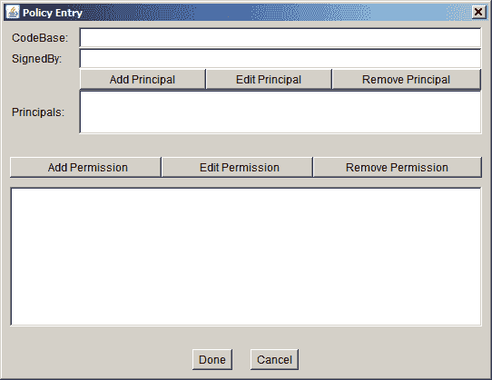
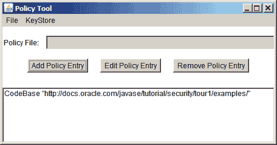

# 授予所需权限

> 原文：[`docs.oracle.com/javase/tutorial/security/tour1/wstep2.html`](https://docs.oracle.com/javase/tutorial/security/tour1/wstep2.html)

要创建新条目，请在主策略工具窗口中单击 **添加策略条目** 按钮。这将显示如下图所示的策略条目对话框。



策略条目指定了来自特定*代码源*的一个或多个权限--来自特定位置（URL）的代码，由特定实体签名的代码，或两者兼有。

**CodeBase** 和 **SignedBy** 文本框指定您要授予权限的代码，这些权限将添加到文件中。

+   **CodeBase** 值表示代码源位置；您授予来自该位置的代码的权限。空的 **CodeBase** 条目表示“任何代码”--代码的来源并不重要。

+   **SignedBy** 值表示存储在密钥库中的证书的别名。该证书内的公钥用于验证代码上的数字签名。您授予由与别名指定的密钥库条目中的公钥对应的私钥签名的代码的权限。**SignedBy** 条目是可选的；省略它表示“任何签名者”--代码是否签名或由谁签名并不重要。

如果您同时拥有 **CodeBase** 和 **SignedBy** 条目，权限仅授予来自指定位置且由指定别名签名的代码。

您可以授予存储示例的位置（URL）的所有代码权限。

在策略条目对话框的 **CodeBase** 文本框中键入以下 URL：

```java
https://docs.oracle.com/javase/tutorial/security/tour1/examples/

```

**注意：** 这是一个 URL。因此，它必须始终使用斜杠作为分隔符，而不是反斜杠。

将 **SignedBy** 文本框留空，因为您不需要代码签名。

* * *

**注意：** 要授予权限给任何代码（`.class` 文件），不仅仅是从先前指定的目录，而是从 `security` 目录*及其子目录*中，将以下 URL 键入 **CodeBase** 框中：

```java
https://docs.oracle.com/javase/tutorial/security/

```

* * *

您已经指定了代码的来源（**CodeBase**），并且代码不需要签名（因为没有 **SignedBy** 值）。

您现在已经指定了此策略条目，因此在策略条目对话框中单击 **完成** 按钮。策略工具窗口现在包含代表策略条目的一行，显示 `CodeBase` 值。



**注意：** 我们将在下一课中授予此新策略条目的权限。
