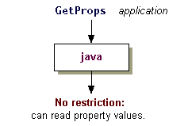

# 观察应用程序自由

> 原文：[`docs.oracle.com/javase/tutorial/security/tour2/step1.html`](https://docs.oracle.com/javase/tutorial/security/tour2/step1.html)

当*应用程序*运行时，*不会*自动安装安全管理器。在下一步中，您将看到如何将相同的安全策略应用于在本地文件系统上找到的应用程序和下载的沙箱小程序。但首先，让我们证明默认情况下未安装安全管理器用于应用程序，因此应用程序可以完全访问资源。

在您的计算机上创建一个名为`GetProps.java`的文件，可以通过复制或下载`GetProps.java`源代码来实现。

本课程中的示例假定您将`GetProps.java`放在`C:\Test`目录中（如果您使用 Windows 系统）或在 UNIX 上的`~/test`目录中。

如您所见，如果检查源文件，此程序尝试获取（读取）属性值，其名称为`"os.name"`，`"java.version"`，`"user.home"`和`"java.home"`。

现在编译并运行`GetProps.java`。您应该看到类似以下的输出：

```java
C:\TEST>java GetProps
    About to get os.name property value
      The name of your operating system is:
      Windows XP
    About to get java.version property value
      The version of the JVM you are running is:
      1.6.0
    About to get user.home property value
      Your user home directory is: C:\WINDOWS
    About to get java.home property value
      Your JRE installation directory is:
      C:\JDK7.0.0\JRE

```

这表明应用程序被允许访问所有属性值，如下图所示。


