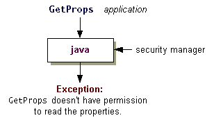

# 查看如何限制应用程序

> 原文：[`docs.oracle.com/javase/tutorial/security/tour2/step2.html`](https://docs.oracle.com/javase/tutorial/security/tour2/step2.html)

正如您在上一步骤中看到的，当 Java 运行时运行一个*应用程序*时，它不会自动安装安全管理器。要将相同的安全策略应用于本地文件系统中找到的应用程序和下载的沙箱小程序，您可以使用新的`-Djava.security.manager`命令行参数调用解释器。

要使用默认安全管理器执行`GetProps`应用程序，请键入以下内容：

```java
java -Djava.security.manager GetProps

```

以下是程序的输出：

```java
C:\TEST>java -Djava.security.manager GetProps
    About to get os.name property value
      The name of your operating system is: SunOS
    About to get java.version property value
      The version of the JVM you are running is: 1.7.0
    About to get user.home property value
    Caught exception java.security.AccessControlException:
        access denied ("java.util.PropertyPermission"
        "user.home" "read")

```

过程如下图所示。



## 安全敏感属性

Java 运行时默认加载默认策略文件，并授予所有代码访问一些常用属性（如`"os.name"`和`"java.version"`）的权限。这些属性不是安全敏感的，因此授予这些权限通常不会构成安全风险。

`GetProps`尝试访问的其他属性`"user.home"`和`"java.home"`不在系统策略文件授予读取权限的属性之列。因此，一旦`GetProps`尝试访问这些属性中的第一个（`"user.home"`）时，安全管理器会阻止访问并报告`AccessControlException`。此异常表示当前生效的策略，其中包含一个或多个策略文件中的条目，不允许读取`"user.home"`属性的权限。

* * *

**注意：** 代码始终可以从与其所在目录相同的目录（或该目录的子目录）中读取文件；它不需要明确的权限来这样做。代码还可以获取其执行目录的路径名，而此路径名可能包含敏感信息。例如，如果代码是从主目录（或主目录的子目录）执行的，则路径名可能会显示当前用户的名称。

* * *

## 默认策略文件

默认策略文件，`java.policy` 默认位于：

+   **Windows**：`*java.home*\lib\security\java.policy`

+   **UNIX**：`*java.home*/lib/security/java.policy`

请注意，*java.home*代表`"java.home"`属性的值，该属性是指定 JRE 安装目录的系统属性。因此，如果 JRE 安装在 Windows 上名为`C:\jdk\jre`，在 UNIX 上名为`/jdk/jre`的目录中，则系统策略文件位于：

+   **Windows**：`C:\jdk\jre\lib\security\java.policy`

+   **UNIX**：`/jdk/jre/lib/security/java.policy`
