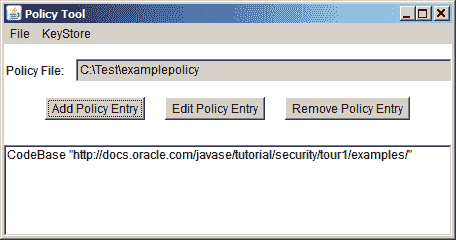

# 打开策略文件

> 原文：[`docs.oracle.com/javase/tutorial/security/tour2/wstep1.html`](https://docs.oracle.com/javase/tutorial/security/tour2/wstep1.html)

通过在命令行中键入以下内容启动策略工具：

```java
policytool

```

这将打开策略工具窗口。要打开`examplepolicy`策略文件，请在**文件**菜单中使用**打开**命令。这将显示一个打开对话框，您可以使用它来浏览目录结构，直到找到包含策略文件的目录（即`C:\Test\`目录）。

选择该目录中的`examplepolicy`文件，然后选择**打开**按钮。

这将从`examplepolicy`策略文件中填充策略工具窗口中的信息，包括策略文件名和由创建策略文件课程创建的**CodeBase**部分的策略条目。


