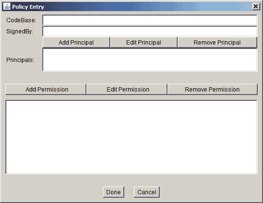

# 授予所需权限

> 原文：[`docs.oracle.com/javase/tutorial/security/tour2/wstep2.html`](https://docs.oracle.com/javase/tutorial/security/tour2/wstep2.html)

要授予`GetProps`应用程序读取`"user.home"`和`"java.home"`属性值的权限，必须创建一个授予这些权限的策略条目。在主策略工具窗口中选择**添加策略条目**按钮。这将弹出策略条目对话框，如下图所示。



在**CodeBase**文本框中键入以下文件 URL，以指示您将授予来自指定目录中的代码的权限，该目录是存储`GetProps.class`的目录。

```java
file:/C:/Test/

```

（注意，这是一个 URL，因此必须始终使用斜杠，而不是反斜杠。）

将**SignedBy**文本框留空，因为您不需要代码签名。

要添加读取`"user.home"`属性值的权限，请选择**添加权限**按钮。这将弹出权限对话框。


执行以下操作。

1.  从权限下拉列表中选择**属性权限**。完整的权限类型名称（`java.util.PropertyPermission`）现在出现在下拉列表右侧的文本框中。

1.  在标有目标名称列表右侧的文本框中键入以下内容，以指定`"user.home"`属性：

    ```java
    user.home

    ```

1.  通过从操作下拉列表中选择**读取**选项来指定读取此属性的权限。

现在权限对话框如下所示。


选择**确定**按钮。新权限将出现在策略条目窗口中的一行中。


要添加读取`"java.home"`属性值的权限，请再次选择**添加权限**按钮。在权限对话框中，执行以下操作：

1.  从权限下拉列表中选择**属性权限**。

1.  在标有目标名称列表右侧的文本框中键入以下内容，以指定`"java.home"`属性：

    ```java
    java.home

    ```

1.  通过从操作下拉列表中选择**读取**选项来指定读取此属性的权限。

现在权限对话框如下所示。


选择**确定**按钮。新权限和先前添加的权限将出现在策略条目窗口中的行中，如下图所示。


您现在已经完成了指定此策略条目的操作，因此在策略条目对话框中选择**完成**按钮。策略工具窗口现在包括表示新策略条目的一行，显示**CodeBase**值。
