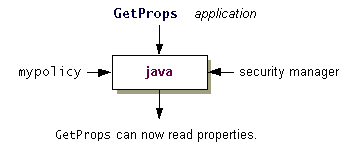

# 查看策略文件效果

> 原文：[`docs.oracle.com/javase/tutorial/security/tour2/step4.html`](https://docs.oracle.com/javase/tutorial/security/tour2/step4.html)

现在您已经向`examplepolicy`策略文件添加了所需的策略条目，当您使用安全管理器执行`GetProps`应用程序时，您应该能够读取指定的属性，如下图所示。



每当您运行一个小程序，或者一个带有安全管理器的应用程序时，默认加载和使用的策略文件是位于以下目录之一的**"安全属性文件"**中指定的文件。

+   **Windows**：`*java.home*\lib\security\java.security`

+   **UNIX**：`*java.home*/lib/security/java.security`

**注意：** `java.home`环境变量指定了 JRE 安装的目录。

策略文件的位置是指定为属性值的形式为：

```java
policy.url.*n*

```

其中变量`n`表示一个数字。请在以下形式的行中指定每个属性值：

```java
policy.url.*n*=*URL*

```

其中*URL*是 URL 规范。例如，默认的策略文件，有时分别称为系统和用户策略文件，在安全属性文件中定义为

```java
policy.url.1=file:${java.home}/lib/security/java.policy
policy.url.2=file:${user.home}/.java.policy

```

* * *

**注意：** 在安全属性文件中使用`${propName}`符号是指定属性值的一种方式。因此`${java.home}`将在运行时被实际的`"java.home"`属性值替换，该属性值指示了 JRE 安装的目录，`${user.home}`将被`"user.home"`属性的值替换，例如，`C:\Windows`。

* * *

有两种可能的方式可以使`examplepolicy`文件被视为整体策略的一部分，除了在安全属性文件中指定的策略文件。您可以通过将附加策略文件指定为传递给运行时系统的属性，如方法 1 中所述，或者在安全属性文件中添加指定附加策略文件的行，如方法 2 中所讨论的那样。

## 方法 1

您可以使用`-Djava.security.policy`解释器命令行参数来指定一个应该在安全属性文件中指定的策略文件之外使用的策略文件。

确保您在包含`GetProps.class`和`examplepolicy`的目录中。然后，您可以运行`GetProps`应用程序，并通过在一行上键入以下命令将`examplepolicy`策略文件传递给解释器：

```java
java -Djava.security.manager -Djava.security.policy=examplepolicy GetProps

```

**注意：** 请记住，为了使用安全管理器运行应用程序，需要`-Djava.security.manager`，如查看如何限制应用程序步骤中所示。

该程序报告了`"user.home"`和`"java.home"`属性的值。

如果应用程序仍然报告错误，则策略文件中存在问题。使用策略工具检查您在设置策略文件以授予所需权限步骤中创建的策略条目。

## 方法 2

您可以在安全属性文件中指定多个 URL，所有指定的策略文件都将被加载。因此，让`java`解释器考虑您的`examplepolicy`文件的策略条目的一种方法是在安全属性文件中添加指定该策略文件的条目。

* * *

**重要提示：** 如果您正在运行自己的 JDK 副本，您可以轻松编辑安全属性文件。如果您正在运行与其他用户共享的版本，只有在具有写入权限或在适当时向系统管理员请求修改文件时，您才能修改系统范围的安全属性文件。但是，对于本教程测试，您可能不应该对系统范围的策略文件进行修改。我们建议您只需阅读以下内容，看看如何操作，或者安装您自己的私人版本的 JDK 用于教程课程。

* * *

要修改安全属性文件，请在适合编辑 ASCII 文本文件的编辑器中打开它。然后在包含`policy.url.2`的行之后添加以下行：如果您在 Windows 系统上，请添加

```java
policy.url.3=file:/C:/Test/examplepolicy

```

如果您在 UNIX 系统上，请添加

```java
policy.url.3=file:${user.home}/test/examplepolicy

```

在 UNIX 系统上，您还可以显式指定您的主目录，如下所示

```java
policy.url.3=file:/home/jones/test/examplepolicy

```

## 运行应用程序

现在，您应该能够成功运行以下内容。

```java
java -Djava.security.manager GetProps

```

与方法 1 一样，如果仍然出现安全异常，则策略文件中存在问题。使用策略工具检查您在设置策略文件以授予所需权限步骤中创建的策略条目。然后修复任何拼写错误或其他错误。

* * *

* * *

**重要提示：** 除非您正在运行本教程课程，否则无需包含`examplepolicy`文件。要排除此文件，请打开安全属性文件并删除刚刚添加的行。

在继续之前，您可能希望删除您刚刚在安全属性文件中添加的行（或将其注释掉），因为您可能不希望在不运行教程课程时包含`examplepolicy`文件。

* * *
