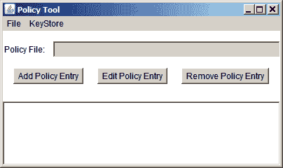

# 启动策略工具

> 原文：[`docs.oracle.com/javase/tutorial/security/toolsign/wstep1.html`](https://docs.oracle.com/javase/tutorial/security/toolsign/wstep1.html)

要启动策略工具，只需在命令行中键入以下内容：

```java
policytool

```

这将打开策略工具窗口。每次启动策略工具时，它会尝试从通常称为“用户策略文件”的文件中填充此窗口中的策略信息，默认情况下，该文件名为`.java.policy`，位于您的主目录中。如果策略工具找不到用户策略文件，它会报告这种情况并显示一个空白的策略工具窗口（即，一个带有标题和按钮但没有数据的窗口，如下图所示。



由于本教程的课程不需要对您的官方用户策略文件进行修改，因此您将创建并使用一个与用户策略文件不同的策略文件。

假设您看到了空白的策略工具窗口（如果没有，请在**文件**菜单中选择**新建**），您可以立即开始创建一个新的策略文件。
