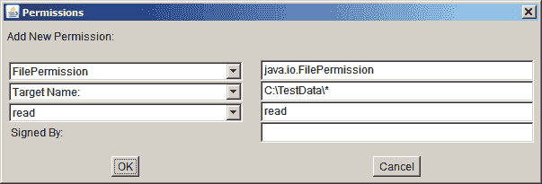
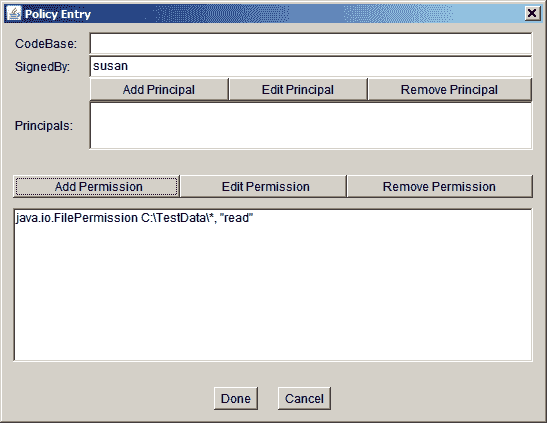

# 添加带有 SignedBy 别名的策略条目

> 原文：[`docs.oracle.com/javase/tutorial/security/toolsign/wstep3.html`](https://docs.oracle.com/javase/tutorial/security/toolsign/wstep3.html)

要授予由`susan`签名的代码权限以读取`C:\TestData`目录中的任何文件，您需要创建一个授予此权限的策略条目。请注意，“由`susan`签名的代码”是指“包含在 JAR 文件中的类文件中的代码，其中 JAR 文件是使用与出现在别名为`susan`的 keystore 证书中的公钥对应的私钥签名的。”

在主策略工具窗口中选择**添加策略条目**按钮。这将打开策略条目对话框：


在此对话框中，将以下别名键入到**SignedBy**文本框中：

```java
susan

```

将**CodeBase**文本框留空，以授予由`susan`签名的*所有*代码权限，无论其来源。

* * *

**注意：** 如果您想将权限限制为仅来自`C:\Test\`目录的`susan`签名代码，您将在**CodeBase**文本框中键入以下 URL：

```java
file:/C:/Test/*

```

* * *

要添加权限，请选择**添加权限**按钮。这将打开权限对话框。


执行以下操作。

1.  从权限下拉列表中选择**文件权限**。完整的权限类型名称（`java.io.FilePermission`）现在显示在下拉列表右侧的文本框中。

1.  在标记为目标名称的列表右侧的文本框中键入以下内容，以指定`C:\TestData\`目录中的所有文件：

    ```java
    C:\TestData\*

    ```

1.  通过从操作下拉列表中选择**读取**选项来指定读取权限。

现在权限对话框看起来像下面这样。



选择**确定**按钮。新的权限出现在策略条目对话框中的一行中，如下所示。



* * *

**注意：** 你在文件路径中键入的每个反斜杠都已替换为两个反斜杠，以方便您使用。策略文件中的字符串由一个标记器处理，允许使用 \ 作为转义字符（例如，`\n` 表示换行），因此策略文件需要*两个*反斜杠来表示一个反斜杠。如果您使用单个反斜杠作为目录分隔符，策略工具会自动将其转换为双反斜杠。

* * *

现在已经完成指定此策略条目的操作，请在策略条目对话框中选择**完成**按钮。策略工具窗口现在包含表示策略条目的一行，显示**SignedBy**值。
