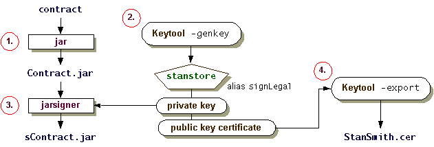

# 合同发送方的步骤

> 原文：[`docs.oracle.com/javase/tutorial/security/toolfilex/sender.html`](https://docs.oracle.com/javase/tutorial/security/toolfilex/sender.html)

此处为合同发送方概述的步骤与签署代码并授予权限课程中列出的代码签署者的步骤*基本相同*。然而，在这里，您假装是 Stan Smith 而不是 Susan Jones，并且在要签名的 JAR 文件中存储数据文件而不是类文件。

作为合同发送方，您需要执行以下步骤。

1.  创建包含合同的 JAR 文件，使用`jar`工具。

1.  生成密钥（如果尚未存在），使用`keytool`的`-genkey`命令。

    *可选步骤*：为公钥证书生成证书签名请求（CSR），并导入认证机构的响应。为简单起见，由于您只是假装是 Stan Smith，因此省略了此步骤。有关更多信息，请参见为公钥证书生成证书签名请求（CSR）。

1.  对 JAR 文件进行签名，使用`jarsigner`工具和第 2 步生成的私钥。

1.  导出公钥证书，使用`keytool`的`-export`命令。然后将签名的 JAR 文件和证书提供给接收方 Ruth。

