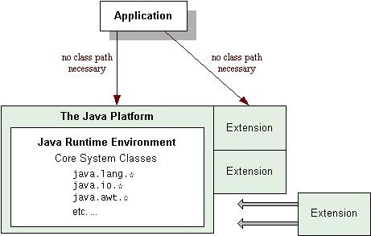

# 教程：扩展机制

> 原文：[`docs.oracle.com/javase/tutorial/ext/index.html`](https://docs.oracle.com/javase/tutorial/ext/index.html)

扩展机制提供了一种标准、可扩展的方式，使自定义 API 对在 Java 平台上运行的所有应用程序可用。*Java 扩展*也被称为*可选包*。本教程可能会交替使用这两个术语。

*扩展*是通过扩展机制增强 Java 平台的一组包和类。扩展机制使运行时环境能够找到并加载扩展类，而无需在类路径上命名扩展类。在这方面，扩展类类似于 Java 平台的核心类。这也是扩展得名的原因--它们实际上扩展了平台的核心 API。

由于此机制扩展了平台的核心 API，应谨慎使用。最常见的用途是用于由 Java 社区流程定义的标准化接口，尽管也可能适用于站点范围接口。

如图所示，扩展充当 Java 平台的“附加”模块。它们的类和公共 API 自动对在平台上运行的任何应用程序可用。

扩展机制还提供了一种从远程位置下载扩展类供 applets 使用的方法。

扩展被打包为 Java 存档（JAR）文件，本教程假定您熟悉 JAR 文件格式。如果您对 JAR 文件不熟悉，您可能需要在继续本教程的课程之前查阅一些 JAR 文件文档：

+   本教程中的在 JAR 文件中打包程序课程。

+   JDK™文档中的[JAR 指南](https://docs.oracle.com/javase/8/docs/technotes/guides/jar/jarGuide.html)。

本教程有两个课程：

## 创建和使用扩展

这一部分向您展示了如何向您的 Java 平台添加扩展，并且 applets 如何通过下载远程扩展类从扩展机制中受益。

## 使扩展安全

本节描述了在您的平台上授予扩展的安全特权和权限。如果您正在编写自己的扩展类，您将了解如何使用 Java 平台的安全架构。

## 附加文档

您可以在 JDK 文档的[Java 扩展机制](https://docs.oracle.com/javase/8/docs/technotes/guides/extensions/)部分找到有关扩展的更多信息。
