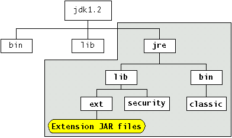

# 已安装的扩展

> 原文：[`docs.oracle.com/javase/tutorial/ext/basics/install.html`](https://docs.oracle.com/javase/tutorial/ext/basics/install.html)

已安装的扩展是 JRE™软件的`lib/ext`目录中的 JAR 文件。顾名思义，JRE 是 Java 开发工具包的运行时部分，包含平台的核心 API，但不包括编译器和调试器等开发工具。JRE 可以单独使用，也可以作为 Java 开发工具包的一部分使用。

JRE 是 JDK 软件的严格子集。JDK 软件目录树的子集如下所示：



JRE 由图中突出显示的目录组成。无论您的 JRE 是独立的还是作为 JDK 软件的一部分，JRE 目录中的`lib/ext`中的任何 JAR 文件都会被运行时环境自动视为扩展。

由于安装的扩展会扩展平台的核心 API，请谨慎使用。它们很少适用于仅由单个或少量应用程序使用的接口。

此外，由于安装的扩展定义的符号将在所有 Java 进程中可见，因此应注意确保所有可见符号遵循适当的“反向域名”和“类层次结构”约定。例如，`com.mycompany.MyClass`。

从 Java 6 开始，扩展 JAR 文件也可以放置在与任何特定 JRE 无关的位置，以便扩展可以被安装在系统上安装的所有 JRE 共享。在 Java 6 之前，`java.ext.dirs`的值指的是单个目录，但是从 Java 6 开始，它是一个目录列表（类似于`CLASSPATH`），指定扩展被搜索的位置。路径的第一个元素始终是 JRE 的`lib/ext`目录。第二个元素是 JRE 之外的目录。这个其他位置允许扩展 JAR 文件只安装一次，并被安装在该系统上安装的几个 JRE 使用。位置因操作系统而异：

+   Solaris™操作系统: `/usr/jdk/packages/lib/ext`

+   Linux: `/usr/java/packages/lib/ext`

+   Microsoft Windows: `%SystemRoot%\Sun\Java\lib\ext`

请注意，放置在上述任一目录中的安装扩展会扩展该系统上*每个*JRE（Java 6 或更高版本）的平台。

## 一个简单的例子

让我们创建一个简单的已安装扩展。我们的扩展由一个类`RectangleArea`组成，用于计算矩形的面积：

```java
public final class RectangleArea {
    public static int area(java.awt.Rectangle r) {
        return r.width * r.height;
    }
}

```

此类有一个名为`area`的方法，该方法接受一个`java.awt.Rectangle`的实例并返回矩形的面积。

假设你想要使用名为`AreaApp`的应用程序测试`RectangleArea`：

```java
import java.awt.*;

public class AreaApp {
    public static void main(String[] args) {
        int width = 10;
        int height = 5;

        Rectangle r = new Rectangle(width, height);
        System.out.println("The rectangle's area is " 
                           + RectangleArea.area(r));
    }
}

```

此应用程序实例化一个 10 `x` 5 的矩形，然后使用`RectangleArea.area`方法打印出矩形的面积。

## 在没有扩展机制的情况下运行 AreaApp

让我们首先回顾一下如何在不使用扩展机制的情况下运行`AreaApp`应用程序。我们假设`RectangleArea`类被捆绑在名为`area.jar`的 JAR 文件中。

当然，`RectangleArea`类不是 Java 平台的一部分，因此您需要将`area.jar`文件放在类路径上才能运行`AreaApp`而不会出现运行时异常。例如，如果`area.jar`在目录`/home/user`中，您可以使用以下命令：

```java
java -classpath .:/home/user/area.jar AreaApp 

```

此命令中指定的类路径包含当前目录，其中包含`AreaApp.class`，以及包含`RectangleArea`包的 JAR 文件的路径。通过运行此命令，您将获得所需的输出：

```java
The rectangle's area is 50

```

## 使用扩展机制运行 AreaApp

现在让我们看看如何通过将`RectangleArea`类作为扩展来运行`AreaApp`。

要将`RectangleArea`类变成一个扩展，您需要将文件`area.jar`放在 JRE 的`lib/ext`目录中。这样做会自动将`RectangleArea`赋予已安装扩展的状态。

将`area.jar`安装为扩展后，您可以运行`AreaApp`而无需指定类路径：

```java
java AreaApp 

```

因为您正在使用`area.jar`作为已安装的扩展，运行时环境将能够找到并加载`RectangleArea`类，即使您没有在类路径上指定它。同样，任何用户在您的系统上运行的小程序或应用程序都可以找到并使用`RectangleArea`类。

如果系统上安装了多个 JRE（Java 6 或更高版本），并且希望`RectangleArea`类作为所有 JRE 的扩展可用，而不是将其安装在特定 JRE 的`lib/ext`目录中，请将其安装在系统范围的位置。例如，在运行 Linux 的系统上，将`area.jar`安装在目录`/usr/java/packages/lib/ext`中。然后`AreaApp`可以在安装在该系统上的不同 JRE 上运行，例如，如果不同的浏览器配置为使用不同的 JRE。
