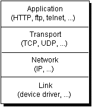
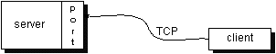
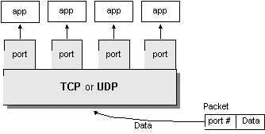

# 网络基础知识

> 原文：[`docs.oracle.com/javase/tutorial/networking/overview/networking.html`](https://docs.oracle.com/javase/tutorial/networking/overview/networking.html)

在互联网上运行的计算机使用传输控制协议（TCP）或用户数据报协议（UDP）相互通信，如此图所示：

当你编写通过网络进行通信的 Java 程序时，你是在应用层编程。通常情况下，你不需要关心 TCP 和 UDP 层。相反，你可以使用 `java.net` 包中的类。这些类提供了系统独立的网络通信。然而，为了决定你的程序应该使用哪些 Java 类，你需要了解 TCP 和 UDP 的区别。

## TCP

当两个应用程序想要可靠地相互通信时，它们建立连接并在该连接上来回发送数据。这类似于打电话。如果你想和肯塔基州的比阿特丽斯阿姨通话，当你拨打她的电话号码并她接听时，就建立了连接。你通过电话线互相交流数据。像电话公司一样，TCP 保证从连接的一端发送的数据实际上到达另一端，并且按照发送顺序。否则，会报告错误。

TCP 为需要可靠通信的应用程序提供了一对一的通道。超文本传输协议（HTTP）、文件传输协议（FTP）和 Telnet 都是需要可靠通信通道的应用程序的示例。在网络上传输和接收数据的顺序对于这些应用程序的成功至关重要。当使用 HTTP 从 URL 读取数据时，数据必须按照发送顺序接收。否则，你会得到一个混乱的 HTML 文件、一个损坏的 zip 文件或其他无效信息。

* * *

**定义：**

*TCP*（传输控制协议）是一种基于连接的协议，它在两台计算机之间提供可靠的数据流。

* * *

## UDP

UDP 协议提供了两个应用程序之间不保证通信的功能。UDP 不像 TCP 那样基于连接。相反，它从一个应用程序发送独立的数据包（称为数据报）到另一个应用程序。发送数据报就像通过邮政服务发送信件一样：交付顺序不重要，也不保证，每个消息都是独立的。

* * *

**定义：**

*UDP*（用户数据报协议）是一种协议，它发送独立的数据包（称为数据报）从一台计算机到另一台计算机，不保证到达。UDP 不像 TCP 那样基于连接。

* * *

对于许多应用程序，可靠性的保证对于信息从连接的一端传输到另一端的成功至关重要。然而，其他形式的通信并不需要如此严格的标准。事实上，它们可能会因为额外的开销或可靠连接可能使服务无效而变慢。

举个例子，考虑一个时钟服务器，当被请求时向其客户端发送当前时间。如果客户端错过了一个数据包，重新发送它并没有意义，因为当客户端第二次接收到时，时间将不正确。如果客户端发出两个请求并且接收到服务器发送的数据包顺序不对，也没关系，因为客户端可以发现数据包顺序不对并发出另一个请求。在这种情况下，TCP 的可靠性是不必要的，因为它会导致性能下降，可能会影响服务的实用性。

另一个不需要可靠通道保证的服务的例子是 ping 命令。ping 命令的目的是测试网络上两个程序之间的通信。事实上，ping 需要知道丢失或顺序错乱的数据包，以确定连接的好坏。可靠通道会使这项服务完全无效。

UDP 协议提供了在网络上两个应用程序之间不保证通信的功能。UDP 不像 TCP 那样基于连接。相反，它从一个应用程序发送独立的数据包到另一个应用程序。发送数据报就像通过邮件服务发送信件一样：交付顺序不重要，也不被保证，每个消息都独立于其他消息。

* * *

**注意：**

许多防火墙和路由器已经配置为不允许 UDP 数据包。如果您在防火墙外部连接到服务时遇到问题，或者客户端无法连接到您的服务，请询问系统管理员是否允许 UDP。

* * *

## 理解端口

一般来说，计算机与网络之间有一个物理连接。所有发送给特定计算机的数据都通过这个连接到达。然而，这些数据可能是针对计算机上运行的不同应用程序的。那么计算机如何知道将数据转发给哪个应用程序呢？通过*端口*。

通过互联网传输的数据附带有标识计算机和目标端口的寻址信息。计算机通过其 32 位 IP 地址进行标识，IP 使用它将数据传递到网络上的正确计算机。端口由一个 16 位数字进行标识，TCP 和 UDP 使用它将数据传递给正确的应用程序。

在基于连接的通信（如 TCP）中，服务器应用程序将套接字绑定到特定端口号。这样做的效果是向系统注册服务器以接收所有发送到该端口的数据。然后客户端可以在服务器的端口处与服务器会合，如下图所示：

* * *

**定义：**

TCP 和 UDP 协议使用端口将传入的数据映射到计算机上运行的特定进程。

* * *

在基于数据报的通信（如 UDP）中，数据报包含其目的地的端口号，UDP 将数据包路由到适当的应用程序，如下图所示：

端口号范围从 0 到 65,535，因为端口由 16 位数字表示。端口号从 0 到 1023 是受限制的；它们保留供 HTTP 和 FTP 等众所周知的服务以及其他系统服务使用。这些端口被称为*众所周知的端口*。您的应用程序不应尝试绑定到它们。

## JDK 中的网络类

通过`java.net`中的类，Java 程序可以使用 TCP 或 UDP 在互联网上进行通信。`URL`、`URLConnection`、`Socket`和`ServerSocket`类都使用 TCP 在网络上进行通信。`DatagramPacket`、`DatagramSocket`和`MulticastSocket`类用于 UDP。
