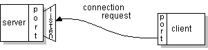
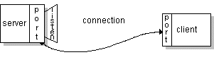

# 什么是套接字？

> 原文：[`docs.oracle.com/javase/tutorial/networking/sockets/definition.html`](https://docs.oracle.com/javase/tutorial/networking/sockets/definition.html)

通常，服务器在特定计算机上运行，并具有绑定到特定端口号的套接字。服务器只是等待，监听套接字，等待客户端发出连接请求。

在客户端：客户端知道服务器正在运行的机器的主机名和服务器正在监听的端口号。为了发出连接请求，客户端尝试在服务器的机器和端口上与服务器会合。客户端还需要向服务器标识自己，因此它绑定到一个本地端口号，在此连接期间将使用该端口号。这通常由系统分配。

如果一切顺利，服务器接受连接。接受后，服务器会获得一个新的套接字，绑定到相同的本地端口，并且其远程端点设置为客户端的地址和端口。它需要一个新的套接字，以便在继续监听原始套接字以接受连接请求的同时，满足已连接客户端的需求。

在客户端，如果连接被接受，套接字将成功创建，客户端可以使用该套接字与服务器通信。

客户端和服务器现在可以通过写入或从套接字读取来进行通信。

* * *

**定义：**

*套接字*是网络上两个运行程序之间的双向通信链路的一个端点。套接字绑定到一个端口号，以便 TCP 层可以识别数据要发送到的应用程序。

* * *

一个端点是 IP 地址和端口号的组合。每个 TCP 连接可以通过其两个端点唯一标识。这样，您可以在主机和服务器之间建立多个连接。

Java 平台中的`java.net`包提供了一个类`Socket`，它实现了您的 Java 程序与网络上另一个程序之间的双向连接的一侧。`Socket`类位于一个平台相关的实现之上，隐藏了任何特定系统的细节，使您的 Java 程序能够以与平台无关的方式在网络上通信，而不是依赖本机代码。

此外，`java.net`包含`ServerSocket`类，它实现了服务器可以用来监听并接受客户端连接的套接字。本课程将向您展示如何使用`Socket`和`ServerSocket`类。

如果你想连接到网络，`URL` 类及其相关类（`URLConnection`，`URLEncoder`）可能比套接字类更合适。实际上，URL 是与网络连接的相对高级的方式，并且在其底层实现中使用了套接字。有关通过 URL 连接到网络的信息，请参阅使用 URL。
