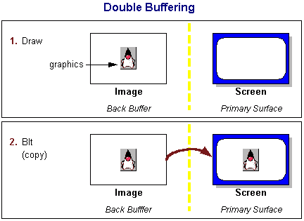
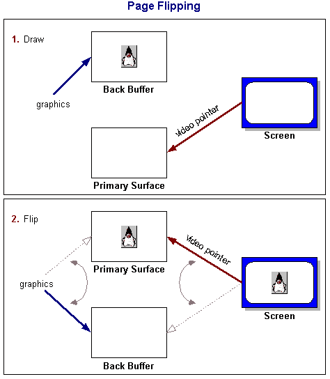

# 双缓冲和页面翻转

> 原文：[`docs.oracle.com/javase/tutorial/extra/fullscreen/doublebuf.html`](https://docs.oracle.com/javase/tutorial/extra/fullscreen/doublebuf.html)

假设您必须逐像素或逐行在屏幕上绘制整个图片。如果您直接将这样的东西绘制到屏幕上（使用`Graphics.drawLine`），您可能会发现需要一些时间。您甚至可能会注意到您的图片是如何绘制的可见痕迹。与观看以这种方式和速度绘制事物不同，大多数程序员使用一种称为*双缓冲*的技术。

在 Java 应用程序中，双缓冲的传统概念相当简单：创建一个屏幕外图像，使用图像的图形对象绘制到该图像，然后，在一步中，使用目标窗口的图形对象和屏幕外图像调用`drawImage`。您可能已经注意到，Swing 在其许多组件中使用了这种技术，通常默认启用，使用`setDoubleBuffered`方法。

屏幕表面通常被称为*主表面*，用于双缓冲的屏幕外图像通常被称为*后备缓冲区*。将内容从一个表面复制到另一个表面的行为通常被称为块线传输，或*blitting*（blt 通常发音为"blit"，不应与 BLT 三明治混淆）。

主表面通常通过任何显示组件的图形对象进行操作；在全屏模式下，使用全屏窗口的图形进行任何操作是对屏幕内存的直接操作。因此，您可以利用全屏独占模式中可能由于窗口系统的开销而无法使用的其他功能。在全屏独占模式中仅可用的一种技术是一种称为*页面翻转*的双缓冲形式。

## 页面翻转

许多显卡都有*视频指针*的概念，它只是视频内存中的一个地址。这个指针告诉显卡在下一个刷新周期期间要显示的视频内容在哪里。在一些显卡和一些操作系统中，这个指针甚至可以通过编程方式进行操作。假设你在视频内存中创建了一个与屏幕精确宽度、高度和位深度相同的后备缓冲区，然后像使用双缓冲区一样向该缓冲区绘制。现在想象一下，如果不像双缓冲区那样将图像传输到屏幕上，而是简单地将视频指针更改为你的后备缓冲区，那会发生什么。在下一次刷新期间，显卡现在将使用你的图像来显示。这种切换称为翻页，与基于 blt 的双缓冲区相比，性能提升在于只需要在内存中移动一个指针，而不是将整个内容从一个缓冲区复制到另一个缓冲区。

当发生页面翻转时，旧后备缓冲区的指针现在指向主表面，旧主表面的指针现在指向后备缓冲区内存。这会自动为下一个绘制操作做好准备。

有时在*翻页链*中设置多个后备缓冲区是有利的。当绘制所花费的时间大于显示器的刷新率时，这是特别有用的。翻页链简单地是两个或更多后备缓冲区（有时称为*中间缓冲区*）加上主表面（有时称为三重缓冲、四重缓冲等）。在翻页链中，下一个可用的后备缓冲区变为主表面，依此类推，一直到用于绘制的最后一个后备缓冲区。

## 双缓冲和翻页的好处

如果你的性能指标只是双缓冲或翻页发生的速度与直接渲染相比，你可能会感到失望。你可能会发现，直接渲染的数字远远超过双缓冲的数字，而双缓冲的数字远远超过翻页的数字。这些技术都是用于改善*感知性能*，在图形应用程序中比*数值性能*更重要。

双缓冲主要用于消除可见的绘制，这可以使应用程序看起来业余、迟缓或闪烁。翻页主要用于消除*撕裂*，这是一种在绘制到屏幕上比显示器的刷新率更快时发生的分裂效果。更平滑的绘制意味着更好的感知性能和更好的用户体验。
