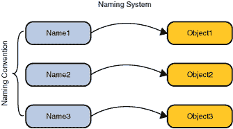
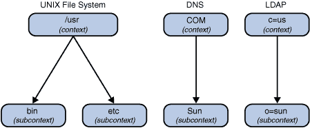

# 教训：命名和目录概念

> 原文：[`docs.oracle.com/javase/tutorial/jndi/concepts/index.html`](https://docs.oracle.com/javase/tutorial/jndi/concepts/index.html)

## 命名概念

在任何计算系统中的一个基本设施是*命名服务*——通过名称与对象关联并根据其名称找到对象的方法。在几乎任何计算机程序或系统中使用时，您总是在命名一个对象或另一个对象。例如，当您使用电子邮件系统时，必须提供收件人的名称。要访问计算机中的文件，必须提供其名称。命名服务允许您根据名称查找对象。



命名服务的主要功能是将人们友好的名称映射到对象，例如地址、标识符或通常由计算机程序使用的对象。

例如，[Internet 域名系统（DNS）](http://www.ietf.org/rfc/rfc1034.txt)将机器名称映射到 IP 地址：

```java
www.example.com ==> 192.0.2.5

```

文件系统将文件名映射到程序可以使用的文件引用，以访问文件的内容。

```java
c:\bin\autoexec.bat ==> File Reference

```

这两个示例也说明了命名服务存在的广泛规模范围——从在互联网上命名对象到在本地文件系统上命名文件。

## 名称

要在命名系统中查找对象，您需要提供对象的*名称*。命名系统确定名称必须遵循的语法。这种语法有时被称为命名系统的*命名约定*。名称由组件组成。名称的表示包括一个组件分隔符，标记名称的组件。

| 命名系统 | 组件分隔符 | 名称 |
| --- | --- | --- |
| UNIX 文件系统 | "/" | /usr/hello |
| DNS | "." | sales.Wiz.COM |
| LDAP | "," 和 "=" | cn=Rosanna Lee, o=Sun, c=US |

UNIX 文件系统的命名约定是，文件的命名来自于相对于文件系统根目录的路径，路径中的每个组件从左到右使用斜杠字符("/")分隔。例如，UNIX 的*路径名* `/usr/hello`，命名了位于文件系统根目录中的文件目录`usr`中的文件`hello`。

DNS 命名约定要求 DNS 名称中的组件从右到左排序，并用点字符(".")分隔。因此，DNS 名称`sales.Wiz.COM`命名了一个名为`sales`的 DNS 条目，相对于 DNS 条目`Wiz.COM`。而 DNS 条目`Wiz.COM`又命名了一个名为`Wiz`的条目，位于`COM`条目中。

[轻量级目录访问协议（LDAP）](http://www.ietf.org/rfc/rfc2251.txt)命名约定按从右到左的顺序排列组件，以逗号字符（“,”）分隔。因此，LDAP 名称`cn=Rosanna Lee, o=Sun, c=US`指定了一个 LDAP 条目`cn=Rosanna Lee`，相对于条目`o=Sun`，后者又相对于`c=us`。LDAP 还有一个规则，即名称的每个组件必须是一个名称/值对，名称和值之间用等号字符（“=”）分隔。

## 绑定

名称与对象的关联称为*绑定*。文件名绑定到文件。

DNS 包含将机器名称映射到 IP 地址的绑定。LDAP 名称绑定到 LDAP 条目。

## 参考和地址

根据命名服务的不同，一些对象无法直接存储在命名服务中；也就是说，不能将对象的副本放入命名服务中。相反，它们必须通过引用存储；也就是说，将指向对象的*指针*或*引用*放入命名服务中。引用表示如何访问对象的信息。通常，它是一种紧凑的表示形式，可用于与对象通信，而对象本身可能包含更多状态信息。使用引用，您可以联系对象并获取有关对象的更多信息。

例如，飞机对象可能包含飞机的乘客和机组人员列表，其飞行计划，燃料和仪表状态，以及其航班号和起飞时间。相比之下，飞机对象引用可能只包含其航班号和起飞时间。引用是关于飞机对象信息的更紧凑表示，并可用于获取附加信息。例如，文件对象使用*文件引用*访问。另外，打印机对象可能包含打印机的状态，如当前队列和纸盒中的纸张量。另一方面，打印机对象引用可能只包含有关如何到达打印机的信息，如其打印服务器名称和打印协议。

尽管一般来说引用可以包含任意信息，但将其内容称为*地址*（或通信终点）是有用的：关于如何访问对象的具体信息。

为简单起见，本教程在不需要区分两者时使用“对象”来指代对象和对象引用。

## 上下文

*上下文*是一组名称到对象的绑定。每个上下文都有一个相关的命名约定。上下文始终提供一个查找（*解析*）操作，返回对象，通常还提供绑定名称、解绑名称和列出绑定名称等操作。一个上下文对象中的名称可以绑定到另一个具有相同命名约定的上下文对象（称为*子上下文*）。



UNIX 文件系统中的文件目录，例如`/usr`，代表一个上下文。相对于另一个文件目录命名的文件目录代表一个子上下文（UNIX 用户将其称为*子目录*）。也就是说，在文件目录`/usr/bin`中，目录`bin`是`usr`的子上下文。DNS 域，例如`COM`，代表一个上下文。相对于另一个 DNS 域命名的 DNS 域代表一个子上下文。对于 DNS 域`Sun.COM`，DNS 域`Sun`是`COM`的子上下文。

最后，LDAP 条目，例如`c=us`，代表一个上下文。相对于另一个 LDAP 条目命名的 LDAP 条目代表一个子上下文。对于 LDAP 条目`o=sun,c=us`，条目`o=sun`是`c=us`的子上下文。

## 命名系统和命名空间

*命名系统*是同一类型上下文的连接集合（它们具有相同的命名约定），并提供一组共同的操作。

实现 DNS 的系统是一个命名系统。使用 LDAP 进行通信的系统也是一个命名系统。

命名系统为其客户提供*命名服务*，用于执行与命名相关的操作。命名服务通过其自己的接口访问。DNS 提供将机器名称映射到 IP 地址的命名服务。LDAP 提供将 LDAP 名称映射到 LDAP 条目的命名服务。文件系统提供将文件名映射到文件和目录的命名服务。

*命名空间*是命名系统中所有可能名称的集合。UNIX 文件系统具有一个命名空间，其中包含该文件系统中所有文件和目录的名称。DNS 命名空间包含 DNS 域和条目的名称。LDAP 命名空间包含 LDAP 条目的名称。
