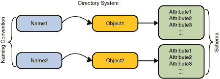

# 目录概念

> 原文：[`docs.oracle.com/javase/tutorial/jndi/concepts/directory.html`](https://docs.oracle.com/javase/tutorial/jndi/concepts/directory.html)

许多命名服务都扩展了*目录服务*。目录服务将名称与对象关联，并将这些对象与*属性*关联起来。

目录服务 = 命名服务 + 包含属性的对象

你不仅可以通过名称查找对象，还可以获取对象的属性或*根据其属性搜索*对象。



一个例子是电话公司的目录服务。它将订户的姓名映射到他的地址和电话号码。计算机的目录服务非常类似于电话公司的目录服务，因为两者都可以用来存储诸如电话号码和地址之类的信息。然而，计算机的目录服务更加强大，因为它可以在线使用，并且可以用来存储各种信息，这些信息可以被用户、程序甚至计算机本身和其他计算机利用。

*目录对象*表示计算环境中的一个对象。例如，目录对象可以用来表示打印机、人员、计算机或网络。目录对象包含描述其所代表对象的*属性*。

## 属性

目录对象可以具有*属性*。例如，打印机可以由具有其速度、分辨率和颜色等属性的目录对象表示。用户可以由具有用户的电子邮件地址、各种电话号码、邮寄地址和计算机帐户信息等属性的目录对象表示。

属性具有*属性标识符*和一组*属性值*。属性标识符是一个标记，独立于其值标识属性。例如，两个不同的计算机帐户可能具有一个`"mail"`属性；`"mail"`是属性标识符。属性值是属性的内容。例如，电子邮件地址可能有：

```java
Attribute Identifier : Attribute Value
                 mail   john.smith@example.com

```

## 目录和目录服务

*目录*是一组连接的目录对象。*目录服务*是提供用于在目录中创建、添加、删除和修改与对象关联的属性的操作的服务。该服务通过其自己的接口访问。

可能有许多目录服务的示例。

网络信息服务（NIS）

NIS 是 UNIX 操作系统上可用的目录服务，用于存储与机器、网络、打印机和用户相关的系统信息。

[Oracle 目录服务器](http://www.oracle.com/technetwork/testcontent/index-085178.html)

Oracle 目录服务器是一个基于互联网标准[LDAP](http://www.ietf.org/rfc/rfc2251.txt)的通用目录服务。

## 搜索服务

你可以通过向目录服务提供其名称来查找目录对象。另外，许多目录，比如基于 LDAP 的目录，支持*搜索*的概念。当你搜索时，你可以提供一个*查询*，其中包含一个逻辑表达式，你可以在其中指定对象必须具有的属性。这个查询被称为*搜索过滤器*。这种搜索方式有时被称为*反向查找*或*基于内容的搜索*。目录服务会搜索并返回满足搜索过滤器的对象。

例如，你可以查询目录服务以查找：

+   所有具有属性`"age"`大于 40 岁的用户。

+   所有 IP 地址以"192.113.50"开头的机器。

## 结合命名和目录服务

目录通常将它们的对象按层次结构排列。例如，LDAP 将所有目录对象排列在一棵树中，称为*目录信息树（DIT）*。在 DIT 中，一个组织对象，例如，可能包含可能又包含人员对象的组对象。当目录对象以这种方式排列时，它们除了作为属性容器外还扮演了命名上下文的角色。
