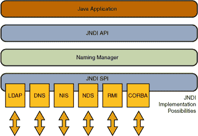

# 课程：JNDI 概述

> 原文：[`docs.oracle.com/javase/tutorial/jndi/overview/index.html`](https://docs.oracle.com/javase/tutorial/jndi/overview/index.html)

Java 命名和目录接口（JNDI）是一个提供命名和目录功能的应用程序编程接口（API），用于使用 Java™ 编程语言编写的应用程序。它被定义为独立于任何特定目录服务实现。因此，各种目录 - 新的、新兴的和已部署的都可以以一种通用的方式访问。

## 架构

JNDI 架构包括 API 和服务提供者接口（SPI）。Java 应用程序使用 JNDI API 访问各种命名和目录服务。SPI 使各种命名和目录服务能够透明地插入，从而允许使用 JNDI API 的 Java 应用程序访问它们的服务。请参见下图：

## 打包

JNDI 包含在 Java SE 平台中。要使用 JNDI，您必须具有 JNDI 类和一个或多个服务提供者。JDK 包含以下命名/目录服务的服务提供者：

+   轻量级目录访问协议（LDAP）

+   公共对象请求代理体系结构（CORBA）公共对象服务（COS）名称服务

+   Java 远程方法调用（RMI）注册表

+   域名服务（DNS）

其他服务提供者可以从[JNDI 页面](http://www.oracle.com/technetwork/java/jndi/index.html)下载或从其他供应商获取。

JNDI 分为五个包：

+   javax.naming

+   javax.naming.directory

+   javax.naming.ldap

+   javax.naming.event

+   javax.naming.spi

课程的下一部分简要描述了 JNDI 包。
