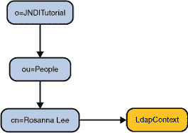

# 查找一个对象

> 原文：[`docs.oracle.com/javase/tutorial/jndi/ops/lookup.html`](https://docs.oracle.com/javase/tutorial/jndi/ops/lookup.html)

要从命名服务中查找对象，请使用[`Context.lookup()`](https://docs.oracle.com/javase/8/docs/api/javax/naming/Context.html#lookup-javax.naming.Name-)并传递要检索的对象的名称。假设在命名服务中有一个名为`cn=Rosanna Lee,ou=People`的对象。要检索对象，您可以编写

```java
Object obj = ctx.lookup("cn=Rosanna Lee,ou=People");

```

`lookup()`返回的对象类型取决于底层命名系统和对象本身关联的数据。命名系统可以包含许多不同类型的对象，在系统的不同部分查找对象可能会产生不同类型的对象。在这个例子中，`"cn=Rosanna Lee,ou=People"`恰好绑定到一个上下文对象（`javax.naming.ldap.LdapContext`）。你可以将`lookup()`的结果转换为目标类。

例如，以下代码查找对象`"cn=Rosanna Lee,ou=People"`并将其转换为`LdapContext`。

```java
import javax.naming.ldap.LdapContext;
...
LdapContext ctx = (LdapContext) ctx.lookup("cn=Rosanna Lee,ou=People");

```

完整的示例在文件``Lookup.java``中。



Java SE 6 中有两个新的静态方法可用于查找名称：

+   [`InitialContext.doLookup(Name name)`](https://docs.oracle.com/javase/8/docs/api/javax/naming/InitialContext.html#doLookup-javax.naming.Name-)

+   [`InitialContext.doLookup(String name)`](https://docs.oracle.com/javase/8/docs/api/javax/naming/InitialContext.html#doLookup-java.lang.String-)

这些方法提供了一种快捷的查找名称的方式，而无需实例化 InitialContext。
