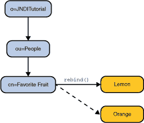

# 添加、替换或移除绑定

> 原文：[`docs.oracle.com/javase/tutorial/jndi/ops/bind.html`](https://docs.oracle.com/javase/tutorial/jndi/ops/bind.html)

`Context` 接口包含用于在上下文中添加、替换和移除绑定的方法。

## 添加绑定

[`Context.bind()`](https://docs.oracle.com/javase/8/docs/api/javax/naming/Context.html#bind-javax.naming.Name-java.lang.Object-) 用于向上下文添加绑定。它接受对象的名称和要绑定的对象作为参数。

* * *

**在继续之前：** 本课程中的示例需要您对模式进行添加。您必须在 LDAP 服务器中关闭模式检查，或者将伴随本教程的`模式`添加到服务器中。这两项任务通常由目录服务器的管理员执行。请参阅 LDAP 设置课程。

* * *

```java
// Create the object to be bound
Fruit fruit = new Fruit("orange");

// Perform the bind
ctx.bind("cn=Favorite Fruit", fruit);

```

`这个例子` 创建一个 `Fruit` 类的对象，并将其绑定到上下文 `ctx` 中的名称 `"cn=Favorite Fruit"`。如果随后在 `ctx` 中查找名称 `"cn=Favorite Fruit"`，则会得到 `fruit` 对象。请注意，要编译 `Fruit` 类，您需要 ``FruitFactory`` 类。

如果您运行此示例两次，则第二次尝试将失败，并显示 [`NameAlreadyBoundException`](https://docs.oracle.com/javase/8/docs/api/javax/naming/NameAlreadyBoundException.html)。这是因为名称 `"cn=Favorite Fruit"` 已经绑定。要使第二次尝试成功，您必须使用 [`rebind()`](https://docs.oracle.com/javase/8/docs/api/javax/naming/Context.html#rebind-javax.naming.Name-java.lang.Object-)。

## 添加或替换绑定

`rebind()` 用于添加或替换绑定。它接受与 `bind()` 相同的参数，但语义是如果名称已经绑定，则将解绑并绑定新给定的对象。

```java
// Create the object to be bound
Fruit fruit = new Fruit("lemon");

// Perform the bind
ctx.rebind("cn=Favorite Fruit", fruit);

```

当你运行`这个例子`时，它将替换由``bind()``例子创建的绑定。



## 移除绑定

要移除绑定，您可以使用[`unbind()`](https://docs.oracle.com/javase/8/docs/api/javax/naming/Context.html#unbind-javax.naming.Name-)。

```java
// Remove the binding
ctx.unbind("cn=Favorite Fruit");

```

运行时，`这个例子`将移除由``bind()``或``rebind()``例子创建的绑定。
