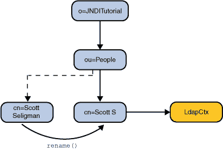

# 重命名

> 原文：[`docs.oracle.com/javase/tutorial/jndi/ops/rename.html`](https://docs.oracle.com/javase/tutorial/jndi/ops/rename.html)

您可以使用[`Context.rename()`](https://docs.oracle.com/javase/8/docs/api/javax/naming/Context.html#rename-javax.naming.Name-javax.naming.Name-)在上下文中重命名对象。

```java
// Rename to Scott S
ctx.rename("cn=Scott Seligman", "cn=Scott S");

```



`这个例子` 将绑定到`"cn=Scott Seligman"`的对象重命名为`"cn=Scott S"`。在验证对象已重命名后，程序将其重新命名为原始名称（`"cn=Scott Seligman"`）。

```java
// Rename back to Scott Seligman
ctx.rename("cn=Scott S", "cn=Scott Seligman");

```

欲了解更多关于 LDAP 条目重命名的示例，请查看 LDAP 用户的高级主题课程。
