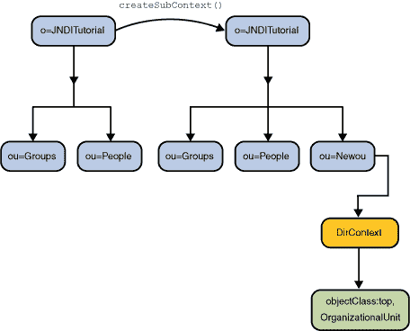

# 创建和销毁子上下文

> 原文：[`docs.oracle.com/javase/tutorial/jndi/ops/create.html`](https://docs.oracle.com/javase/tutorial/jndi/ops/create.html)

`Context`接口包含用于创建和销毁 *子上下文* 的方法，即绑定在同一类型的另一个上下文中的上下文。

此处描述的示例使用具有*属性*的对象，并在目录中创建一个子上下文。您可以使用这些`DirContext`方法在将绑定或子上下文添加到命名空间时将属性与对象关联起来。例如，您可以创建一个`Person`对象并将其绑定到命名空间，并同时关联有关该`Person`对象的属性。命名等效项将没有属性。

createSubcontext()与 bind()的不同之处在于它创建一个新对象，即一个新的上下文，将其绑定到目录，而 bind()将给定对象绑定到目录。

## 创建上下文

要创建命名上下文，您需要向[`createSubcontext()`](https://docs.oracle.com/javase/8/docs/api/javax/naming/Context.html#createSubcontext-javax.naming.Name-) 提供要创建的上下文的名称。要创建具有属性的上下文，您需要向[`DirContext.createSubcontext()`](https://docs.oracle.com/javase/8/docs/api/javax/naming/directory/DirContext.html#createSubcontext-javax.naming.Name-javax.naming.directory.Attributes-) 提供要创建的上下文的名称和其属性。

* * *

**在继续之前：** 本课程中的示例需要您对模式进行添加。您必须在 LDAP 服务器中关闭模式检查，或者将伴随本教程的`模式`添加到服务器中。这两项任务通常由目录服务器的管理员执行。请参阅 LDAP 设置课程。

* * *

```java
// Create attributes to be associated with the new context
Attributes attrs = new BasicAttributes(true); // case-ignore
Attribute objclass = new BasicAttribute("objectclass");
objclass.add("top");
objclass.add("organizationalUnit");
attrs.put(objclass);

// Create the context
Context result = ctx.createSubcontext("NewOu", attrs);

```

`This example` 创建了一个名为`"ou=NewOu"`的新上下文，在上下文`ctx`中有一个属性`"objectclass"`，其值为`"top"`和`"organizationalUnit"`。

```java
# java Create
ou=Groups: javax.naming.directory.DirContext
ou=People: javax.naming.directory.DirContext
ou=NewOu: javax.naming.directory.DirContext

```

`This example` 创建了一个名为`"NewOu"`的新上下文，它是`ctx`的子上下文。



## 销毁上下文

要销毁一个上下文，您需要向[`destroySubcontext()`](https://docs.oracle.com/javase/8/docs/api/javax/naming/Context.html#destroySubcontext-javax.naming.Name-) 提供要销毁的上下文的名称。

```java
// Destroy the context
ctx.destroySubcontext("NewOu");

```

`This example` 在上下文`ctx`中销毁了上下文`"NewOu"`。
