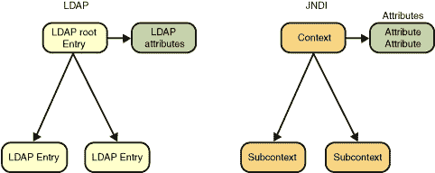

# JNDI 作为 LDAP API

> 原文：[`docs.oracle.com/javase/tutorial/jndi/ldap/jndi.html`](https://docs.oracle.com/javase/tutorial/jndi/ldap/jndi.html)

JNDI 和 LDAP 模型都定义了一个层次化的命名空间，您可以在其中命名对象。命名空间中的每个对象都可以具有用于搜索该对象的属性。在这个高层次上，这两个模型是相似的，因此不足为奇 JNDI 很好地映射到 LDAP。

## 模型

您可以将 LDAP 条目视为 JNDI [`DirContext`](https://docs.oracle.com/javase/8/docs/api/javax/naming/directory/DirContext.html)。每个 LDAP 条目包含一个名称和一组属性，以及一个可选的子条目集。例如，LDAP 条目`"o=JNDITutorial"`可能具有其属性`"objectclass"`和`"o"`，并且可能具有其子条目`"ou=Groups"`和`"ou=People"`。

在 JNDI 中，LDAP 条目`"o=JNDITutorial"`被表示为一个具有名称`"o=JNDITutorial"`的上下文，其具有两个子上下文，分别命名为`"ou=Groups"`和`"ou=People"`。LDAP 条目的属性由[`Attributes`](https://docs.oracle.com/javase/8/docs/api/javax/naming/directory/Attributes.html)接口表示，而单个属性由[`Attribute`](https://docs.oracle.com/javase/8/docs/api/javax/naming/directory/Attribute.html)接口表示。



请查看本课程的下一部分以了解如何通过 JNDI 访问 LDAP 操作的详细信息。

## 名称

由于联邦制度的结果，您提供给 JNDI 上下文方法的名称可以跨越多个命名空间。这些被称为复合名称。当使用 JNDI 访问 LDAP 服务时，您应该意识到字符串名称中的斜杠字符("/")对 JNDI 具有特殊含义。如果 LDAP 条目的名称包含此字符，则需要对其进行转义（使用反斜杠字符"\"）。例如，具有名称`"cn=O/R"`的 LDAP 条目必须呈现为字符串`"cn=O\\/R"`以供 JNDI 上下文方法使用。有关名称的更多信息，请查看[JNDI 教程](https://docs.oracle.com/javase/jndi/tutorial/beyond/names/index.html)。[LdapName](https://docs.oracle.com/javase/8/docs/api/javax/naming/ldap/LdapName.html)和[Rdn](https://docs.oracle.com/javase/8/docs/api/javax/naming/ldap/Rdn.html)类简化了 LDAP 名称的创建和操作。

在协议中使用的 LDAP 名称始终是完全限定的名称，用于标识从 LDAP 命名空间的根（由服务器定义）开始的条目。以下是一些完全限定的 LDAP 名称的示例。

```java
cn=Ted Geisel, ou=Marketing, o=Some Corporation, c=gb
cn=Vinnie Ryan, ou=People, o=JNDITutorial

```

在 JNDI 中，然而，名称始终是*相对的*；也就是说，你总是相对于上下文命名一个对象。例如，你可以将条目`"cn=Vinnie Ryan"`命名为相对于名为`"ou=People, o=JNDITutorial"`的上下文。或者你可以将条目`"cn=Vinnie Ryan, ou=People"`命名为相对于名为`"o=JNDITutorial"`的上下文。或者，你可以创建一个指向 LDAP 服务器命名空间根的初始上下文，并将条目命名为`"cn=Vinnie Ryan, ou=People, o=JNDITutorial"`。

在 JNDI 中，你还可以使用 LDAP URL 来命名 LDAP 条目。请参阅[JNDI 教程](https://docs.oracle.com/javase/jndi/tutorial/ldap/misc/url.html)中关于 LDAP URL 的讨论。
