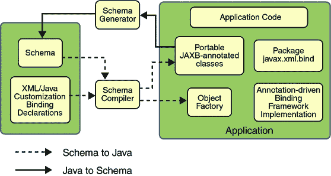
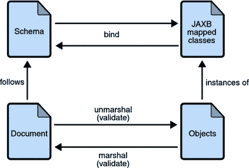

# JAXB 架构

> 原文：[`docs.oracle.com/javase/tutorial/jaxb/intro/arch.html`](https://docs.oracle.com/javase/tutorial/jaxb/intro/arch.html)

本节描述了 JAXB 处理模型中的组件和交互。

## 架构概述

以下图显示了构成 JAXB 实现的组件。

图：JAXB 架构概述

JAXB 实现由以下架构组件组成：

+   模式编译器：将源模式绑定到一组基于模式的程序元素。绑定由基于 XML 的绑定语言描述。

+   模式生成器：将一组现有程序元素映射到一个派生模式。映射由程序注解描述。

+   绑定运行时框架：提供了用于访问、操作和验证 XML 内容的解组（读取）和组装（写入）操作，使用基于模式的或现有程序元素。

## JAXB 绑定过程

以下图显示了 JAXB 绑定过程中发生的情况。

图：JAXB 绑定过程中的步骤

JAXB 数据绑定过程中的一般步骤如下：

1.  生成类：将 XML 模式用作 JAXB 绑定编译器的输入，以根据该模式生成基于 JAXB 的类。

1.  编译类：所有生成的类、源文件和应用程序代码都必须被编译。

1.  Unmarshal：根据源模式中的约束编写的 XML 文档由 JAXB 绑定框架解组。请注意，JAXB 还支持从文件和文档以外的源解组 XML 数据，如 DOM 节点、字符串缓冲区、SAX 源等。

1.  生成内容树：解组过程生成从生成的 JAXB 类实例化的数据对象内容树；此内容树表示源 XML 文档的结构和内容。

1.  验证（可选）：解组过程涉及在生成内容树之前验证源 XML 文档。请注意，如果您在第 6 步中修改内容树，您还可以使用 JAXB 验证操作在将内容组装回 XML 文档之前验证更改。

1.  处理内容：客户端应用程序可以通过使用绑定编译器生成的接口修改 Java 内容树表示的 XML 数据。

1.  Marshal：处理后的内容树被组装成一个或多个 XML 输出文档。在组装之前可能会进行验证。

## 更多关于 Unmarshalling

Unmarshalling 提供了客户端应用程序将 XML 数据转换为基于 JAXB 的 Java 对象的能力。

## 更多关于 Marshalling

Marshalling 提供了客户端应用程序将基于 JAXB 的 Java 对象树转换为 XML 数据的能力。

默认情况下，`Marshaller`在生成 XML 数据时使用 UTF-8 编码。

在组合之前，客户端应用程序不需要验证 Java 内容树。也没有要求 Java 内容树在组合成 XML 数据时必须符合其原始模式。

## 更多关于验证

验证是验证 XML 文档是否符合模式中表达的所有约束的过程。JAXB 1.0 在解组时提供了验证，并且还可以在 JAXB 内容树上按需进行验证。JAXB 2.0 只允许在解组和组合时进行验证。Web 服务处理模型是在读取数据时宽松，在写出数据时严格。为了符合该模型，在组合时添加了验证，以便用户可以确认在修改 JAXB 表单中的文档时未使 XML 文档无效。
