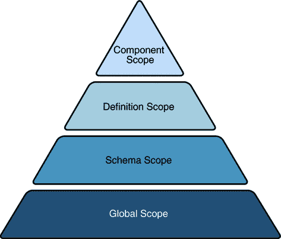

# 自定义 JAXB 绑定

> 原文：[`docs.oracle.com/javase/tutorial/jaxb/intro/custom.html`](https://docs.oracle.com/javase/tutorial/jaxb/intro/custom.html)

以下部分描述了几个示例，这些示例是基于基本示例中演示的概念构建的。

本节的目标是演示如何使用自定义绑定声明来自定义 JAXB 绑定，可以通过以下两种方式之一进行：

+   作为内联注释在 XML 模式中

+   作为传递给 JAXB 绑定编译器的外部文件中的语句

与基本 JAXB 示例中的示例不同，该示例侧重于在生成基于模式的 Java 绑定类之前对 XML 模式进行的自定义。

* * *

**注意：** JAXB 绑定自定义目前必须手动完成。JAXB 技术的目标之一是标准化绑定声明的格式，从而可以创建自定义工具，并在 JAXB 实现之间提供标准的交换格式。

* * *

本节介绍了可以对 JAXB 绑定和验证方法进行的自定义。更多信息，请参见[JAXB 规范](http://jaxb.java.net)。

## 为什么要自定义？

在大多数情况下，由 JAXB 绑定编译器生成的默认绑定就足够了。然而，有些情况下，您可能希望修改默认绑定。其中一些情况包括：

+   为基于模式的 JAXB 包、类、方法和常量创建 API 文档：通过向您的模式添加自定义 Javadoc 工具注释，您可以解释与您的实现特定的概念、指南和规则。

+   为默认的 XML 名称到 Java 标识符映射无法自动处理的情况提供语义上有意义的自定义名称；例如：

    +   为解决名称冲突（如 *JAXB 规范* 的附录 D.2.1 中所述）。请注意，JAXB 绑定编译器会检测并报告所有名称冲突。

    +   为类型安全枚举常量提供名称，这些名称不是有效的 Java 标识符；例如，枚举整数值。

    +   为未命名模型组的 Java 表示提供更好的名称，当它们绑定到 Java 属性或类时。

    +   提供比默认从目标命名空间 URI 派生的包名称更有意义的名称。

+   覆盖默认绑定；例如：

    +   指定模型组必须绑定到类而不是列表。

    +   指定一个固定属性可以绑定到一个 Java 常量。

    +   覆盖 XML 模式内置数据类型到 Java 数据类型的指定默认绑定。在某些情况下，您可能希望引入一个替代的 Java 类，该类可以表示内置 XML 模式数据类型的其他特征。

## 自定义概述

本节解释了一些核心的 JAXB 自定义概念：

+   内联和外部自定义

+   范围、继承和优先级

+   自定义语法

+   定制命名空间前缀

## 内联和外部定制

对默认 JAXB 绑定的定制以传递给 JAXB 绑定编译器的**绑定声明**的形式进行。这些绑定声明可以通过以下两种方式进行：

+   作为源 XML 模式中的内联注释

+   作为外部绑定定制文件中的声明

对于一些人来说，使用内联定制更容易，因为您可以在应用于的模式的上下文中看到您的定制。相反，使用外部绑定定制文件使您能够定制 JAXB 绑定而无需修改源模式，并且使您能够轻松地将定制应用于多个模式文件。

* * *

**注意：** 您可以结合两种类型的定制。例如，您可以在内联注释中包含对外部绑定定制文件的引用。但是，您不能在同一模式元素上同时声明内联和外部定制。

* * *

这些类型的定制在以下各节中有更详细的描述：

### 内联定制

通过在 XML 模式文件中使用内联**绑定声明**进行的 JAXB 绑定定制采用了嵌入在模式`<xsd:annotation>`元素中的`<xsd:appinfo>`元素的形式（`xsd:`是 XML 模式命名空间前缀，在 W3C *XML Schema Part 1: Structures*中定义）。内联定制的一般形式如下例所示：

```java
<xs:annotation>
    <xs:appinfo>
        <!--
        ...
        binding declarations     .
        ...
        -->
    </xs:appinfo>
</xs:annotation>

```

定制是应用在模式中声明的位置。例如，对特定元素级别的声明仅适用于该元素。请注意，必须在`<annotation>`和`<appinfo>`声明标签中使用 XML 模式命名空间前缀。在前面的例子中，`xs:`被用作命名空间前缀，因此声明被标记为`<xs:annotation>`和`<xs:appinfo>`。

### 外部绑定定制文件

通过使用包含绑定声明的外部文件进行的 JAXB 绑定定制，采用了以下示例中显示的一般形式：

```java
<jxb:bindings schemaLocation = "xs:anyURI">
    <jxb:bindings node = "xs:string">*
        <!-- binding declaration -->
    <jxb:bindings>
</jxb:bindings>

```

+   `schemaLocation`是指向远程模式的 URI 引用。

+   `node`是一个 XPath 1.0 表达式，用于标识与给定绑定声明相关联的`schemaLocation`中的模式节点。

例如，在 JAXB 绑定声明文件中，第一个`schemaLocation`/`node`声明指定了模式名称和根模式节点：

```java
<jxb:bindings schemaLocation="po.xsd" node="/xs:schema">
</jxb:bindings>

```

后续的`schemaLocation`/`node`声明，例如前一个模式示例中名为`ZipCodeType`的`simpleType`元素，采用以下形式：

```java
<jxb:bindings node="//xs:simpleType [@name=’ZipCodeType’]">

```

### 绑定定制文件格式

绑定定制文件必须是 ASCII 文本。名称或扩展名并不重要；尽管在本章中使用的典型扩展名是`.xjb`。

### 将定制文件传递给 JAXB 绑定编译器

包含绑定声明的定制文件通过以下语法传递给 JAXB 绑定编译器`xjc`：

```java
xjc -b file schema

```

其中*file*是绑定自定义文件的名称，*schema*是要传递给绑定编译器的模式的名称。

您可以拥有一个包含多个模式的自定义的单个绑定文件，或者您可以将自定义分成多个绑定文件；例如：

```java
xjc schema1.xsd schema2.xsd schema3.xsd \
    -b bindings123.xjb
xjc schema1.xsd schema2.xsd schema3.xsd \
    -b bindings1.xjb \
    -b bindings2.xjb \
    -b bindings3.xjb

```

请注意，命令行上模式文件和绑定文件的顺序无关紧要；尽管每个绑定自定义文件在命令行上必须在其自己的`-b`开关之前。

有关`xjc`编译器选项的更多信息，请参见 JAXB 编译器选项。

### 外部绑定自定义的限制

有几条规则适用于在外部绑定自定义文件中进行的绑定声明，而不适用于在源模式中内联进行的类似声明：

+   绑定自定义文件必须以`jxb:bindings version`属性开头，以及 JAXB 和 XMLSchema 命名空间的属性：

    ```java
    <jxb:bindings version="1.0" 

        >

    ```

+   绑定声明适用的远程模式必须通过使用`jxb:bindings`声明明确在 XPath 表示法中标识，指定`schemaLocation`和`node`属性：

    +   `schemaLocation`指定远程模式的 URI 引用。

    +   `node`指定一个 XPath 1.0 表达式，用于标识`schemaLocation`中的模式节点，给定的绑定声明与之相关联；在绑定自定义文件中的初始`jxb:bindings`声明的情况下，此节点通常为`"/xs:schema"`。

同样，必须使用 XPath 表示法指定要应用自定义的模式中的各个节点；例如：

```java
<jxb:bindings node="//xs:complexType [@name=’USAddress’]">

```

在这种情况下，绑定编译器将自定义应用于节点，就好像声明被嵌入在节点的`<xs:appinfo>`元素中一样。

总结这些规则，外部绑定元素`<jxb:bindings>`仅在以下三种情况下被 JAXB 绑定编译器识别并处理：

+   当其父元素是`<xs:appinfo>`元素时。

+   当它是另一个`<jxb:bindings>`元素的祖先时。

+   当它是文档的根元素时。将`<jxb:bindings>`元素作为其根的 XML 文档称为外部绑定声明文件。

### 范围、继承和优先级

默认的 JAXB 绑定可以在四个不同级别或**范围**上进行自定义或覆盖。

以下图示了自定义声明的继承和优先级。具体来说，金字塔顶部的声明继承并取代下面的声明。

组件声明继承并取代定义声明；定义声明继承并取代模式声明；模式声明继承并取代全局声明。

图：自定义范围继承和优先级



### 自定义语法

JAXB 绑定声明的四种类型的语法，XML 到 Java 数据类型绑定声明的语法，以及自定义命名空间前缀的语法在以下部分中描述。

+   全局绑定声明

+   模式绑定声明

+   类绑定声明

+   属性绑定声明

+   javaType 绑定声明

+   Typesafe 枚举绑定声明

+   javadoc 绑定声明

### 全局绑定声明

全局范围的自定义使用 `<globalBindings>` 声明。全局范围自定义的语法如下：

```java
<globalBindings>
    [ collectionType = "collectionType" ]
    [ fixedAttributeAsConstantProperty = "true" | "false" | "1" | "0" ]
    [ generateIsSetMethod = "true" | "false" | "1" | "0" ]
    [ enableFailFastCheck = "true" | "false" | "1" | "0" ]
    [ choiceContentProperty = "true" | "false" | "1" | "0" ]
    [ underscoreBinding = "asWordSeparator" | "asCharInWord" ]
    [ typesafeEnumBase = "typesafeEnumBase" ]
    [ typesafeEnumMemberName = "generateName" | "generateError" ]
    [ enableJavaNamingConventions = "true" | "false" 
    | "1" | "0" ]
    [ bindingStyle = "elementBinding" | "modelGroupBinding" ]
    [ <javaType> ... </javaType> ]*
</globalBindings>

```

+   `collectionType` 可以是 `indexed` 或实现 `java.util.List` 的任何完全限定类名。

+   `fixedAttributeAsConstantProperty` 可以是 `true`, `false`, `1`, 或 `0`。默认值为 `false`。

+   `generateIsSetMethod` 可以是 `true`, `false`, `1`, 或 `0`。默认值为 `false`。

+   `enableFailFastCheck` 可以是 `true`, `false`, `1`, 或 `0`。如果 `enableFailFastCheck` 是 `true` 或 `1`，并且 JAXB 实现支持此可选检查，那么在设置属性时将执行类型约束检查。默认值为 `false`。请注意，JAXB 实现不支持快速失败验证。

+   `choiceContentProperty` 可以是 `true`, `false`, `1`, 或 `0`。默认值为 `false`。当 `bindingStyle` 是 `elementBinding` 时，`choiceContentProperty` 不相关。因此，如果指定 `bindingStyle` 为 `elementBinding`，那么 `choiceContentProperty` 必须导致无效的自定义。

+   `underscoreBinding` 可以是 `asWordSeparator` 或 `asCharInWord`。默认值为 `asWordSeparator`。

+   `typesafeEnumBase` 可以是一组 QNames，每个都必须解析为简单类型定义。默认值为 `xs:NCName`。有关将 `simpleType` 定义本地化映射到 Java `typesafe enum` 类的信息，请参见 Typesafe 枚举绑定声明。

+   `typesafeEnumMemberName` 可以是 `generateError` 或 `generateName`。默认值为 `generateError`。

+   `enableJavaNamingConventions` 可以是 `true`, `false`, `1`, 或 `0`。默认值为 `true`。

+   `bindingStyle` 可以是 `elementBinding` 或 `modelGroupBinding`。默认值为 `elementBinding`。

+   `<javaType>` 可以是零个或多个 javaType 绑定声明。有关更多信息，请参见 javaType 绑定声明。

`<globalBindings>` 声明仅在顶层 `schema` 元素的 `annotation` 元素中有效。在任何给定的模式或绑定声明文件中只能有一个 `<globalBindings>` 声明的实例。如果一个源模式包含或导入第二个源模式，则 `<globalBindings>` 声明必须在第一个源模式中声明。

### 模式绑定声明

模式范围的自定义使用 `<schemaBindings>` 声明。模式范围自定义的语法如下：

```java
<schemaBindings>
[ <package> package </package> ]
[ <nameXmlTransform> ... </nameXmlTransform> ]*
</schemaBindings>

<package 
    [ name = "packageName" ]
    [ <javadoc> ... </javadoc> ]
</package>

<nameXmlTransform>
[ <typeName 
    [ suffix="suffix" ]
    [ prefix="prefix" ] /> ]
[ <elementName 
    [ suffix="suffix" ]
    [ prefix="prefix" ] /> ]
[ <modelGroupName 
    [ suffix="suffix" ]
    [ prefix="prefix" ] /> ]
[ <anonymousTypeName 
    [ suffix="suffix" ]
    [ prefix="prefix" ] /> ]
</nameXmlTransform>

```

如上所示，`<schemaBinding>` 声明包括两个子组件：

+   `<package>...</package>` 指定了包的名称，如果需要的话，还可以指定模式派生类的 API 文档的位置。

+   `<nameXmlTransform>...</nameXmlTransform>` 指定要应用的自定义。

### 类绑定声明

`<class>` 绑定声明使您能够自定义模式元素与 Java 内容接口或 Java `Element` 接口的绑定。`<class>` 声明可用于自定义：

+   用于模式派生的 Java 接口的名称

+   用于模式派生的 Java 内容接口的实现类

`<class>` 自定义的语法是：

```java
<class 
    [ name = "className"]
    [ implClass= "implClass" ] >
    [ <javadoc> ... </javadoc> ]
</class>

```

+   `name` 是派生 Java 接口的名称。它必须是有效的 Java 接口名称，不能包含包前缀。包前缀从当前包的值继承。

+   `implClass` 是 *className* 的实现类的名称，必须包含完整的包名称。

+   `<javadoc>` 元素为模式派生的 Java 接口指定了 Javadoc 工具注释。在此输入的字符串必须使用 `CDATA` 或 `<` 来转义嵌入的 HTML 标记。

### 属性绑定声明

`<property>` 绑定声明使您能够自定义 XML 模式元素与其 Java 表示作为属性的绑定。自定义的范围可以是在定义级别或组件级别，具体取决于 `<property>` 绑定声明的指定位置。

`<property>` 自定义的语法是：

```java
<property
    [ name = "propertyName"]
    [ collectionType = "propertyCollectionType" ]
    [ fixedAttributeAsConstantProperty = "true" |
    "false" | "1" | "0" ]
    [ generateIsSetMethod = "true" | 
    "false" | "1" | "0" ]
    [ enableFailFastCheck ="true" | 
    "false" | "1" | "0" ]
    [ <baseType> ... </baseType> ]
    [ <javadoc> ... </javadoc> ]
</property>

<baseType>
    <javaType> ... </javaType>
</baseType>

```

+   `name` 定义了自定义值 `propertyName`；它必须是有效的 Java 标识符。

+   `collectionType` 定义了自定义值 `propertyCollectionType`，即属性的集合类型 `propertyCollectionType`。如果指定，属性可以是 `indexed` 或任何实现 `java.util.List` 的完全限定类名。

+   `fixedAttributeAsConstantProperty` 定义了自定义值 `fixedAttributeAsConstantProperty`。该值可以是 `true`、`false`、`1` 或 `0`。

+   `generateIsSetMethod` 定义了自定义值 `generateIsSetMethod`。该值可以是 `true`、`false`、`1` 或 `0`。

+   `enableFailFastCheck` 定义了自定义值 `enableFailFastCheck`。该值可以是 `true`、`false`、`1` 或 `0`。请注意，JAXB 实现不支持快速失败验证。

+   `<javadoc>` 自定义了属性的 getter 方法的 Javadoc 工具注释。

### javaType 绑定声明

`<javaType>` 声明提供了一种自定义将 XML 数据类型转换为 Java 数据类型的方法。XML 提供的数据类型比 Java 更多，因此当默认的 JAXB 绑定无法充分表示您的模式时，`<javaType>` 声明使您能够指定自定义数据类型绑定。

目标 Java 数据类型可以是 Java 内置数据类型或特定于应用程序的 Java 数据类型。如果将特定于应用程序的 Java 数据类型用作目标，则您的实现还必须为解组和组合数据提供解析和打印方法。为此，JAXB 规范支持 `parseMethod` 和 `printMethod`：

+   `parseMethod` 在解组过程中被调用，将输入文档中的字符串转换为目标 Java 数据类型的值。

+   在组合过程中，`printMethod` 被调用以将目标类型的值转换为词法表示。

如果您更喜欢定义自己的数据类型转换，JAXB 定义了一个静态类 `DatatypeConverter`，以帮助解析和打印 XML Schema 内置数据类型的有效词法表示。

`<javaType>` 自定义的语法为：

```java
<javaType name= "*javaType*"
    [ xmlType= "*xmlType*" ]
    [ hasNsContext = "true" | "false" ]
    [ parseMethod= "*parseMethod*" ]
    [ printMethod= "*printMethod*" ]>

```

+   `name` 是要将 `xmlType` 绑定到的 Java 数据类型。

+   `xmlType` 是要将 `javaType` 绑定到的 XML Schema 数据类型的名称；当 `<javaType>` 声明的父级为 `<globalBindings>` 时，此属性是必需的。

+   `hasNsContext` 允许指定命名空间上下文作为打印或解析方法的第二个参数；可以是 `true`、`false`、`1` 或 `0`。默认情况下，此属性为 `false`，在大多数情况下，无需更改。

+   `parseMethod` 是在解组过程中调用的解析方法的名称。

+   `printMethod` 是在组合过程中调用的打印方法的名称。

`<javaType>` 声明可用于：

+   一个 `<globalBindings>` 声明

+   用于简单类型定义、`GlobalBindings` 和 `<basetype>` 声明的注释元素

+   一个 `<property>` 声明

请参见`MyDatatypeConverter` 类 ，了解在自定义数据类型转换器类中如何实现 `<javaType>` 声明和 `DatatypeConverterInterface` 接口的示例。

### 类型安全枚举绑定声明

类型安全枚举声明提供了一种将 XML `simpleType` 元素映射到 Java `typesafe enum` 类的本地化方式。您可以进行两种类型的类型安全枚举声明：

+   `<typesafeEnumClass>` 允许您将整个 `simpleType` 类映射到 `typesafe enum` 类。

+   `<typesafeEnumMember>` 允许您将 `simpleType` 类的选定成员映射到 `typesafe enum` 类。

在这两种情况下，对此类型的自定义有两个主要限制：

+   只有具有枚举约束的 `simpleType` 定义才能使用此绑定声明进行自定义。

+   此自定义仅适用于一次仅有一个 `simpleType` 定义。要在全局级别映射一组相似的 `simpleType` 定义，请在 `<globalBindings>` 声明中使用 `typesafeEnumBase` 属性，如全局绑定声明中所述。

`<typesafeEnumClass>` 自定义的语法为：

```java
<typesafeEnumClass 
    [ name = "enumClassName" ]
    [ <typesafeEnumMember> ... </typesafeEnumMember> ]*
    [ <javadoc> enumClassJavadoc </javadoc> ]
</typesafeEnumClass>

```

+   `name` 必须是有效的 Java 标识符，并且不能有包前缀。

+   您可以在`<typesafeEnumClass>`声明中嵌入零个或多个`<typesafeEnumMember>`声明。

+   `<javadoc>`定制了枚举类的 Javadoc 工具注释。

`<typesafeEnumMember>`定制的语法是：

```java
<typesafeEnumMember 
    name = "enumMemberName">
    [ value = "enumMemberValue" ]
    [ <javadoc> enumMemberJavadoc </javadoc> ]
</typesafeEnumMember>

```

+   `name`必须始终指定，并且必须是有效的 Java 标识符。

+   `value`必须是源模式中指定的枚举值。

+   `<javadoc>`定制了枚举常量的 Javadoc 工具注释。

对于内联注释，必须在`<simpleType>`元素的注释元素中指定`<typesafeEnumClass>`声明。必须在枚举成员的注释元素中指定`<typesafeEnumMember>`。这使得枚举成员可以独立于枚举类进行定制。

有关类型安全枚举设计模式的信息，请参阅[Joshua Bloch 的*Effective Java Programming*在 Oracle Technology Network 上的示例章节。](http://www.oracle.com/technetwork/java/page1-139488.html)。

### javadoc 绑定声明

`<javadoc>`声明允许您向基于模式的 JAXB 包、类、接口、方法和字段添加自定义 Javadoc 工具注释。请注意，`<javadoc>`声明不能全局应用；它们只能作为其他绑定定制的子元素有效。

`<javadoc>`定制的语法是：

```java
<javadoc>
    Contents in <b>Javadoc<\b> format.
</javadoc>

```

或

```java
<javadoc>
    <<![CDATA[Contents in <b>Javadoc<\b> format ]]>
</javadoc>

```

请注意，应用于包级别的`<javadoc>`声明中的文档字符串必须包含`<body>`开放和关闭标签；例如：

```java
<jxb:package 
    name="primer.myPo">
    <jxb:javadoc>
        <![CDATA[<body>
            Package level documentation for generated package primer.myPo.
        </body>]]>
    </jxb:javadoc>
</jxb:package>

```

### 定制命名空间前缀

所有标准的 JAXB 绑定声明必须以映射到 JAXB 命名空间 URI [`java.sun.com/xml/ns/jaxb`](http://java.sun.com/xml/ns/jaxb) 的命名空间前缀为前缀。例如，在此示例中，使用了`jxb:`。为此，您想要使用标准 JAXB 绑定声明自定义的任何模式**必须**在模式文件的顶部包含 JAXB 命名空间声明和 JAXB 版本号。例如，在 Customize Inline 示例的`po.xsd`中，命名空间声明如下：

```java
<xsd:schema 
    xmlns:xsd= "http://www.w3.org/2001/XMLSchema"
    xmlns:jxb= "http://java.sun.com/xml/ns/jaxb"
    jxb:version="1.0">

```

具有`jxb`命名空间前缀的绑定声明采用以下形式：

```java
<xsd:annotation>
    <xsd:appinfo>
    <jxb:globalBindings 
        *binding declarations* />
    <jxb:schemaBindings>
        ...
        *binding declarations*         .
        ...
    </jxb:schemaBindings>
    </xsd:appinfo>
</xsd:annotation>

```

请注意，在此示例中，`globalBindings`和`schemaBindings`声明用于分别指定全局范围和模式范围的定制。这些定制范围在范围、继承和优先级中有更详细的描述。

#### 内联定制示例

Customize Inline 示例演示了通过内联注释对名为`po.xsd`的 XML 模式进行的一些基本定制。此外，该示例实现了一个自定义数据类型转换器类`MyDatatypeConverter.java`，展示了处理自定义数据类型转换的`<javaType>`定制中的打印和解析方法。

总结这个示例：

1.  `po.xsd`是一个包含内联绑定定制的 XML 模式。

1.  `MyDatatypeConverter.java` 是一个 Java 类文件，实现了 `po.xsd` 中 `<javaType>` 自定义中指定的打印和解析方法。

1.  `Main.java` 是自定义内联示例中的主要类文件，使用了由 JAXB 编译器生成的模式派生类。

### 使用 Ant 构建和运行自定义内联示例

要使用 Ant 编译和运行自定义内联示例，在终端窗口中，转到 *jaxb-ri-install*`/samples/inline-customize/` 目录并输入以下内容：

```java
ant 

```

此示例中的关键自定义和自定义的 `MyDatatypeConverter.java` 类在下一节中有更详细的描述。

### 自定义模式

在自定义内联示例中使用的自定义模式位于文件 *jaxb-ri-install*`/samples/inline-customize/po.xsd` 中。自定义内容位于 `<xsd:annotation>` 标签中。

### 全局绑定声明

以下代码示例显示了 `po.xsd` 中的 `globalBindings` 声明：

```java
<jxb:globalBindings
    fixedAttributeAsConstantProperty="true"
    collectionType="java.util.Vector"
    typesafeEnumBase="xsd:NCName"
    choiceContentProperty="false"
    typesafeEnumMemberName="generateError"
    bindingStyle="elementBinding"
    enableFailFastCheck="false"
    generateIsSetMethod="false"
    underscoreBinding="asCharInWord"/>

```

在此示例中，除了 `collectionType` 外，所有值都设置为默认值。

+   将 `fixedAttributeAsConstantProperty` 设置为 true 表示所有固定属性应绑定到 Java 常量。默认情况下，固定属性映射到更合适的简单属性或集合属性。

+   将 `collectionType` 设置为 `java.util.Vector` 指定生成实现类中所有列表在内部表示为向量。请注意，您为 `collectionType` 指定的类名必须实现 `java.util.List` 并且可以通过 `newInstance` 调用。

+   如果将 `typesafeEnumBase` 设置为 `xsd:string`，这是一种全局方式，指定所有直接或间接从 `xsd:string` 派生并具有枚举约束的 `simple` 类型定义默认绑定到 `typesafe enum`。如果将 `typesafeEnumBase` 设置为空字符串 (`""`)，则不会将任何 `simple` 类型定义默认绑定到 `typesafe enum` 类。`typesafeEnumBase` 的值可以是除 `xsd:boolean` 和两种二进制类型之外的任何原子简单类型定义。

+   JAXB 实现不支持 `enableFailFastCheck` 属性。

    * * *

    **注意：** 使用类型安全的枚举类使您能够将模式枚举值映射到 Java 常量，这样就可以对 Java 常量进行比较，而不是对字符串值进行比较。

    * * *

### 模式绑定声明

以下代码显示了 `po.xsd` 中的模式绑定声明：

```java
<jxb:schemaBindings>
<jxb:package name="primer.myPo">
    <jxb:javadoc>
        <![CDATA[<body>
            Package level documentation for generated package primer.myPo.
        </body>]]>
    </jxb:javadoc>
</jxb:package>
    <jxb:nameXmlTransform>
        <jxb:elementName suffix="Element"/>
    </jxb:nameXmlTransform>
</jxb:schemaBindings>

```

+   `<jxb:package name="primer.myPo"/>` 指定 `primer.myPo` 作为生成模式派生类的包。

+   `<jxb:nameXmlTransform>`指定所有生成的 Java 元素接口默认附加`Element`到生成的名称。例如，当针对此模式运行 JAXB 编译器时，将生成元素接口`CommentElement`和`PurchaseOrderElement`。相比之下，没有此自定义， 默认绑定会生成`Comment`和`PurchaseOrder`。如果模式在不同的符号空间中使用相同的名称，例如在全局元素和类型定义中，此自定义可帮助您解决冲突，而不必使用单独的绑定声明逐个解决每个冲突。

+   `<jxb:javadoc>`指定了`primer.myPo`包的自定义 Javadoc 工具注释。请注意，与在类级别显示的`<javadoc>`声明不同，当在包级别进行`<javadoc>`声明时，必须包含开头和结尾的`<body>`标签。

### 类绑定声明

以下代码显示了`po.xsd`中的类绑定声明：

```java
<xsd:complexType name="PurchaseOrderType">
    <xsd:annotation>
        <xsd:appinfo>
            <jxb:class name="POType">
                <jxb:javadoc>
                    A &lt;b>Purchase Order&lt;/b>
                    consists of addresses and items.
                </jxb:javadoc>
            </jxb:class>
        </xsd:appinfo>
    </xsd:annotation>
    <!-- ... -->
</xsd:complexType>

```

为基于模式的`POType`类编写的 Javadoc 工具注释将包含描述`"一个&lt;b>采购订单&lt;/b>包括地址和商品。"` 其中`&lt;`用于转义`<b>` HTML 标签中的开括号。

* * *

**注意：** 当在`complexType`定义的`appinfo`元素中指定`<class>`自定义时，如前面的示例所示，`complexType`定义将绑定到 Java 内容接口。

* * *

在`po.xsd`中，另一个`<javadoc>`自定义在此类级别声明，但这次使用`CDATA`转义 HTML 字符串：

```java
<xsd:annotation>
    <xsd:appinfo>
        <jxb:class>
            <jxb:javadoc>
                <![CDATA[
                    First line of documentation for a
                    <b>USAddress</b>.]]>
            </jxb:javadoc>
        </jxb:class>
    </xsd:appinfo>
</xsd:annotation>

```

* * *

**注意：** 如果要在`<jaxb:javadoc>`自定义中包含 HTML 标签，必须将数据放在`CDATA`部分中或使用`&lt;`转义所有左尖括号。有关更多信息，请参阅[XML 1.0 第 2 版](http://www.w3.org/TR/2000/REC-xml-20001006#sec-cdata-sect)。

* * *

### 属性绑定声明

这里特别感兴趣的是`generateIsSetMethod`自定义，它导致生成两个额外的属性方法，`isSetQuantity`和`unsetQuantity`。这些方法使客户端应用程序能够区分模式默认值和在实例文档中明确出现的值。

例如，在`po.xsd`中：

```java
<xsd:complexType name="Items">
    <xsd:sequence>
        <xsd:element name="item" 
            minOccurs="1"  
            maxOccurs="unbounded">
            <xsd:complexType>
                <xsd:sequence>
                    <xsd:element 
                        name="productName" 
                        type="xsd:string"/>
                    <xsd:element 
                        name="quantity" 
                        default="10">
                        <xsd:annotation>
                            <xsd:appinfo>
                                <jxb:property 
                                    generateIsSetMethod="true"/>
                            </xsd:appinfo>
                        </xsd:annotation>
                        <!-- ... -->
                    </xsd:complexType>
            </xsd:element>
    </xsd:sequence>
</xsd:complexType>

```

`@generateIsSetMethod`适用于`quantity`元素，该元素绑定到`Items.ItemType`接口中的属性。在`Items.ItemType`接口中生成了`unsetQuantity`和`isSetQuantity`方法。

### `MyDatatypeConverter`类

类*jaxb-ri-install*`/samples/inline-customize/src/inlinecustomize/primer/MyDatatypeConverter`，如下例所示，提供了一种自定义将 XML 数据类型与 Java 数据类型之间的转换的方法，使用`<javaType>`自定义。

```java
package primer;
import java.math.BigInteger;
import javax.xml.bind.DatatypeConverter;

public class MyDatatypeConverter {

    public static short parseIntegerToShort(String value) {
        BigInteger result = DatatypeConverter.parseInteger(value);
        return (short)(result.intValue());
    }

    public static String printShortToInteger(short value) {
        BigInteger result = BigInteger.valueOf(value);
        return DatatypeConverter.printInteger(result);
    }

    public static int parseIntegerToInt(String value) {
        BigInteger result = DatatypeConverter.parseInteger(value);
        return result.intValue();
    }

    public static String printIntToInteger(int value) {
        BigInteger result = BigInteger.valueOf(value);
        return DatatypeConverter.printInteger(result);
    }
};

```

以下代码显示了如何在 `po.xsd` 中的 `<javaType>` 声明中引用 `MyDatatypeConverter` 类：

```java
<xsd:simpleType name="ZipCodeType">
<xsd:annotation>
    <xsd:appinfo>
    <jxb:javaType name="int"
        parseMethod="primer.MyDatatypeConverter.parseIntegerToInt"
        printMethod="primer.MyDatatypeConverter.printIntTo Integer" />
    </xsd:appinfo>
</xsd:annotation>
    <xsd:restriction base="xsd:integer">
    <xsd:minInclusive value="10000"/>
    <xsd:maxInclusive value="99999"/>
    </xsd:restriction>
</xsd:simpleType>

```

在此示例中，`jxb:javaType` 绑定声明覆盖了此类型的默认 JAXB 绑定为 `java.math.BigInteger`。对于 Customize Inline 示例，`ZipCodeType` 的限制（特别是有效的美国邮政编码限于五位数字）使得所有有效值都可以适应 Java 基本数据类型 `int`。还要注意，因为 `<jxb:javaType name="int"/>` 在 `ZipCodeType` 中声明，所以该定制适用于所有引用此 `simpleType` 定义的 JAXB 属性，包括 `getZip` 和 `setZip` 方法。

#### DataType Converter 示例

DataType Converter 示例类似于 Customize Inline 示例。与 Customize Inline 示例一样，DataType Converter 示例中的定制是通过在应用程序的 XML 模式 `po.xsd` 中使用内联绑定声明来实现的。

Customize Inline 和 DataType Converter 示例的全局、模式和包以及大多数类自定义是相同的。DataType Converter 示例与 Customize Inline 示例不同之处在于用于将 XML 数据转换为 Java `int` 数据类型的 `parseMethod` 和 `printMethod`。

具体而言，DataType Converter 示例不是使用自定义的 `MyDataTypeConverter` 类中的方法执行这些数据类型转换，而是使用 `javax.xml.bind.DatatypeConverter` 提供的内置方法：

```java
<xsd:simpleType name="ZipCodeType">
    <xsd:annotation>
        <xsd:appinfo>
            <jxb:javaType 
                name="int"
                parseMethod="javax.xml.bind.DatatypeConverter.parseInt"
                printMethod="javax.xml.bind.DatatypeConverter.printInt"/>
        </xsd:appinfo>
    </xsd:annotation>
    <xsd:restriction base="xsd:integer">
        <xsd:minInclusive value="10000"/>
        <xsd:maxInclusive value="99999"/>
    </xsd:restriction>
</xsd:simpleType>

```

### 使用 Ant 构建和运行 DataType Converter 示例

要使用 Ant 编译和运行 DataType Converter 示例，在终端窗口中，转到 *jaxb-ri-install*`/samples/datatypeconverter/` 目录，并输入以下内容：

```java
ant

```

#### 绑定声明文件

以下各节提供有关绑定声明文件的信息：

+   JAXB 版本、命名空间和模式属性

+   全局和模式绑定声明

+   类声明

### JAXB 版本、命名空间和模式属性

所有 JAXB 绑定声明文件必须以以下内容开头：

+   JAXB 版本号

+   命名空间声明

+   模式名称和节点

`bindings.xjb` 中的版本、命名空间和模式声明如下：

```java
<jxb:bindings 
    version="1.0"

    >
    <jxb:bindings 
        schemaLocation="po.xsd" 
        node="/xs:schema">
            <!-- ...
            *binding-declarations* 
            ... -->
    </jxb:bindings>
    <!-- 
    schemaLocation="po.xsd" 
    node="/xs:schema" -->
</jxb:bindings>

```

### JAXB 版本号

具有根元素 `<jaxb:bindings>` 的 XML 文件被视为外部绑定文件。根元素必须指定其绑定声明必须遵守的 JAXB 版本属性；具体来说，根 `<jxb:bindings>` 元素必须包含 `<jxb:version>` 声明或 `version` 属性。相比之下，当进行内联绑定声明时，JAXB 版本号作为 `<xsd:schema>` 声明的属性：

```java
<xsd:schema 

    jxb:version="1.0">

```

### 命名空间声明

如 JAXB 版本、命名空间和模式属性中所示，外部绑定声明文件中的命名空间声明包括 JAXB 命名空间和 XMLSchema 命名空间。请注意，此示例中使用的前缀实际上可以是任何您想要的；重要的是在文件中后续声明中一致使用您在此定义的任何前缀。

### 模式名称和模式节点

代码中的第四行在 JAXB 版本、命名空间和模式属性中指定了此绑定声明文件适用的模式的名称，以及首次生效的模式节点。此文件中的后续绑定声明可以引用模式中的特定节点，但此第一个声明应该涵盖整个模式；例如，在`bindings.xjb`中：

```java
<jxb:bindings schemaLocation="po.xsd" node="/xs:schema">

```

### 全局和模式绑定声明

`bindings.xjb`中的全局模式绑定声明与数据类型转换器示例中的`po.xsd`中的相同。唯一的区别是，因为`po.xsd`中的声明是内联完成的，您必须将它们嵌入到`<xs:appinfo>`元素中，而这些元素又嵌入到`<xs:annotation>`元素中。以这种方式嵌入声明在外部绑定文件中是不必要的。

```java
<jxb:globalBindings
    fixedAttributeAsConstantProperty="true"
    collectionType="java.util.Vector"
    typesafeEnumBase="xs:NCName"
    choiceContentProperty="false"
    typesafeEnumMemberName="generateError"
    bindingStyle="elementBinding"
    enableFailFastCheck="false"
    generateIsSetMethod="false"
    underscoreBinding="asCharInWord"/>
    <jxb:schemaBindings>
        <jxb:package name="primer.myPo">
            <jxb:javadoc>
                <![CDATA[<body>
                    Package level documentation for generated package
                    primer.myPo.</body>]]>
                </jxb:javadoc>
        </jxb:package>
        <jxb:nameXmlTransform>
            <jxb:elementName suffix="Element"/>
        </jxb:nameXmlTransform>
    </jxb:schemaBindings>

```

相比之下，数据类型转换器示例中`po.xsd`中使用的语法是：

```java
<xsd:annotation>
    <xsd:appinfo>
        <jxb:globalBindings
            ...
            *binding-declarations*
            ...
        <jxb:schemaBindings>
            ...
            *binding-declarations*
            ...
        </jxb:schemaBindings>
    </xsd:appinfo>
</xsd:annotation>

```

### 类声明

`bindings.xjb`中的类级绑定声明与数据类型转换器示例中的`po.xsd`中的类似声明有两个不同之处：

+   与`bindings.xjb`中的所有其他绑定声明一样，您不需要将自定义嵌入到模式`<xsd:appinfo>`元素中。

+   您必须指定应用自定义的模式节点。此类型声明的一般语法为：

    ```java
    <jxb:bindings node="//*node-type*[@name=’*node-name*’]">

    ```

例如，以下代码显示了名为`USAddress`的`complexType`的绑定声明。

```java
<jxb:bindings node="//xs:complexType [@name=’USAddress’]">
    <jxb:class>
        <jxb:javadoc>
            <![CDATA[
                First line of documentation for a <b>USAddress</b>.
            ]]>
        </jxb:javadoc>
    </jxb:class>

<jxb:bindings node=".//xs:element [@name=’name’]">
    <jxb:property name="toName"/>
</jxb:bindings>

<jxb:bindings node=".//xs:element [@name=’zip’]">
    <jxb:property name="zipCode"/>
</jxb:bindings>
</jxb:bindings>
<!-- 
    node="//xs:complexType
    [@name=’USAddress’]" -->

```

请注意，在此示例中，`USAddress`是子元素`name`和`zip`的父元素，因此`</jxb:bindings>`标签将子元素和类级`javadoc`声明的`bindings`声明括起来。

#### 外部自定义示例

外部自定义示例与数据类型转换器示例相同，只是外部自定义示例中的绑定声明是使用外部绑定声明文件而不是内联在源 XML 模式中完成的。

外部自定义示例中使用的绑定自定义文件是*jaxb-ri-install*`/samples/external-customize/binding.xjb`。

本节将`bindings.xjb`中的自定义声明与 XML 模式`po.xsd`中的数据类型转换器示例中使用的类似声明进行比较。这两组声明实现完全相同的结果。

### 使用 Ant 构建和运行外部自定义示例

要使用 Ant 编译和运行外部自定义示例，在终端窗口中，转到*jaxb-ri-install*`/samples/external-customize/`目录，并输入以下内容：

```java
ant

```
